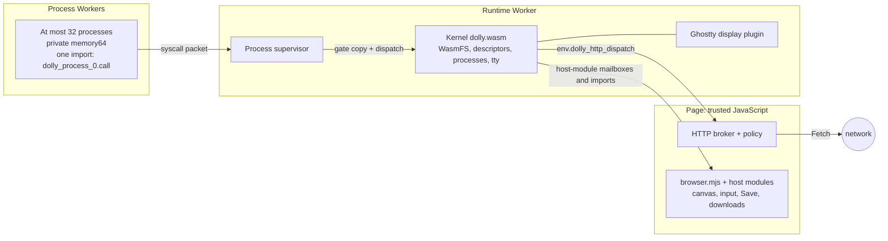
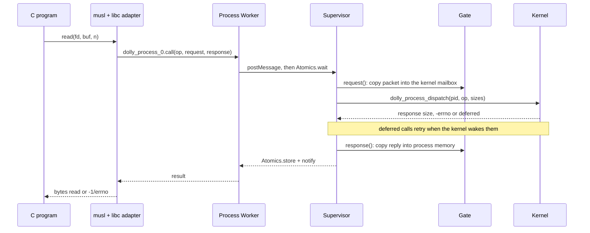
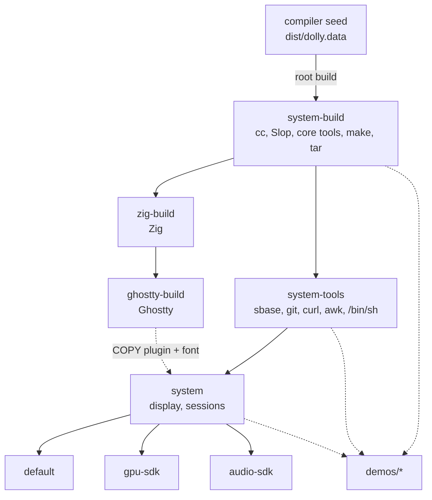

# Architecture

Dolly is a POSIX-like userspace inside one browser tab. A Wasm kernel owns all
mutable state, ordinary commands run as private wasm64 processes, and trusted
browser code supplies a fixed set of host modules. Design rules are in
[AGENTS.md](../AGENTS.md); exact Wasm contracts are in [abi/](../abi/README.md).

| Part | Code | Role |
| --- | --- | --- |
| Page | [`browser.mjs`](../src/browser.mjs), [`terminal.html`](../terminal.html) | Boots one route; gives host modules its canvas, keyboard and status line |
| Host modules | [`host/`](../host/README.md) | One directory and manifest per bridge: JavaScript provider, WAT contract, C header, kernel C, process client; see [browser boundary](browser-boundary.md) |
| Runtime Worker | [`runtime-worker.mjs`](../src/runtime-worker.mjs) | Instantiates the kernel with the host modules' imports, restores or builds the image, runs its ENTRY |
| Kernel | [`dolly.c`](../src/dolly.c), [`process-kernel.c`](../src/process-kernel.c), [`system-snapshot.c`](../src/system-snapshot.c), [`file-blocks.cpp`](../src/file-blocks.cpp) | WasmFS, open files, pipes, processes, signals, terminal modes, image snapshots; module operations go to each module's `kernel.c` ([build](../toolchain/CMakeLists.txt)) |
| Supervisor | [`process-supervisor.mjs`](../src/process-supervisor.mjs) | Compiles executables, gives each process a fresh memory, gate and Worker (one per thread), forwards syscalls, enforces deadlines |
| Process Worker | [`process-worker.mjs`](../src/process-worker.mjs), [`process-ffi.mjs`](../src/process-ffi.mjs) | Instantiates the executable; loads process-local DSOs and FFI |
| Process libc | [`libc-adapter.c`](../src/process/libc-adapter.c), [`signal.c`](../src/process/signal.c) | Maps Emscripten musl's low-level calls to process operations |
| Kernel libc | [`libc-host.c`](../src/libc-host.c) | Answers what Emscripten musl and WasmFS ask of a host from the kernel's own imports |
| Display | [`host/display/kernel.c`](../host/display/kernel.c), [`ghostty/display.c`](../src/ghostty/display.c), [`kernel-plugin.mjs`](../src/kernel-plugin.mjs) | Terminal device and framebuffer lease; resident terminal emulator and rasterizer; see [display](display.md) |

## Decisions

- **Slop is serial; programs run in parallel.** Slop is one process without
  threads or a scheduler: what it runs itself (builtins, functions, compound
  commands, substitutions) runs one at a time. Programs are separate
  processes: those of a [pipeline](slop.md#pipelines-and-interrupts) and those
  started with `&` run at the same time. Build tools use several cores:
  `posix_spawn` returns without waiting, each child runs in its own Worker, and
  only the kernel's system call dispatch stays serial. Make `-jN` with its
  jobserver and `xargs -P N` use this; Ninja still runs one job. Every process is a fresh Worker
  and memory, and Worker termination has no completion event, so `N` multiplies
  memory pressure in one tab.
- **One user, no permission bits.** Every process is the same principal and the
  containment boundary is the browser, so modes would protect nothing. Execute
  bits never select programs; the `chmod` and `chown` calls check that the path
  exists and change nothing.

## System calls

Every kernel request is one bounded packet through the process's single import.

- Packets are at most 1 MiB, use fixed-width little-endian fields and relative
  ranges, never pointers ([`process.h`](../include/dolly/process.h)).
- The gate ([`dolly-process-gate-0.wat`](../abi/dolly-process-gate-0.wat)) is a
  policy-free multi-memory copier; bounds failures trap.
- Errors are negated `dolly_process_error` numbers of `process.h`, part of the
  hashed contract; a libc maps its `errno` to them.
  A malformed packet is one of them, never the end of the process.
- A pending signal turns the next call into `-EINTR`; libc then runs the handler
  ([process model](process-model.md)).

## Images

An image is a sealed snapshot of retained files, environment and an ENTRY
program, built from a [Dollyfile](dollyfile.md). Core images:

- Recipes: [`Dollyfile-system-build`](../Dollyfile-system-build),
  [`Dollyfile-system-tools`](../Dollyfile-system-tools),
  [`Dollyfile-zig-build`](../Dollyfile-zig-build),
  [`Dollyfile-ghostty-build`](../Dollyfile-ghostty-build),
  [`Dollyfile-system`](../Dollyfile-system), [`Dollyfile`](../Dollyfile) (default),
  [`Dollyfile-gpu-sdk`](../Dollyfile-gpu-sdk), [`Dollyfile-audio-sdk`](../Dollyfile-audio-sdk);
- The graph is split so an edit rebuilds only its descendants: each builder
  starts from the smallest image with its tools. Neither Git nor display
  packaging is an input to the Rust producers (`rust-sdk` starts from
  `system-build`); CMake, Neovim and SDL build from `system-tools` without
  display or Rust.
- Toolchains stay in images that are only built; applications and packages keep
  exact outputs, as `system` copies Ghostty's plugin and font without the Zig
  SDK and `pi-runtime` installs the `javascript` package
  ([Dollyfile](dollyfile.md#building)).
- Prebuilt boot restores a sealed snapshot without downloading the compiler seed
  or compiling anything.
- Demos build `FROM` core images; the core never uses a demo.
- The kernel's WasmFS is the only filesystem. Browser storage holds only opaque
  image snapshots and [sessions](sessions.md); nothing is mounted.
- File bytes live in kernel memory in 1 MiB blocks. A write that memory cannot
  hold fails with `ENOSPC` and leaves 128 MiB for the kernel to keep working.

## Filesystem layout

| Path | Contents |
| --- | --- |
| `/bin`, `/usr/bin` | Slop, core commands, tools and runtimes |
| `/usr/include`, `/usr/lib` | Headers, libraries, retained runtimes |
| `/usr/src` | Source retained by images |
| `/etc/dolly` | Image identity, ENTRY record, startup scripts |
| `/home/dolly` | `HOME` |
| `/workspace`, `/tmp` | Scratch; never retained in images |
| `/seed` | Compiler seed, root rebuilds only |
| `/run` | Volatile files, excluded from sessions |
