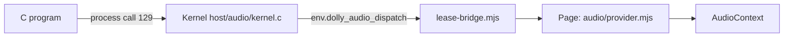

# Audio

`audio@0` plays stereo f32 PCM at 48 kHz. Programs keep their single
`dolly_process_0.call` import; operation 129 selects the extension, so the base
process ABI is unchanged and older kernels return `ENOSYS`. Decoding and mixing
stay in Wasm; the browser owns only queued output and grants no capture.

- Contract: [`host/audio/dolly-audio-0.wat`](../host/audio/dolly-audio-0.wat). Kernel leases and
  revocation: [`host/audio/kernel.c`](../host/audio/kernel.c). Browser side:
  [`host/audio/audio.mjs`](../host/audio/audio.mjs),
  [`host/lease-bridge.mjs`](../host/lease-bridge.mjs),
  [`host/audio/provider.mjs`](../host/audio/provider.mjs).
- Requests have a 32-byte header (version, operation, scope, sequence, body
  length). Operations: OPEN, WRITE (128–4096 frames), STATUS (queued frames,
  running or suspended, frames played), CLOSE.
- One stream per process, four in total, each queueing at most one second (48,000
  frames) in 64 buffers. A write is accepted whole or fails with `EAGAIN`.
  Nonfinite samples fail with `EINVAL`; others are clamped to [-1, 1].
- Exit, abort and forced termination revoke the stream. Playback may need a user
  interaction to start; the guest cannot supply one.
- C SDK: [`host/audio/audio.h`](../host/audio/audio.h) and `libdolly-audio.a` in the
  seed, which `cc` links by default. Calling it stamps `audio@0` into the
  executable. Calls return 0 or a frame count, or -1 with `errno`; after
  `EOVERFLOW`, close and reopen.

## Microphone

`microphone@0` is a separate module: an image that declares only `audio@0` can
record nothing. A program records mono f32 PCM at 48 kHz from the browser's
default input, through process operation 130.

- Contract: [`host/microphone/dolly-microphone-0.wat`](../host/microphone/dolly-microphone-0.wat).
  Browser side: [`host/microphone/microphone.mjs`](../host/microphone/microphone.mjs),
  [`provider.mjs`](../host/microphone/provider.mjs) and, on the audio thread,
  [`worklet.mjs`](../host/microphone/worklet.mjs).
- The browser decides. OPEN asks it for the default input and returns at once;
  the browser shows its own permission prompt, and the page shows "Microphone"
  over the display for as long as a program waits for or holds the device.
  Nothing is asked before a program opens the microphone.
- Operations: OPEN, READ (1 to 4,096 frames; never blocks, returns the frames
  queued), STATUS (queued, captured and dropped frames, state), CLOSE. States:
  waiting for permission, capturing, denied (a read fails with `EACCES`),
  unavailable (no device or it ended: `ENODEV`).
- One capture at a time, held by one process; a second OPEN fails with `EBUSY`.
  Two seconds are queued; a program that reads too slowly loses the oldest
  frames, which STATUS counts.
- CLOSE, exit, abort and forced termination stop the tracks, which releases
  the device and ends the browser's recording mark.
- No list of devices, labels or choice of device, and no video.
- C SDK: [`host/microphone/microphone.h`](../host/microphone/microphone.h) and
  `libdolly-microphone.a`, as for playback; calling it stamps `microphone@0`
  into the executable. `audio-sdk` is the image that declares it.
