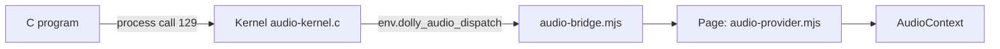

# Audio

`audio@0` plays stereo f32 PCM at 48 kHz. Programs keep their single
`dolly_process_0.call` import; operation 129 selects the extension, so the base
process ABI is unchanged and older kernels return `ENOSYS`. Decoding and mixing
stay in Wasm; the browser owns only queued output and grants no capture.

- Contract: [`dolly-audio-0.wat`](../abi/dolly-audio-0.wat). Kernel leases and
  revocation: [`audio-kernel.c`](../src/audio-kernel.c). Browser side:
  [`host/audio.mjs`](../src/host/audio.mjs),
  [`audio-bridge.mjs`](../src/audio-bridge.mjs),
  [`audio-provider.mjs`](../src/audio-provider.mjs).
- Requests have a 32-byte header (version, operation, scope, sequence, body
  length). Operations: OPEN, WRITE (128–4096 frames), STATUS (queued frames,
  running or suspended, frames played), CLOSE.
- One stream per process, four in total, each queueing at most one second (48,000
  frames) in 64 buffers. A write is accepted whole or fails with `EAGAIN`.
  Nonfinite samples fail with `EINVAL`; others are clamped to [-1, 1].
- Exit, abort and forced termination revoke the stream. Playback may need a user
  interaction to start; the guest cannot supply one.
- C SDK: [`audio.h`](../include/dolly/audio.h) and `-ldolly-audio`, built by
  [`audio.dm`](../modules/audio.dm) in
  [`Dollyfile-audio-sdk`](../Dollyfile-audio-sdk). Linking it stamps `audio@0`
  into the executable. Calls return 0 or a frame count, or -1 with `errno`; after
  `EOVERFLOW`, close and reopen.
