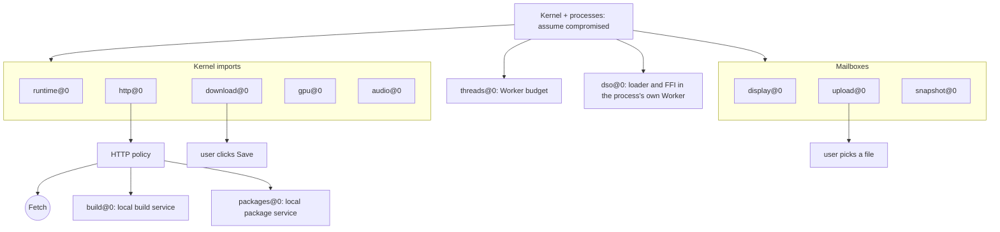

# Browser boundary

Assume every program, file and byte of Wasm userspace is compromised. Guest code
can then exercise only the authority of the trusted browser providers below.
This is the review map: keep it current when an import, host module or local
service changes.

Trusted: the browser engine, page and Worker JavaScript, and host-module
implementations. Outside the model: engine bugs, XSS, compromised application
JavaScript, and hosts that rewrite delivered HTML ([deployment](deployment.md)).
Private processes help recovery, not containment.



## Host modules

[`abi/dolly-browser-0.wat`](../abi/dolly-browser-0.wat) is the exact outer import
allowlist; the build rejects any other import and artifact checks reject
undeclared `dolly_*` exports.
[`host/modules.mjs`](../host/modules.mjs) assigns each import to the module whose
[manifest](../host/README.md) owns it; a disabled module's imports return `ENOSYS`. Images and packets
select no JavaScript or Worker URL.

| Module | Channel | Authority | Code |
| --- | --- | --- | --- |
| `runtime@0` | memory, clocks, entropy, environment, seed preload, text output, terminal mailbox | Kernel memory and boot inputs; process Workers; report foreground and results, receive Ctrl+C | [`host/runtime/`](../host/runtime/module.json) ([`process-supervisor.mjs`](../src/process-supervisor.mjs)) |
| `http@0` | `env.dolly_http_dispatch`, 16-slot pool | The only agent-selected network edge, under the page's policy | [`host/http/`](../host/http/module.json) |
| `download@0` | `env.dolly_download_dispatch` | Stream one file (1 MiB chunks, 1 GiB) into a Blob under a checked basename; saved only by a user click; at most 4 waiting | [`host/download/`](../host/download/module.json) |
| `upload@0` | mailbox | Ask for a file; the user picks it; 1 GiB of bytes in 1 MiB chunks, no name or path; refused for 2 s after a cancel | [`host/upload/`](../host/upload/module.json) |
| `snapshot@0` | mailbox | Save and restore opaque session deltas (512 MiB) on user action | [`host/snapshot/`](../host/snapshot/module.json) |
| `display@0` | mailbox | Publish checked RGBA frames; receive bounded input records; load the display plugin from WasmFS | [`host/display/`](../host/display/module.json) ([`kernel-plugin.mjs`](../src/kernel-plugin.mjs)) |
| `gpu@0` | `env.dolly_gpu_dispatch` | Bounded WebGPU packets on the browser's `high-performance` adapter, 8 scopes, 4,096 objects each, 4 GiB total, one canvas | [`host/gpu/`](../host/gpu/module.json) |
| `audio@0` | `env.dolly_audio_dispatch` | Stereo PCM output, 4 streams of 1 s; no capture | [`host/audio/`](../host/audio/module.json) |
| `threads@0` | supervisor | Worker per thread of an admitted executable: 16 per process, 64 total | [`host/threads/`](../host/threads/module.json) |
| `dso@0` | process Worker of an executable that records it | Instantiate Wasm the process supplies into its own memory and function table, and call its table entries with signatures chosen at run time; no import, no kernel entry, nothing outside that process | [`host/dso/`](../host/dso/module.json) ([`process.mjs`](../host/dso/process.mjs)) |
| `build@0` | reserved URL via `http@0` | Start a disposable image build that writes the image cache | [`host/build/`](../host/build/module.json) |
| `packages@0` | reserved URL via `http@0` | Serve the verified snapshot of a published package, one at a time, 64 per page | [`host/packages/`](../host/packages/module.json) |

- `REQUIRES HOST` lines and executable `dolly.host` records
  ([`dolly-host-0.wat`](../abi/dolly-host-0.wat)) are compatibility demands, not
  grants; a missing provider fails before ENTRY. An image's own recipe is its
  complete list: nothing is inherited from `FROM`, `INSTALL` or `COPY` images,
  sealing refuses a retained executable stamped with an undeclared module, and
  the loader refuses one at run time. An embedding can restrict the set with
  `globalThis.DOLLY_HOST_MODULES`.
- The page enables exactly the image's requirements, its runtime among them;
  rebuild routes add `http@0`, `threads@0` and `dso@0` for building (sources
  are fetched, and toolchains run threaded tools and compilers and
  interpreters that load modules), and a dependency build enables the
  declared runtime with those three. Only Dollyfile Studio
  declares `build@0`, and the page admits it only after ENTRY starts
  ([Studio builds](image-build-service.md)). An image declaring `packages@0`
  (`default`) may GET `https://packages.dolly.invalid/v1/packages/SHA256`
  after ENTRY starts: the page serves a published package's snapshot, rebuilt
  and verified from the release's packs exactly as a build input
  ([`service.mjs`](../host/packages/service.mjs)). A pin outside the release is
  404, a second concurrent snapshot 409, the 65th per page 429; the bytes are
  ordinary sandbox data and grant nothing ([amy](dollyfile.md#packages-and-amy)).
  The index of package names is not the service's: it is the site's public
  `amy-index.txt`, an ordinary request under the HTTP policy.
- Builders ([`image-builder.mjs`](../src/image-builder.mjs)) run the build
  host's modules as the page's modules configure them (`host.builder`): the
  page's HTTP policy without local services, no display, file picker or
  ENTRY. One build runs per page; cancellation holds that lease until the
  builder stops.
- Build and custom-session policy comes from trusted browser state, never from
  recipe or snapshot contents. [`http.mjs`](../host/http/http.mjs) consumes the
  embedding's policy once and intersects a result tab's saved parent policy
  with its own; missing inheritance fails closed, so reopening a build cannot
  silently restore unrestricted HTTP. Build results are opaque retained files,
  not permission to execute host code.
- Audio and GPU scope, lease and object IDs are never reused and request
  sequences only increase, so a stale handle never reaches a successor. The
  browser tracks one outstanding request per slot: fabricated Wasm mailbox
  completions cannot bypass admission, and a revoked or cancelled slot stays
  occupied until the provider settles.

## Network

- Programs have no Fetch, sockets, DNS or TLS. libcurl, Git, Python and Janis are
  adapters above `http@0` ([HTTP](http.md)).
- Policy is set by the embedding outside Wasm and survives total compromise.
  **The default permits arbitrary HTTP(S), including credentials stored in Dolly:
  it does not prevent exfiltration.** An allowlist bounds destinations, not what
  an allowed destination does with the data.
- The default includes the app's own origin (same-origin requests need no CORS).
  URLs must be absolute; the page URL is no implicit base. Restrict it with a policy.
- Bootstrap sources are the exact files the release publishes, named by their
  canonical `https://daugasauron.com` URLs; the page fetches its own copy instead
  ([`policy.mjs`](../host/http/policy.mjs)). The guest cannot choose that mirror,
  and the mirror's URLs grant nothing. Other canonical-origin URLs are ordinary
  destinations.
- A relay ([HTTP](http.md#cors-and-relays)) is embedding configuration consumed
  with the policy: it maps an exact origin to a URL prefix the page fetches
  instead. It adds no destination: the policy judges the URL the program
  asked for before the mapping applies, and the guest can neither set nor see
  it. It moves trust: the relay's operator sees every relayed request and
  chooses what is returned, so it receives no credential header the mapping
  does not name, and its requests follow no redirect. No relay is configured
  by default or on the public sites.
- Loopback and LAN hosts are ordinary destinations: responses need CORS, but the
  request itself still reaches them.
- A request URL that is a path (`/amy-index.txt`) is resolved against the root
  of the site serving the release, never above it, and then judged by the
  policy like any absolute URL ([`broker.mjs`](../host/http/broker.mjs)). It
  grants nothing: the default policy already admits the page's own origin, an
  explicit policy admits the file only by a rule for it, and the request
  carries no cookies. The program is told the path it asked for, not where
  the site is served.
- Reserved `*.dolly.invalid` URLs never reach Fetch; redirects cannot enter them
  and remote rules cannot grant them.
- The broker owns a fixed 16-slot provider table, independent of the guest's
  claimed free slots. Cancellation is acknowledged at once but holds the host
  slot until the provider settles, so forged slot state or repeated cancellation
  cannot grow a host queue. The kernel acknowledges records by compare-exchange,
  so a late acknowledgement cannot erase a terminal failure.
- Multipart reassembly ([`static-asset.mjs`](../src/static-asset.mjs)) applies
  only to exact bootstrap sources (every inherited policy must agree), pinned
  snapshot packs and user-clicked source links. The manifest holds sizes and
  hashes, never destinations; parts are fixed `.part-N` siblings fetched without
  guest headers, credentials, queries or redirects, within the original deadline
  and byte bound (64 parts of 20 MiB, 1 GiB). A remote response cannot activate it.

## Other crossings

| Channel | Bound |
| --- | --- |
| Keyboard, pointer, focus, resize, paste | Bounded records, one motion sample per animation frame; a record the ring has no room for is counted and shown, never queued on the page ([display](display.md#page)). Interpretation stays in Wasm. Pointer lock only after a trusted canvas press |
| Clipboard copy | Bounded selection text after a user Ctrl+Shift+C |
| RGBA frames, bootstrap text | Visible output only; the browser parses no terminal or HTML content |
| Display wake-ups | The page and the Worker notify each other on display mailbox words (new frame, input record, animation frame); a notify carries no data, and a forged one only costs the guest's own time |
| GPU indicator | Page text over the display naming the browser's adapter and whether it has `shader-f16`, or why there is none; no guest input ([`gpu.mjs`](../host/gpu/gpu.mjs)) |
| Image cache | Verified artifacts in IndexedDB, 32 images and 8 GiB ([`image-artifact.mjs`](../src/image-artifact.mjs)) |
| Boot and code loading | Fixed kernel artifacts only ([`runtime-worker.mjs`](../src/runtime-worker.mjs)); one bundled process Worker; the plugin loader links an explicit kernel export map and fetches nothing |
| Clocks, entropy, exit, CPU and memory use | Inputs and availability effects only |

## Persistence

- Unsaved state dies with the tab. Compromise can persist in a saved session, an
  exported session file or a custom image; discard them when trust is lost.
- Sessions and exports may contain credentials; they are neither encrypted nor
  signed. Browser storage is per origin: every site on one `github.io` account
  can read Dolly's sessions and image cache.
- Images never retain `/tmp` or `/workspace`, and otherwise only the paths their
  recipes name. A hash proves byte identity, not that an image is benign.

## Required checks

- Exact typed outer imports; no automatic allowance for new port requirements.
- Denied HTTP never reaches Fetch; credentials, redirects, limits and
  cancellation stay enforceable after arbitrary guest mailbox writes.
- Span, frame, input, file-transfer and decompression bounds fail closed.
- Filesystem and process operations stay in Wasm; unsupported fork, socket and
  host operations fail without fallbacks.
- Fixed loaders cannot resolve guest-selected URLs, paths or JavaScript.
- Process failure and forced termination preserve the kernel and shell.

These are testable design invariants, not a formal containment proof. Worker
termination and resource bounds help availability but do not protect against
browser-wide memory pressure or engine failure.

```sh
node scripts/dolly-abi.mjs validate-browser build/dolly-browser-0.wasm dist/dolly.wasm
node --test test/http-broker.test.mjs test/http-policy.test.mjs test/host-modules.test.mjs
```

Treat any new import, mailbox, host module or local service as an authority
change: review it here and prove denial in a real browser.
