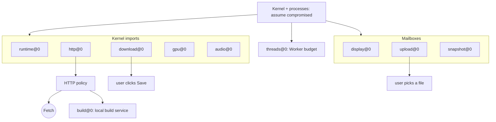

# Browser boundary

Assume every program, file and byte of Wasm userspace is compromised. Guest code
can then exercise only the authority of the trusted browser providers below.
This is the review map: keep it current when an import, host module or local
service changes.

Trusted: the browser engine, page and Worker JavaScript, and host-module
implementations. Outside the model: engine bugs, XSS, compromised application
JavaScript, and hosts that rewrite delivered HTML ([deployment](deployment.md)).
Private processes help recovery, not containment.



## Host modules

[`abi/dolly-browser-0.wat`](../abi/dolly-browser-0.wat) is the exact outer import
allowlist; the build rejects any other import and artifact checks reject
undeclared `dolly_*` exports.
[`host/modules.mjs`](../src/host/modules.mjs) assigns each import to one
provider; a disabled provider's imports return `ENOSYS`. Images and packets
select no JavaScript or Worker URL.

| Module | Channel | Authority | Code |
| --- | --- | --- | --- |
| `runtime@0` | memory, clocks, entropy, environment, seed preload, text output | Kernel memory and boot inputs; process Workers | [`runtime.mjs`](../src/host/runtime.mjs), [`process-supervisor.mjs`](../src/process-supervisor.mjs) |
| `http@0` | `env.dolly_http_dispatch`, 16-slot pool | The only agent-selected network edge, under the page's policy | [`http.mjs`](../src/host/http.mjs), [`http-broker.mjs`](../src/http-broker.mjs), [`http-policy.mjs`](../src/http-policy.mjs) |
| `download@0` | `env.dolly_download_dispatch` | Offer one copied file (64 MiB) under a checked basename; saved only by a user click; at most 4 waiting | [`download.mjs`](../src/host/download.mjs) |
| `upload@0` | mailbox | Ask for a file; the user picks it; 64 MiB of bytes, no name or path; refused for 2 s after a cancel | [`upload.mjs`](../src/host/upload.mjs), [`upload-transport.mjs`](../src/upload-transport.mjs), [`upload.c`](../src/upload.c) |
| `snapshot@0` | mailbox | Save and restore opaque session deltas (512 MiB) on user action | [`snapshot.mjs`](../src/host/snapshot.mjs), [`session-transport.mjs`](../src/session-transport.mjs) |
| `display@0` | mailbox | Publish checked RGBA frames; receive bounded input records; load the display plugin from WasmFS | [`display.mjs`](../src/host/display.mjs), [`kernel-plugin.mjs`](../src/kernel-plugin.mjs) |
| `gpu@0` | `env.dolly_gpu_dispatch` | Bounded WebGPU packets, 8 scopes, 4,096 objects each, 4 GiB total, one canvas | [`gpu.mjs`](../src/host/gpu.mjs), [`gpu-bridge.mjs`](../src/gpu-bridge.mjs), [`gpu-worker.mjs`](../src/gpu-worker.mjs) |
| `audio@0` | `env.dolly_audio_dispatch` | Stereo PCM output, 4 streams of 1 s; no capture | [`audio.mjs`](../src/host/audio.mjs), [`audio-bridge.mjs`](../src/audio-bridge.mjs), [`audio-provider.mjs`](../src/audio-provider.mjs) |
| `threads@0` | supervisor | Worker per thread of an admitted executable: 16 per process, 64 total | [`threads.mjs`](../src/host/threads.mjs) |
| `build@0` | reserved URL via `http@0` | Start a disposable image build that writes the image cache | [`build.mjs`](../src/host/build.mjs), [`local-services.mjs`](../src/local-services.mjs), [`image-build-service.mjs`](../src/image-build-service.mjs) |

- `REQUIRES HOST` lines and executable `dolly.host` records
  ([`dolly-host-0.wat`](../abi/dolly-host-0.wat)) are compatibility demands, not
  grants; a missing provider fails before ENTRY. An embedding can restrict the
  set with `globalThis.DOLLY_HOST_MODULES`.
- The page enables `runtime@0` plus the image's requirements; rebuild routes add
  `http@0` and `threads@0` for building. Only Dollyfile Studio declares
  `build@0`, and the page admits it only after ENTRY starts
  ([Studio builds](image-build-service.md)).
- Builders ([`image-builder.mjs`](../src/image-builder.mjs)) inherit the page's
  HTTP policy but get no display, file picker or local service, and never run
  ENTRY.

## Network

- Programs have no Fetch, sockets, DNS or TLS. libcurl, Git, Python and Janis are
  adapters above `http@0` ([HTTP](http.md)).
- Policy is set by the embedding outside Wasm and survives total compromise.
  **The default permits arbitrary HTTP(S), including credentials stored in Dolly:
  it does not prevent exfiltration.** An allowlist bounds destinations, not what
  an allowed destination does with the data.
- The default includes the app's own origin (same-origin requests need no CORS);
  relative URLs resolve against the page. Restrict it with a policy.
- Loopback and LAN hosts are ordinary destinations: responses need CORS, but the
  request itself still reaches them.
- Reserved `*.dolly.invalid` URLs never reach Fetch; redirects cannot enter them
  and remote rules cannot grant them.

## Other crossings

| Channel | Bound |
| --- | --- |
| Keyboard, pointer, focus, resize, paste | Bounded records; interpretation stays in Wasm. Pointer lock only after a trusted canvas press |
| Clipboard copy | Bounded selection text after a user Ctrl+Shift+C |
| RGBA frames, bootstrap text | Visible output only; the browser parses no terminal or HTML content |
| Image cache | Verified artifacts in IndexedDB, 32 images and 8 GiB ([`image-artifact.mjs`](../src/image-artifact.mjs)) |
| Boot and code loading | Fixed kernel artifacts only ([`runtime-worker.mjs`](../src/runtime-worker.mjs)); one bundled process Worker; the plugin loader links an explicit kernel export map and fetches nothing |
| Clocks, entropy, exit, CPU and memory use | Inputs and availability effects only |

## Persistence

- Unsaved state dies with the tab. Compromise can persist in a saved session, an
  exported session file or a custom image; discard them when trust is lost.
- Sessions and exports may contain credentials; they are neither encrypted nor
  signed. Browser storage is per origin: every site on one `github.io` account
  can read Dolly's sessions and image cache.
- Images never retain `/tmp`, `/workspace` or Pi's `auth.json` and sessions. This
  is not a secret scanner. A hash proves byte identity, not that an image is benign.

## Recheck

```sh
node scripts/dolly-abi.mjs validate-browser build/dolly-browser-0.wasm dist/dolly.wasm
node --test test/http-broker.test.mjs test/http-policy.test.mjs test/host-modules.test.mjs
```

Treat any new import, mailbox, host module or local service as an authority
change: review it here and prove denial in a real browser.
