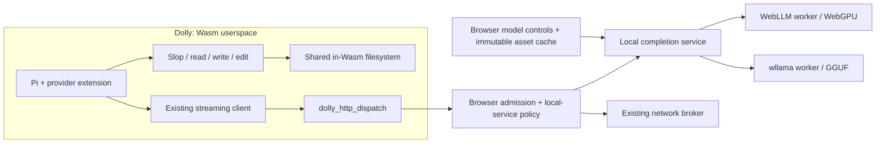

This experiment adds two local model providers to Pi: **webgpu**, implemented with WebLLM, and **wllama**, implemented with the GGUF/llama.cpp browser runtime. Pi continues to run inside Dolly and execute its tools there. The browser supplies bounded inference and model loading.

Planning baseline: `3db50e6826b91109663cd4d5404e5d80518c0d2b`, Pi 0.84.4 / upstream source `b79e4cc834970cca69daebffab7df1da7d1e52c4`. Branch: `codex/browser-local-models`; worktree: `/tmp/dolly-local-models.Oh9HwI/repo`. Main had substantial uncommitted work when this branch was created; none was copied, reset or stashed. This commit contains a plan only. No inference integration, model download or performance test has been performed.

The main design decision is to expose a small **browser-local completion service through the existing bounded HTTP transport**. This is a new host capability and protocol, but initially needs no new Wasm import. `NetworkTransport` already accepts a `fetchRequest` implementation, authorizes before dispatch, and transports streaming response bytes through the version-4 mailbox. Pi already supports extension-registered OpenAI-compatible providers. Reusing those paths avoids another Janis primitive, libc wrapper, syscall and mailbox before there is evidence they are needed.

The service returns text and tool-call descriptions. It never executes a tool. The model workers receive copied request data, not Dolly memory, filesystem access or a JavaScript callback into Pi. Provider runtime memory and GPU/KV caches are disposable accelerator state; Pi's conversation, files and sessions remain authoritative inside Dolly. The external engines can use their own Wasm build targets; they do not link into Dolly's wasm64 address space or ABI.

The comparison with Piodide is useful for behavior and known integration problems. Piodide at `ba144e1c2749c786e8aec28d44fec6e23811c8fb` uses WebLLM and wllama, displays loading/backend/cache state, and keeps model files outside its userspace image. Its `src/webllm-model-stream.ts` also contains substantial custom tool prompting and parsing, and `src/browser-model-runtime.ts` works around wllama 3.5.1 streaming completion issues. Those are reasons to test upstream behavior carefully, not to copy that architecture or its private API patches.

Candidate dependencies, verified against the npm registry on 2026-09-07, are WebLLM **0.2.84** and wllama **3.6.1**. Pin exact versions and package integrity when implementing. The latter is newer than Piodide's 3.5.1. Check its published ESM entry, stream completion and cancellation directly before deciding any workaround is still necessary. WebLLM's worker API is documented upstream; wllama supports OpenAI-shaped chat completions and gained WebGPU support in 3.1. Thus the provider distinction is **MLC/WebLLM versus GGUF/wllama**, not strictly GPU versus CPU. Start the wllama proof with an explicit CPU configuration, then test its GPU path separately. [WebLLM workers](https://webllm.mlc.ai/docs/user/advanced_usage.html), [wllama chat API](https://github.com/ngxson/wllama/blob/master/guides/intro-v3.md), [wllama WebGPU](https://github.com/ngxson/wllama/blob/master/guides/intro-v3.1.md).

The initial host interface is intentionally small:

| Operation | Request | Result |
| --- | --- | --- |
| Discover WebGPU models | `GET https://webgpu.dolly.invalid/v1/models` | Approved model IDs, context/output limits and basic capability metadata |
| Discover GGUF models | `GET https://wllama.dolly.invalid/v1/models` | Same descriptor shape for wllama |
| Generate | `POST` to either origin's `/v1/chat/completions` | OpenAI-compatible SSE, including fragmented tool calls, finish reason, usage when available, and stream termination |
| Cancel | Abort the existing request | Propagate through the existing cancellation/sequence mechanism to the engine |

These are reserved transport addresses handled inside the page, with no DNS lookup, actual HTTP server or native localhost process. Recognize the reserved namespace before network dispatch and reject unknown/disabled reserved routes without falling through to Fetch. Return the logical request URL in response metadata; a constructed browser `Response` otherwise has an empty `url`.

Keep the existing span validation and mailbox limits. Compose explicit local-service admission with the existing remote HTTP policy rather than inserting a universal authorization bypass. Local inference must be possible when remote networking is denied, and an ordinary remote allow rule must not implicitly grant model loading or local inference. Only the page's trusted configuration chooses enabled engines and approved models. Installing a Pi extension does not grant browser authority. Apply the reserved-namespace guard at every broker creation site, including build-only workers; those workers get an explicit local-service denial, never a network fallback.

Accept a versioned, narrow subset: text/system/assistant/tool messages, one choice, `stream: true`, bounded tool schemas, `max_tokens`, and the few sampling fields actually supported by the selected model. Configure Pi compatibility to emit `system` rather than `developer`, `max_tokens` rather than `max_completion_tokens`, and disable unsupported `store`/reasoning fields. Preserve assistant tool-call IDs and tool-result history. Reject unsupported images/audio or arbitrary `extra_body` options instead of silently dropping them or forwarding engine configuration. Profile context limits must describe the loaded model, not an optimistic training limit.

For the first experiment, start with a 1 MiB request cap, 8 MiB emitted-response cap, 32 tool definitions with 64 KiB total schema data, one active inference and one loaded model per tab across both engines. Use an explicit finite generation deadline, initially 120 seconds, and a bounded cancellation grace period, initially two seconds before terminating a stuck engine worker. These are proposed bounds to check against the real Pi prompt and hardware, not measured performance promises. Output-token and context limits additionally come from each tested model profile. Fail explicitly rather than silently truncate an agent conversation.

Model selection/loading belongs to browser controls. Discovery never downloads weights. A completion request for an unloaded model returns an actionable `model_not_loaded` error; it cannot trigger arbitrary URL downloads. User-triggered preparation can download approved assets or reuse the model cache before generation starts. Keep loading outside the completion request deadline. Reject unknown model IDs, filesystem paths, runtime-module URLs and executable configuration in guest input. Discard credential headers on local routes; a non-secret placeholder may be necessary because Pi 0.84.4's OpenAI client requires an API key. It is never forwarded to asset downloads.

The HTTP mailbox currently admits one request at a time. Standard Pi execution waits for a model response before running tools, so this is a plausible first implementation. It does mean concurrent sandbox HTTP while inference is streaming can receive `EBUSY`. Test that explicitly. Keep admission short: copy/authorize/start, then return; generation happens asynchronously. Do not add a hidden request queue to simulate concurrency.

Both adapters must connect demand, cancellation and lifecycle correctly. Pull the next chunk only when the response consumer can accept it; bound any callback bridge queue and abort on overflow. A bounded Wasm mailbox does not automatically bound an upstream worker queue. Keep the generation lease until the backend has actually settled, including cancellation, and reject stale late chunks by generation identity. Map abort to wllama's signal and WebLLM's interrupt operation; terminate/recreate the private inference worker if it cannot settle. Distinguish finish reasons, truncation, model errors and user cancellation. Do not synthesize a successful end when an engine omitted its terminal result.

A Pi process exit or restart must cancel its outstanding inference through Dolly's existing lifecycle cancellation, while keeping an idle healthy loaded model available in the page. New sessions send their complete context and reset conversation-dependent provider state. Closing or navigating away from the page disposes workers. Do not attempt cross-tab inference scheduling, service-worker residency or serialization of GPU state in this experiment.

The Pi extension should be a small ordinary JavaScript file under `~/.pi/agent/extensions/`, with no Pi source fork. It discovers the approved catalogs and registers `webgpu` and `wllama` using the pinned version's `pi.registerProvider` API and `api: "openai-completions"`. The existing client should handle SSE-to-Pi events; add a custom `streamSimple` implementation only if a measured incompatibility demands it. Match `supportsDeveloperRole`, `supportsStore`, `maxTokensField` and streamed-usage behavior to the service. Failure or absence of local inference must leave existing cloud providers usable. Native extension registration and model switching need to be tested inside Janis, not inferred from a Node-only test. [Pi's pinned custom-provider documentation](https://github.com/earendil-works/pi/blob/b79e4cc834970cca69daebffab7df1da7d1e52c4/packages/coding-agent/docs/custom-provider.md).

Tool calling is the acceptance gate. A text-chat demo is insufficient for Pi. WebLLM has a specific native tool-calling model list and describes function calling as preliminary; generic OpenAI API compatibility does not establish reliable agent behavior. Begin with a native supported profile, such as an appropriately sized Hermes configuration that fits the measured GPU, and prove both ordinary answers and tool turns. Use a small GGUF chat model with the correct native tool template for the wllama proof. Piodide's Qwen3.5 0.8B GGUF is a candidate for a small integration test, not a claim of coding-agent quality. [WebLLM function-calling profiles at the release commit](https://github.com/mlc-ai/web-llm/blob/9e572d6ed95e248f29634996cd32cc8f3023d89d/src/config.ts), [upstream function-calling status](https://github.com/mlc-ai/web-llm/issues/526).

If no native WebLLM tool profile is usable on the target hardware, record that as an unresolved experiment requirement. A single model-specific adapter can then translate its tool protocol at the provider boundary, but it must be an explicit implementation step with genuine tool-turn tests. Do not silently recreate Piodide's prompt-repair framework or label an untested text-only model agent-ready. Choose concrete model revisions and hashes only after checking memory, actual prompt/tool-schema token count, licensing and runtime support. No large model download is part of this planning task.

Browser delivery and caching must remain separate from image composition:

- Bundle the pinned engine JavaScript, worker scripts and runtime Wasm as browser assets. Dolly currently ships explicit ES modules without a general frontend bundling pipeline; add a small dedicated vendor-asset build step, with a pinned bundler if needed, rather than switching the whole app to a new framework.
- Extend `scripts/package-pages.sh`, the static browser harness and release checks so production delivery contains the same adapter/worker assets that tests use. Lazy-load the selected engine, so ordinary cloud-Pi boot does not initialize both runtimes.
- Keep weights, tokenizers and model cache outside `dolly.data`, system snapshots and session snapshots. Use backend-native caches with stable artifact identities; do not build a second generic cache system. Recipe edits must not cause model downloads.
- Fix the model artifact graph to approved URLs and integrity metadata, including configurations, tokenizer files, MLC model libraries and any compatibility runtime. Pinned vendor Wasm is executable browser-side code and belongs in the review, not just the weight manifest.
- Audit all engine-initiated requests. Wllama's inspected release source defaults compatibility assets to a CDN; disable that default or serve explicitly pinned local compatibility assets. No guest-supplied field may select an asset URL. Prefer a same-origin approved fixture/mirror for initial real-model proofs; resolve model-host redirects and CORS deliberately without weakening the normal broker's redirect policy. [wllama 3.6.1 compatibility configuration](https://github.com/ngxson/wllama/blob/c35450cf9597eaf901293b12458cae204aea0b65/src/wllama.ts).
- User-triggered downloads are host-selected model preparation, not a second agent-controlled network API. During warm inference, the expected model-provider network activity is zero. Browser cache contains model assets, not authoritative Pi history or userspace files.

For image iteration, add `modules/browser-model-providers.dm` containing only the extension and any small static configuration. Prototype with `Dollyfile-pi-local` deriving from the existing completed Pi image, then using this module and preserving the current `/bin/foreground -i /bin/slop /etc/dolly/init.slop` entry. This makes extension edits a small leaf build. The expensive Pi/Janis/SDK artifacts are reused.

Once the prototype passes, include the same module in the small `pi` and `python-pi` leaf recipes. Gamedev, gamedev-phone and bhop inherit it through Pi. Avoid putting it in `modules/pi.dm`, which would recompile the upstream Pi workspace on every extension edit. No additional Dollyfile keyword or module dependency type is needed. Keep the extension and its source inputs clickable in the existing viewer; link the new browser capability documentation from that source.

The user flow should remain simple: open a Pi image; open a small **Local models** panel; choose a model with its download size and backend requirements visible; load it with progress; select **WebGPU (WebLLM)** or **wllama** through Pi's ordinary model picker. Show cached/loading/ready/error state, actual backend and context, plus Stop, Unload and removal of the selected cached model. Stop generation must remain responsive while GPU work is active. Do not silently download another model, switch to a cloud provider, or hide a CPU fallback. Memory estimates are guidance until tested on the current browser/device. Start with a tiny curated catalog, not Piodide's full model manager.

Implementation and verification order:

| Step | Deliverable | Required evidence before moving on |
| --- | --- | --- |
| 1. Transport and extension | Reserved local routes with a deterministic streaming fixture; Pi provider registration | Pi inside Dolly receives fragmented text/tool deltas; executes a real shell/file tool in Wasm; consumes its result and finishes a second model turn; no Fetch call for local routes |
| 2. wllama | Pinned published assets and one GGUF profile | Real browser inference, complete terminal chunk, two consecutive tool turns, cancellation followed by another request, actual backend and memory measurements |
| 3. WebGPU | WebLLM worker and one verified agent profile | Real GPU inference and tool roundtrip; ordinary answer without forced spurious tool call; adapter/device loss and cancellation recovery |
| 4. Model controls and cache | Small panel, approved asset preparation and cache reuse | Visible cold-load progress; reload uses cached weights; warm inference offline; changing a provider implementation does not redownload models |
| 5. Pi image integration | Tiny leaf module in Pi and Python+Pi; inherited by Pi-derived images | Viewer links, correct startup, provider availability and shared in-Wasm file results in packaged images; edits reuse Pi runtime snapshots |
| 6. Boundary and regression review | Updated browser-boundary/http documentation and targeted tests | Exact kernel import types/count preserved; denied or malformed local requests cannot reach network, load arbitrary assets or execute host tools; existing cloud-provider and lifecycle tests still pass |

Boundary tests must include disabled services, unknown reserved origins/paths, URL credentials/query/fragment tricks, excessive request/schema/output sizes, unsupported modalities, stale responses, stopped readers, worker failure and a provider that ignores cancellation. Test separate remote-deny/local-allow and local-deny/remote-allow configurations. Assert that no native server, Node fallback, ambient Fetch/WebGPU in Janis or host filesystem API is introduced. Test the packaged app with real browser workers and cross-origin isolation; a development-only bundler success is not enough.

Measure cold download, warm load, prefill/time to first token, generation rate, complete tool-turn latency, cancellation latency, queue high-water marks and peak process/GPU memory separately. Include the real Pi system prompt and tools; do not extrapolate from a short chatbot prompt. Verify that shell commands are usable again after the model stream finishes or is cancelled. The final success criterion is a real local model reading and modifying a Dolly file through Pi, running a shell command, and continuing from those results on both backends.

The likely code changes are concentrated in a local-model broker, two engine adapters, browser UI/worker integration, vendor asset preparation, one Pi extension/module, leaf recipes, explicit packaging inputs and focused tests. `src/browser.mjs`, `src/http-broker.mjs`, `src/http-policy.mjs`, `scripts/package-pages.sh` and `scripts/browser-harness.mjs` are coordination hotspots with main. Keep that diff narrow. The canonical WAT contract remains unchanged for this first approach; document the added local capability in `docs/browser-boundary.md` and `docs/http.md`.

A dedicated inference import/mailbox becomes justified only if the experiment demonstrates that sharing the HTTP request slot prevents required agent behavior or makes bounded cancellation unreliable. In that case, use a separate versioned WAT contract with bounded start/read/cancel semantics and the same approved model identities; expose no raw WebGPU handles. It would require a new runtime build and image compatibility checks. Do not pay that cost merely to give the initial transport a different name.

All implementation/build work stays in this branch with its own `dist`, caches, release directory, browser profile and dynamically assigned ports. Reuse copies of verified immutable artifacts only after checking their runtime IDs and recipe hashes. Do not point mutable worktree paths at main's live build outputs, run main's publish scripts, kill shared browser processes, or incorporate uncommitted changes. A missing compatible artifact means a separate bootstrap in this worktree. Rebase or integrate only through a later deliberate handoff; this experiment does not interrupt main's work.
