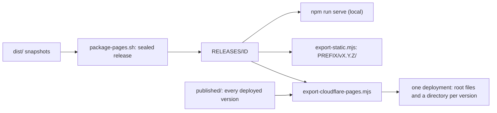

# Deployment

Dolly deploys as static files: no server code, Functions or proxy. A release is
a version `X.Y.Z` ([`version.mjs`](../src/version.mjs), equal to
`package.json`): the git tag `vX.Y.Z`, the GitHub release of that name and the
site path `/vX.Y.Z/`. [daugasauron.com](https://daugasauron.com/) (Cloudflare
Pages project `dolly`, full catalog) keeps every published version;
[GitHub Pages](https://daugasauron.github.io/dolly/) (a smaller catalog within
its 1 GB limit) carries the newest only.



## What a site serves

| Path on daugasauron.com | Response |
| --- | --- |
| `/` | 302 to the newest version (`_redirects`) |
| `/vX.Y.Z/…` | That version's complete site: pages, code, recipes, sources, packs |
| `/robots.txt`, `/404.html` | The newest version's; `robots.txt` names each version's paths |
| Anything else | 404 |

- Versions share nothing: each is the whole site exported under its path, so a
  published version keeps serving its own bytes whatever is released later.
  While the version is 0.x a patch release fixes and a minor release may
  change anything; nothing is promised about services outside the site (npm,
  model endpoints, git hosts) or about browsers.
- A published version never changes. A fix is a new version, and `/` then
  leads to it. Removing a version is the owner's explicit act: delete its
  directory from the archive and deploy; its paths return 404.
- GitHub Pages serves `PREFIX/vX.Y.Z/` and an `index.html` at `PREFIX/` that
  leads there; each deploy replaces the whole site.
- Saved sessions belong to a version; the image cache is shared
  ([sessions](sessions.md)).

## Package and export

Use one catalog for source preparation, snapshots and packaging:

```sh
export DOLLY_BUILD_IMAGES="$(paste -sd, config/domain-pages-images.txt)"
npm run image
bash scripts/package-pages.sh build/domain-releases daugasauron.com
npm run serve build/domain-releases     # the candidate as it will be deployed

export DOLLY_BUILD_IMAGES="$(paste -sd, config/github-pages-images.txt)"
npm run image
bash scripts/package-pages.sh build/github-releases github-pages
```

- Catalogs: [`domain-pages-images.txt`](../config/domain-pages-images.txt) and
  [`github-pages-images.txt`](../config/github-pages-images.txt); dependencies are
  included automatically.
- The second packaging argument selects the site: `daugasauron.com` adds the
  `/agents/` showcase ([`package-domain.mjs`](../scripts/package-domain.mjs));
  `github-pages` links Studio, Pi Local and 0 A.D. to the domain
  ([`package-github-pages.mjs`](../scripts/package-github-pages.mjs)).
- [`package-pages.sh`](../scripts/package-pages.sh) `RELEASES SITE` seals a
  release into `RELEASES/ID` and points `RELEASES/current` at it (default
  `build/releases`); [`site-release.mjs`](../scripts/site-release.mjs)
  verifies it. A sealed release carries its version and the commit it was
  packaged from.
- `npm run serve [RELEASES]` serves that directory's current release as it
  will be deployed: `/` redirects to its version, the site is under
  `/vX.Y.Z/`, every other path is 404.
- [`export-static.mjs`](../scripts/export-static.mjs) `RELEASE OUT PREFIX/`
  writes `OUT/vX.Y.Z/` and the `index.html` that leads there;
  `.github/workflows/pages.yml` runs it for the version tag it is given,
  after checking the artifact's digest and that the release was packaged from
  the tag's commit.
- [`export-cloudflare-pages.mjs`](../scripts/export-cloudflare-pages.mjs)
  `ARCHIVE OUT RELEASE` assembles the deployment: every version in the
  archive, the new one exported from its sealed release, and the root files.
  Without `RELEASE` it assembles the archive alone, which is how a removed
  version leaves the site.
- Exporters verify the sealed input, refuse an existing destination, publish
  atomically and upload nothing. `sha256sum --check deployment.sha256` in a
  version's directory checks it.
- A release build needs disk for the catalog twice (snapshots in `dist/` and
  their packs) and little memory: sharing the 67-image, 25 GB catalog into
  packs streams one 4 MB chunk at a time (221 MB peak, 3.5 minutes);
  `site-release.mjs accept` then holds about twice the largest image while it
  merges that image's packs.

## The archive of published versions

- `published/` in the checkout a release is made from (ignored by git) holds
  one directory per published version, exactly as it was deployed, with its
  `deployment.sha256` (every file) and `deployment.headers` (the headers its
  compressed and split files need). Every deployment needs all of them: the
  exporter checks each against its list and hard-links it into the new
  deployment, so the archive and `OUT` must be on one filesystem.
- The archive is the only record of what is published: a deployment assembled
  without a version removes that version from the site.
- The live site is the second copy.
  [`published-version.mjs`](../scripts/published-version.mjs)
  `mirror SITE vX.Y.Z ARCHIVE` takes a version back, checking every file
  against the list the site serves; compare that list's SHA-256 with the one
  in the version's release notes.
- Cloudflare Pages takes 20,000 files, 25 MiB each, and 100 `_headers` rules.
  The exporter fails at either limit, naming the versions; nothing is dropped
  automatically. One rule covers a file in every version that stores it the
  same way, so rules grow with distinct large files, not with versions.
- Measured on 2026-10-08 (71 images): one version is 2,335 files and
  19.1 GB, so eight versions fit in 20,000 files. It needs 44 rules: 5 for
  every version, 28 for large sources by path and 11 for large packs by
  content, which leaves 56 for the large files later versions change.

## Release

[`release-checklist.sh`](../scripts/release-checklist.sh)
`DOMAIN_RELEASES GITHUB_RELEASES` checks steps 1 to 3 and assembles the
deployment of step 6, then prints the commands of the others. It never tags,
pushes, uploads or deploys.

1. A green round on the commit (source, artifacts, browser suites in both
   browsers, demos, GPU tests); the tree clean.
2. No credential in the commits to push or in `dist/dolly-*-system.snapshot`.
3. Both sites packaged from that commit and accepted; the Pages workflow's
   steps pass locally, under 1 GB.
4. Tag `vX.Y.Z` on the commit; push `main` and the tag.
5. GitHub release `vX.Y.Z` with notes and `dolly-pages.tar.gz` (the GitHub
   Pages release, packed); run `pages.yml` with the tag and the tarball's
   SHA-256.
6. Assemble the deployment from the archive and the new release; upload it
   with `wrangler pages deploy` as a detached job. An interrupted upload keeps
   nothing: never restart it.
7. Live, in Chromium and Firefox: `published-version.mjs boot SITE vX.Y.Z…`
   (`/` leads to the newest version, an unversioned path is 404, every
   version boots `default` from its own files) and
   `published-version.mjs verify SITE OUT vX.Y.Z` (every file of the new
   version, and every older version's list).
8. Move the new version's directory from `OUT` into the archive; move
   `package.json` and `src/version.mjs` to the next version.

## Delivery contract

| Path under `/vX.Y.Z/` | Caching |
| --- | --- |
| `_dolly/RELEASE/` code, recipes, sources | Immutable |
| `dist/packs/HASH.snapshot.gz` | Immutable |
| HTML, `coi-serviceworker.js`, `amy-index.txt` | No-store |

- Every URL is a file at its checkout path below the version (directories
  serve `index.html`; [`generate-routes.mjs`](../scripts/generate-routes.mjs)
  writes the menu, image routes and recipe views), so no host needs rewrite
  rules. Unknown paths get a `404.html` with status 404; missing assets must
  never get an HTML success response.
- Send `Cross-Origin-Opener-Policy: same-origin`,
  `Cross-Origin-Embedder-Policy: require-corp` and
  `Cross-Origin-Resource-Policy: same-origin` where possible; otherwise
  [`coi-serviceworker.js`](../coi-serviceworker.js) isolates same-origin
  responses below its version and passes cross-origin broker requests through
  unchanged.
- Snapshot `.gz` files are application payloads: never mark them
  `Content-Encoding: gzip`.
- The Cloudflare exporter splits oversized sources, packs and the compiler seed
  `dist/dolly.data` into verified 20 MiB parts
  ([`static-asset.mjs`](../src/static-asset.mjs)) and Brotli-compresses large
  downloads as `application/octet-stream`: the tested Pages runtime overwrites
  the encoding of Wasm MIME types. Do not substitute Workers Static Assets; its
  tested encoding behavior differs. Runtime JavaScript and Wasm are never
  precompressed or split.
- Disable CDN HTML rewriting, email obfuscation and injected analytics; they
  change the reviewed page. Serve Dolly from its own origin when sessions matter:
  storage is shared by every site on an origin.
- Verify delivered hashes and requests, not dashboard settings. Never put
  credentials in build artifacts or edit source while sealing.
- Docs publish every git-tracked text file they link outside `demos/`
  ([`package-documentation.mjs`](../scripts/package-documentation.mjs)).
