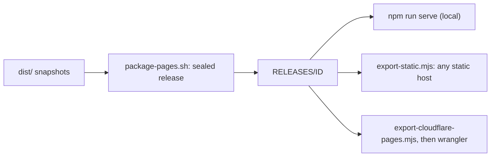

# Deployment

Dolly deploys as static files: no server code, Functions or proxy. The same
packaging serves [daugasauron.com](https://daugasauron.com/) (Cloudflare Pages
project `dolly`, full catalog) and
[GitHub Pages](https://daugasauron.github.io/dolly/) (a smaller catalog within
its 1 GB limit).



## Package and export

Use one catalog for source preparation, snapshots and packaging:

```sh
export DOLLY_BUILD_IMAGES="$(paste -sd, config/domain-pages-images.txt)"
node scripts/update-module-pins.mjs
bash scripts/prepare-image-sources.sh
npm run snapshot

# daugasauron.com: export with predecessor releases, then upload.
bash scripts/package-pages.sh build/dolly-domain.tar.gz build/domain-releases daugasauron.com
npm run export:pages -- build/domain-releases/current build/pages-next build/domain-releases/PREVIOUS_ID
npx wrangler@4.129.1 pages deploy build/pages-next --project-name dolly --branch main

# GitHub Pages (github-pages-images.txt): attach the tarball to a GitHub release,
# then run the "Deploy Dolly demo" workflow with its tag, SHA-256 and commit.
bash scripts/package-pages.sh build/dolly-pages.tar.gz build/github-releases github-pages
```

- Catalogs: [`domain-pages-images.txt`](../config/domain-pages-images.txt) and
  [`github-pages-images.txt`](../config/github-pages-images.txt); dependencies are
  included automatically.
- The third packaging argument selects the site: `daugasauron.com` adds the
  `/agents/` showcase ([`package-domain.mjs`](../scripts/package-domain.mjs));
  `github-pages` links Studio, Pi Local and 0 A.D. to the domain
  ([`package-github-pages.mjs`](../scripts/package-github-pages.mjs)).
- [`package-pages.sh`](../scripts/package-pages.sh) `OUTPUT RELEASES SITE` seals a
  release into `RELEASES/ID` and points `RELEASES/current` at it (defaults:
  `build/dolly-pages.tar.gz`, `build/releases`);
  [`site-release.mjs`](../scripts/site-release.mjs) verifies it.
  `npm run serve [RELEASES]` serves only that directory's current release.
- `.github/workflows/pages.yml` verifies the artifact and source,
  then runs `export-static.mjs` with the Pages prefix. Exporters verify the sealed
  input, refuse an existing destination, publish atomically and upload nothing;
  `sha256sum --check deployment.sha256` checks an export.
- Pass predecessor releases to `export:pages` so open tabs keep their immutable
  assets; GitHub Pages replaces the whole site on each deploy.

## Delivery contract

| Path under the public prefix | Caching |
| --- | --- |
| `_dolly/RELEASE/` code, recipes, sources | Immutable |
| `dist/packs/HASH.snapshot.gz` | Immutable |
| HTML and `coi-serviceworker.js` | No-store |

- Serve directory `index.html` files; unknown paths get the packaged `404.html`
  with status 404 (it handles first visits to `/session/NAME`). Missing assets
  must never get an HTML success response.
- Send `Cross-Origin-Opener-Policy: same-origin`,
  `Cross-Origin-Embedder-Policy: require-corp` and
  `Cross-Origin-Resource-Policy: same-origin` where possible; otherwise
  [`coi-serviceworker.js`](../coi-serviceworker.js) provides isolation.
- Snapshot `.gz` files are application payloads: never mark them
  `Content-Encoding: gzip`.
- The Cloudflare exporter splits oversized sources and packs into verified 20 MiB
  parts ([`static-asset.mjs`](../src/static-asset.mjs)) and Brotli-compresses
  large downloads as `application/octet-stream`.
- Disable CDN HTML rewriting, email obfuscation and injected analytics; they
  change the reviewed page. Serve Dolly from its own origin when sessions matter:
  storage is shared by every site on an origin.
