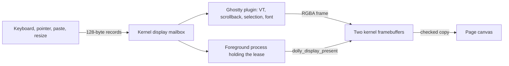

# Display

One canvas has two producers: the resident Ghostty terminal and, while it holds a
lease, one foreground graphics process. Terminal parsing, rasterization and
application input handling stay in Wasm; the browser only checks and blits RGBA
frames and forwards bounded input records
([`dolly-display-0.wat`](../abi/dolly-display-0.wat),
[`host/display.mjs`](../src/host/display.mjs)).

## Terminal

- Ghostty is the only resident kernel plugin, so terminal state survives
  foreground replacement. Its closed contract
  ([`dolly-kernel-plugin-0.wat`](../abi/dolly-kernel-plugin-0.wat)) is built only
  by `cc --dolly-kernel-plugin -shared`; ordinary programs cannot target it.
- Trusted boot code copies the plugin bytes from WasmFS and links them to an
  explicit map of kernel exports ([`kernel-plugin.mjs`](../src/kernel-plugin.mjs)):
  no URLs, dependency loading or JavaScript evaluation.
- The driver ([`ghostty/display.c`](../src/ghostty/display.c)) renders
  libghostty-vt's grid with IosevkaTerm SemiBold through stb_truetype. The
  supervisor coalesces redraws on a 16 ms tick.
- Ghostty owns selection and copy text; Ctrl+Shift+C writes the clipboard only
  after that user gesture. Wheel deltas and scrollback stay in Wasm.
- Before the plugin loads, and in images without a display, output goes to a
  plain-text bootstrap log.

## Graphics processes

[`display.h`](../include/dolly/display.h) exposes these operations over
`dolly_process_0.call`:

| Operation | Purpose |
| --- | --- |
| `dolly_display_acquire` | Foreground lease, generation and geometry |
| `dolly_display_set_size` | Logical framebuffer size |
| `dolly_display_begin_frame` | Private writable buffer and stride |
| `dolly_display_present` | Copy and publish a complete frame |
| `dolly_display_wait_frame` | Wait for the browser's animation frame |
| `dolly_display_set_cursor` | Closed cursor values, including click-gated capture |
| `dolly_display_next_event` | Next input record or timeout |
| `dolly_display_release` | Return the canvas to the terminal |

- Frames are top-down non-premultiplied RGBA8. The kernel checks size, stride,
  generation and length before publishing; the browser checks again.
- Only the foreground process or a descendant can hold the lease. Exit, trap or
  forced termination releases it, and Ghostty redraws its retained grid; stale
  input is drained so it cannot reach the recovery prompt.
- Pointer capture needs a user click on the canvas; Escape or release undoes it.
  Records carry buttons, hover, relative motion, pointer enter/leave and window
  focus.
- There is no compositor, DOM or WebGL access; GPU programs use
  [`gpu@0`](gpu.md).

## Zig and the Ghostty build

- `ghostty-build` ([`Dollyfile-ghostty-build`](../Dollyfile-ghostty-build),
  [`zig.dm`](../modules/zig.dm), [`ghostty.dm`](../modules/ghostty.dm)) runs Zig
  0.16 as a private process to compile Ghostty VT, then Dolly `cc` links
  `/usr/lib/libdisplay.so`. `system` copies only that plugin, the font and
  licenses.
- `zig.wasm` is an explicit bootstrap exception: the pinned host Zig builds its
  frontend and LLVM/LLD links it ([`build-native-zig.sh`](../scripts/build-native-zig.sh),
  [`zig-0.16.0-dolly-native.patch`](../patches/zig-0.16.0-dolly-native.patch)).
  The SDK files are listed in [`zig-sdk-files.txt`](../config/zig-sdk-files.txt).
- Clang and Zig each link their own LLVM/LLD. That duplicates builder code but
  lets ordinary images omit Zig without a shared LLVM loader or compiler-specific
  API. There is no Zig-to-C translation, nested interpreter or host compilation
  service.
- Ghostty's generated option and Unicode tables are pinned source inputs
  ([`src/ghostty/generated/`](../src/ghostty/generated/README.md));
  [`ghostty-dolly.patch`](../config/ghostty-dolly.patch) zeroes page-pool buffers.
