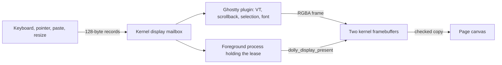

# Display

One canvas has two producers: the resident Ghostty terminal and, while it holds a
lease, one foreground graphics process. Terminal parsing, rasterization and
application input handling stay in Wasm; the browser only checks and blits RGBA
frames and forwards bounded input records
([`host/display/dolly-display-0.wat`](../host/display/dolly-display-0.wat),
[`host/display.mjs`](../host/display/display.mjs)).

## Terminal

- Ghostty is the only resident kernel plugin, so terminal state survives
  foreground replacement. Its closed contract
  ([`dolly-kernel-plugin-0.wat`](../abi/dolly-kernel-plugin-0.wat)) is built only
  by `cc --dolly-kernel-plugin -shared`; ordinary programs cannot target it.
- Trusted boot code copies the plugin bytes from WasmFS and links them to an
  explicit map of kernel exports ([`kernel-plugin.mjs`](../src/kernel-plugin.mjs)):
  no URLs, dependency loading or JavaScript evaluation.
- The driver ([`ghostty/display.c`](../src/ghostty/display.c)) renders
  libghostty-vt's grid with IosevkaTerm SemiBold through stb_truetype. The
  supervisor coalesces redraws on a 16 ms tick.
- Ghostty owns selection and copy text; Ctrl+Shift+C writes the clipboard only
  after that user gesture. Wheel deltas and scrollback stay in Wasm.
- Before the plugin loads, and in images without a display, output goes to a
  plain-text bootstrap log.

## Graphics processes

[`host/display/display.h`](../host/display/display.h) exposes these operations over
`dolly_process_0.call`:

| Operation | Purpose |
| --- | --- |
| `dolly_display_acquire` | Foreground lease, generation and geometry |
| `dolly_display_set_size` | Logical framebuffer size |
| `dolly_display_begin_frame` | Private writable buffer and stride |
| `dolly_display_present` | Copy and publish a complete frame |
| `dolly_display_wait_frame` | Wait for the browser's animation frame |
| `dolly_display_set_cursor` | Closed cursor values, including click-gated capture |
| `dolly_display_next_event` | Next input record or timeout |
| `dolly_display_release` | Return the canvas to the terminal |

- Frames are top-down non-premultiplied RGBA8. The kernel checks size, stride,
  generation and length before publishing; the browser checks again.
- Only the foreground process or a descendant can acquire the lease. Exit, trap
  or forced termination releases it, and Ghostty redraws its retained grid;
  stale input is drained so it cannot reach the recovery prompt.
- Pointer capture needs a user click on the canvas; Escape or release undoes it.
  Records carry buttons, hover, relative motion, pointer enter/leave and window
  focus.
- `dolly_display_wait_frame` waits for the page's next animation frame, a
  counter the page advances only while a graphics lease is active and the tab
  is drawn. It is not a clock: the page may advance it faster than the
  program presents, and not at all in a hidden tab. Pace a simulation with
  `clock_gettime(CLOCK_MONOTONIC)` and use the frame only to avoid drawing
  more often than the page shows.

Every input record ([`dolly_input_event`](../host/display/display.h)) has the same
fields; a type uses the ones listed and leaves the rest zero. `data` holds
`key`, `code` and `text` back to back as UTF-8 without terminators, with their
byte lengths in `key_length`, `code_length` and `text_length` (88 bytes in all).

| Type | Fields |
| --- | --- |
| `KEY` | `action` release 0, press 1, repeat 2; `modifiers` (`DOLLY_INPUT_MOD_*`); `flags` bit 0 while composing; `key` and `code` as in a browser `KeyboardEvent` |
| `TEXT` | `text`: typed, composed or pasted text, split at 88 bytes on character boundaries |
| `RESIZE` | `width_css_px`, `height_css_px`, `device_scale_milli`, `font_size_milli` |
| `FOCUS` | `action` 1 focused, 0 not |
| `POINTER` | `action` release 0, press 1, drag 2; `modifiers`; button number (0 to 4) in `flags >> 8`; position in framebuffer pixels in `width_css_px` (x) and `height_css_px` (y) |
| `POINTER_MOTION` | while captured: signed deltas in thousandths of a CSS pixel in `width_css_px` (x) and `height_css_px` (y), each within ±32,768,000 |
| `POINTER_CAPTURE`, `POINTER_PRESENCE` | `action` 1 captured or inside, 0 not |
| `SCROLL` | `action`: signed delta in thousandths of a terminal row |
- There is no compositor, DOM or WebGL access; GPU programs use
  [`gpu@0`](gpu.md).

## Zig and the Ghostty build

- `zig-build` ([`Dollyfile-zig-build`](../Dollyfile-zig-build),
  [`Dollyfile-zig-build`](../Dollyfile-zig-build)) builds Zig 0.16 from its source archive with
  Dolly `cc`, as upstream `bootstrap.c` does with two substitutions. WAMR, built
  by `cc` ([`zig1.c`](../src/zig/zig1.c)), interprets upstream `zig1.wasm`
  because wasm2c's translation overflows a browser Worker's native stack. zig1
  emits zig2 as C with only the C backend ([`config.zig`](../src/zig/config.zig)),
  which `cc` compiles to `/usr/bin/zig`.
- `ghostty-build` ([`Dollyfile-ghostty-build`](../Dollyfile-ghostty-build),
  [`Dollyfile-ghostty-build`](../Dollyfile-ghostty-build)) has that Zig emit Ghostty VT and
  compiler_rt as C, compiles them with `cc` and links `/usr/lib/libdisplay.so`.
  `system` copies only that plugin, the font and licenses.
- This Zig has no LLVM: it emits only C, so there is no `zig build` or `zig cc`.
  Host preparation only patches the pinned tree for Emscripten's wasm64 layouts
  and WasmFS ([`zig-0.16.0-dolly-native.patch`](../patches/zig-0.16.0-dolly-native.patch));
  the SDK files are listed in [`zig-sdk-files.txt`](../config/zig-sdk-files.txt).
- Ghostty's generated option and Unicode tables are pinned source inputs
  ([`src/ghostty/generated/`](../src/ghostty/generated/README.md));
  [`ghostty-dolly.patch`](../config/ghostty-dolly.patch) zeroes page-pool buffers.
