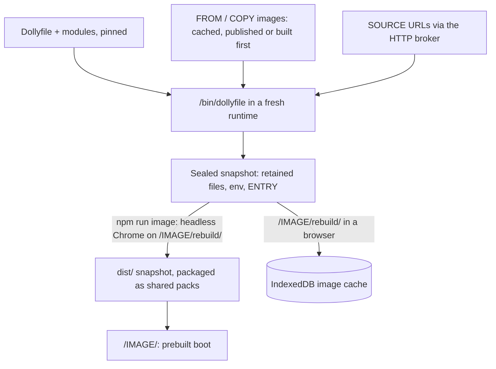

# Dollyfile 5

A Dollyfile is an ordered recipe that `/bin/dollyfile`
([`dollyfile.c`](../src/dollyfile.c)) executes inside Wasm to build an image.
An image recipe (`/Dollyfile` for `default`, otherwise `/Dollyfile-NAME`) ends
with its ENTRY program; a module (`/modules/NAME.dm`) is a reusable group of
steps. Steps share one filesystem and environment and run in order.

```text
DOLLY 5
IMAGE example

FROM https://daugasauron.com/Dollyfile-system <sha256>

FILE /tmp/example.c
    #include <stdio.h>
    int main(void) { puts("hello"); }
SLOP cc /tmp/example.c -o /usr/bin/example
EXPORTS TOOL example

ENTRY /bin/foreground -i /bin/slop
```

Recipes name every image, module and file they read by full URL with its
SHA-256. Catalog recipes and their prepared sources are published flat on one
canonical origin, `https://daugasauron.com`: `/Dollyfile-NAME`,
`/modules/NAME.dm`, `/static/…` and `/include/dolly/…`. In the checkout, core
recipes sit at the top level and in `modules/`, demo recipes in `demos/DEMO/`
([`recipe-files.mjs`](../scripts/recipe-files.mjs)).

## Text

- UTF-8, at most 128 KiB, no NUL. Lines end at LF, CRLF or CR.
- A `#` that starts an unquoted, unescaped word begins a comment to end of line.
- After comments and trailing blanks are removed, a trailing `\` joins the next
  physical line with one space. An empty or comment-only line ends the
  continuation; a continuation on the last line is an error. Joined lines are at
  most 64 KiB.
- Words split on ASCII whitespace. `'…'` is literal. Inside `"…"`, `\` escapes
  only `$`, `` ` ``, `"` and `\`. Elsewhere `\` escapes the next character.
  Unclosed quotes are errors. Values are literal: expansion happens only inside
  `SLOP`.
- The first declaration is `DOLLY 5`, the second `IMAGE name` or `MODULE name`.
- `FILE /path` may be followed by a body: the following lines that start with
  four spaces, which are removed; each line ends with LF. A blank body line needs
  the four spaces; tabs do not count. Body text is literal.

## Declarations

| Declaration | Meaning |
| --- | --- |
| `DOLLY 5` | Language version. |
| `IMAGE name` | `[a-z][a-z0-9-]*`, at most 32 bytes. |
| `MODULE name` | At most 64 bytes; its URL names the file `name.dm`. |
| `FROM URL SHA256` | Image only, first operation: start from that completed image. |
| `COPY FROM URL SHA256 SOURCE DESTINATION` | Copy a retained file or tree out of a completed image. |
| `USE URL SHA256` | Run the module here. |
| `SOURCE URL SHA256 DESTINATION` | Download a file. |
| `SLOP [CWD /directory] command…` | Run a Slop command; failure stops the build. |
| `FILE /path` | Write the body, if any, and retain the file. |
| `FOLDER /path` | Retain the directory and its members. |
| `EXPORTS TYPE name …` | Offer an object when the recipe finishes. |
| `REQUIRES TYPE name` | Assert that an object is available here. |
| `REQUIRES HOST name@abi` | The image needs this host module to run. |
| `ENTRY /program [argument…]` | Image only, last declaration: the program the image runs. |

- Paths are absolute and normalized: no trailing `/`, `//`, `.`, `..`,
  backslash, CR or LF; under 4096 bytes. Only `COPY` paths and `SLOP CWD` may be
  `/`.
- URLs are absolute `http(s)://` with a host, no fragment and no whitespace or
  `\`. `FROM` and `COPY` URLs name `Dollyfile` or `Dollyfile-name` and `USE`
  URLs `name.dm`, with no query.
- `SHA256` is 64 lowercase hex digits of the exact referenced bytes.
  `node scripts/update-module-pins.mjs` refreshes USE/FROM/COPY pins
  (`--sources` also the pins of prepared canonical sources).
- Pins stay inline and cascade: each pin covers everything the referenced
  recipe pins, so a change anywhere changes the hash of every recipe that
  depends on it and rebuilds those images. That is intended: every image is
  completely replicable from its recipe chain.
- Never retained: `/tmp`, `/workspace`, `/home/dolly/.pi/agent/auth.json`,
  `/home/dolly/.pi/agent/sessions`. `FILE` may write scratch under `/tmp/`;
  `FOLDER`, exports and `COPY` destinations may not. This is not a secret scanner.

## Execution

- `SLOP` runs `/bin/slop -e -c COMMAND` in `/` or `CWD`, stdin `/dev/null`,
  keeping the command's quoting. Each `SLOP` is a new shell: use `SLOP CWD` and
  `EXPORTS ENV` instead of `cd` and assignments.
- `USE` checks the pin and runs the module in the same filesystem and
  environment, again on every use. Failures name the recipe and line. Nesting is
  at most 16 recipes including the image; cycles are errors.
- `FROM` restores the image's retained files, environment and exports, not its
  ENTRY. `COPY FROM` merges directories, replaces files and fails on a missing
  source; it imports no environment, exports or host requirements. Imported
  images are earlier builds of at most 2 GiB; an image cannot share a name with
  one it imports.
- `SOURCE` downloads through the HTTP broker, creates parent directories and
  replaces `DESTINATION` only after the digest matches. Downloads are not
  retained by themselves.
- Where bytes come from never changes a recipe or its identity; pins cover
  content. The page serves its own copy of every file its release publishes on
  the canonical origin (a mirror), so `npm run serve`, the test server and image
  builds build an unpublished checkout from its own files. The page grants
  exactly those files to builds ([HTTP](http.md)); other URLs are external and
  pass only if the embedding's HTTP policy allows them. A recipe never grants
  itself network access. Upstream hosts often send no CORS headers, so upstream
  archives are staged and published on the canonical origin
  ([sources](sources.md#pins-and-identity)).
- `EXPORTS ENV NAME VALUE` sets the variable now; `EXPORTS ENV NAME APPEND VALUE`
  appends `:VALUE` (or sets it when empty); `EXPORTS ENV NAME` keeps the current
  value, which must be set at the end. Final values are stored in the image.

## Exports, assertions and retention

| Export | Object |
| --- | --- |
| `EXPORTS TOOL name [SHA256]` | The command `name` on `PATH` when the recipe finishes; the digest checks its bytes. |
| `EXPORTS FILE name /path`, `EXPORTS LIB name /path` | A regular file. |
| `EXPORTS FOLDER name /path` | A directory and its members. |
| `EXPORTS HEADER name /path` | A file or directory. |
| `EXPORTS ENV NAME [[APPEND] VALUE]` | An environment variable. |

- ENV names match `[A-Za-z_][A-Za-z0-9_]*`; other names match
  `[A-Za-z][A-Za-z0-9._+-]*` or are `[`; at most 128 bytes.
- Objects are captured when their recipe finishes, so an export may precede its
  files; a repeated export replaces the earlier one. A module's exports are
  visible to its caller's later steps. An image retains its own exports and those
  of modules it uses directly; a module passes on a child's object by exporting it.
- `REQUIRES TOOL` checks `PATH`, `REQUIRES ENV` the environment, other types an
  earlier visible export of that kind.
- The image keeps only `FILE` and `FOLDER` paths, exported objects, `FROM` and
  `COPY` results, and its recipes. Scratch needs no cleanup. ENTRY and its target
  must be retained regular files; ENTRY has at most 256 words of at most 4096
  bytes and a record of at most 64 KiB.

## Host requirements

- `name@abi`: a module name of at most 31 bytes (`[a-z][a-z0-9-]*`) and a
  revision 0–65535. At most 64 per image, one revision each.
- `REQUIRES HOST` may appear in images and modules and propagates through `FROM`
  and `USE`, not `COPY`. The artifact records them; boot checks them before ENTRY
  and fails with the module's name.
- Requirements grant nothing: the embedding enables modules and the HTTP broker
  decides network access ([browser boundary](browser-boundary.md)). `system`
  declares display, http, download, upload and snapshot.
- Linked client libraries (`-ldolly-gpu`, `-ldolly-audio`) also stamp their
  module and its ABI digest into the executable's `dolly.host` section; loading
  fails for an unknown module or a different layout. Calling a disabled module
  returns `ENOSYS`.
- `-pthread` programs need `REQUIRES HOST threads@0`
  ([process model](process-model.md#threads-dsos-and-ffi)).
- Build hosts supply their own modules: compiling a GPU program needs no GPU,
  running one during the build does.

## Entry and startup

The browser runs the retained ENTRY once. Frontends enter
`/bin/foreground -i /bin/slop /etc/dolly/init.slop`, which starts the program and
then a recovery shell; reusable images enter `/bin/foreground -i /bin/slop`.

## Building



- A root build (no `FROM`) loads the compiler seed and compiles Slop and
  `/bin/dollyfile` first ([`bootstrap.c`](../src/process/bootstrap.c)); other
  builds restore their base image.
- Images, not modules, are cached. A cache identity is the image build ID, the
  root recipe hash and the snapshot digests of its direct `FROM`/`COPY` images.
  The browser uses a verified local artifact, then a published one, and otherwise
  builds the missing dependency in a disposable runtime first.
- Modules are never cached by their declared outputs: arbitrary reads,
  overwrites and deletions make that insufficient. Unpinned downloads inside a
  `SLOP` command are not made reproducible by the cache.
- `COPY FROM` a build-only image is the multi-stage mechanism: toolchains stay
  in images that are only built, shipped images copy exact outputs, and the
  consumer keeps the builder's recipe chain in `/etc/dolly/recipes` as
  provenance. There is no catalog-wide solver.
- Images without `display@0` only build: their route shows the log and never
  runs ENTRY.
- Published images share content-addressed compressed packs of identical file
  records, deduplicating distribution without layer mounts in WasmFS; the
  browser rebuilds and verifies each exact snapshot before restoring.
- `npm run image -- IMAGE` stages local sources, refreshes canonical source and
  recipe pins and builds with the existing runtime; `--plan` only shows what
  would rebuild. External source pins are never refreshed automatically.
- `npm run lint:dollyfiles` checks every catalog graph (pins, names, USE depth,
  host requirements) without running anything. Catalog images are named after
  their file.

## Custom images and Studio

`/custom/` builds a pasted or uploaded recipe in a fresh sandbox; its FROM, COPY
and USE URLs must name images and modules the release publishes on the canonical
origin, which include every module. Dollyfile Studio adds Pi,
Neovim linting and `dollyfile-build FILE` ([Studio builds](image-build-service.md)).
Custom images can be saved as [sessions](sessions.md).
