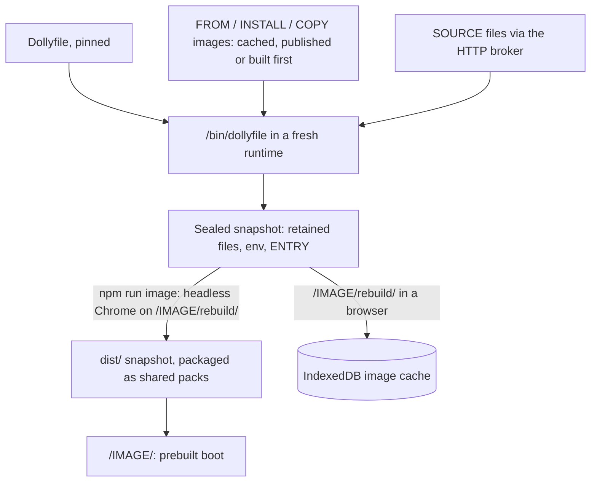

# Dollyfile 7

A Dollyfile is an ordered recipe that `/bin/dollyfile`
([`dollyfile.c`](../src/dollyfile.c)) executes inside Wasm to build an image.
A recipe declares its role on its second line: an `APPLICATION` that people
open, a `TOOLCHAIN` that other recipes build on, or a `PACKAGE` that recipes
and sessions install. Steps share one filesystem and environment and run in
order.

```text
DOLLY 7
APPLICATION example
REQUIRES HOST runtime@0
REQUIRES HOST display@0
REQUIRES HOST input@0

FROM /vX.Y.Z/Dollyfile-system <sha256>
INSTALL /vX.Y.Z/demos/javascript/Dollyfile-javascript <sha256>

FILE /tmp/example.c
    #include <stdio.h>
    int main(void) { puts("hello"); }
SLOP cc /tmp/example.c -o /usr/bin/example
EXPORTS TOOL example

ENTRY /bin/foreground -i /bin/slop
```

Recipes name every image and file they read with its SHA-256. A file the
site publishes is a site path, `/vX.Y.Z/PATH`: the site's version
([`version.mjs`](../src/version.mjs), `package.json`), then the file's
checkout path. Core recipes are at the top level, demo recipes in
`demos/DEMO/` ([`recipe-files.mjs`](../scripts/recipe-files.mjs)), headers in
`include/dolly/` and `host/MODULE/`, prepared sources in `dist/static/`. No
recipe names a host: a page serves its own version's files wherever it is
mounted, and reads no other version's.

## Text

- UTF-8, at most 128 KiB, no NUL. Lines end at LF, CRLF or CR.
- A `#` that starts an unquoted, unescaped word begins a comment to end of line.
- After comments and trailing blanks are removed, a trailing `\` joins the next
  physical line with one space. An empty or comment-only line ends the
  continuation; a continuation on the last line is an error. Joined lines are at
  most 64 KiB.
- Words split on ASCII whitespace. `'…'` is literal. Inside `"…"`, `\` escapes
  only `$`, `` ` ``, `"` and `\`. Elsewhere `\` escapes the next character.
  Unclosed quotes are errors. Values are literal: expansion happens only inside
  `SLOP`.
- The first declaration is `DOLLY 7`, the second the role and name.
- `FILE /path` may be followed by a body: the following lines that start with
  four spaces, which are removed; each line ends with LF. A blank body line needs
  the four spaces; tabs do not count. Body text is literal.

## Roles and names

| Role | Opened by | Imported by | ENTRY | Keeps |
| --- | --- | --- | --- | --- |
| `APPLICATION name` | people, at `/name/` | `FROM` | required, last | its base and everything it declares |
| `TOOLCHAIN name` | people, when it has ENTRY | `FROM` | optional, last | its base and everything it declares |
| `PACKAGE name` | nobody | `INSTALL` | none | only what it declares |

- `COPY` takes files out of an image of any role.
- Names match `[a-z][a-z0-9]*(-[a-z0-9]+|\.[0-9]+)*` and are at most 32 bytes: a
  dot starts a run of version digits (`qwen3.5-4b`, `python3.14`), so a
  documentation copy such as `Dollyfile-example.txt` is never a recipe.
- A recipe is the file `Dollyfile-NAME` (`Dollyfile` for `default`); the site
  path that imports it must name that file.
- Catalog convention: applications and packages take the product's name
  (`pi`, `ripgrep`, `python`); toolchains are `family-variant`
  (`rust-sdk`, `cmake-build`, `pi-runtime`); versions go in the family
  (`qwen3.5-4b`). When an application already has the product's name, the
  package takes another name the project uses (`nvim`, `pi-coding-agent`,
  `codex-cli`). The
  start page lists images by role, toolchains grouped by their directory.
- `/etc/dolly/recipes/` retains every recipe an image was built from, by file
  name; `/etc/dolly/Dollyfile` is the image's own.

## Declarations

| Declaration | Meaning |
| --- | --- |
| `DOLLY 7` | Language version. |
| `APPLICATION name`, `TOOLCHAIN name`, `PACKAGE name` | Role and name. |
| `REQUIRES HOST name@abi` | The image uses this host module when it runs. |
| `FROM RECIPE SHA256` | First operation: start from a completed application or toolchain. |
| `INSTALL RECIPE SHA256` | Import a completed package: its files, exports and environment. |
| `COPY RECIPE SHA256 SOURCE DESTINATION` | Copy a retained file or tree out of a completed image. |
| `SOURCE LOCATION SHA256 DESTINATION` | Download a file. |
| `RUN [CWD /directory] /program [word…]` | Run a program; failure stops the build. |
| `SLOP [CWD /directory] command…` | `RUN /bin/slop -e -c command`. |
| `FILE /path` | Write the body, if any, and retain the file. |
| `FOLDER /path` | Retain the directory and the members it has at this row. |
| `EXPORTS TYPE name …` | Offer an object when the recipe finishes. |
| `REQUIRES TYPE name` | Assert that an object is available here. |
| `ENTRY /program [word…]` | Last declaration: the program the image runs when opened. |

- Paths are absolute and normalized: no trailing `/`, `//`, `.`, `..`,
  backslash, CR or LF; under 4096 bytes. Only `COPY` paths and `CWD` may be
  `/`.
- A site path is `/vX.Y.Z/` (three decimal numbers) and a normalized path, with
  no query, fragment, whitespace or `\`. `RECIPE` is a site path that names
  `Dollyfile` or `Dollyfile-name`. `LOCATION` is a site path, or a file of
  another site: an absolute `http(s)://` URL with a host, no fragment and no
  whitespace or `\`.
- `SHA256` is 64 lowercase hex digits of the exact referenced bytes.
  `node scripts/update-recipe-pins.mjs` writes the site's version into every
  site path and refreshes recipe pins (`--sources` also the pins of the
  site's prepared sources). A version change therefore rewrites every recipe
  and rebuilds every image once.
- Pins stay inline and cascade: each pin covers everything the referenced
  recipe pins, so a change anywhere changes the hash of every recipe that
  depends on it and rebuilds those images. That is intended: every image is
  completely replicable from its recipe chain.
- Never retained: `/tmp` and `/workspace`. `FILE` may write scratch under
  `/tmp/`; `FOLDER`, exports and `COPY` destinations may not. Retention is
  explicit, so a recipe keeps credentials or sessions only by naming them.

## Execution

- `RUN` spawns the program with the following words as its arguments, in `/`
  or `CWD`, with stdin `/dev/null`: no shell and no expansion. The words follow
  the ENTRY limits. The program must exist by then: a root build has only the
  seed compiler, `/usr/libexec/dolly/process-bin/compiler
  --dolly-toolchain-mode=c`, until it compiles Slop and the compiler front ends
  ([`Dollyfile-system-build`](../Dollyfile-system-build)).
- `SLOP` runs `/bin/slop -e -c COMMAND`, keeping the command's quoting. Each
  `SLOP` is a new shell: use `CWD` and `EXPORTS ENV` instead of `cd` and
  assignments. A `SLOP` step before the recipe has `/bin/slop` fails, naming
  the line; the language defines the dependency, so `REQUIRES TOOL slop` is an
  error.
- `FROM` restores the image's retained files, environment and exports, not its
  ENTRY or host requirements. An application or toolchain keeps all of it. A
  package keeps none of it: the base is only the environment the package is
  built in. The build runs the base's `/bin/dollyfile`.
- A recipe without `FROM` starts from nothing and keeps only what it installs
  and declares: `default` is `core`, `posix`, `display`, `curl`, `amy`, its
  start-up script and an ENTRY, with no compiler. It opens, and `amy` installs
  into it, but it is not a base to compile on: `FROM` a toolchain for that.
- `INSTALL` restores a package's retained files, applies and exports its
  environment and exports its objects. It may appear anywhere and names only a
  package. It imports the package's contents, not the files that describe the
  package image (`/etc/dolly/Dollyfile`, `artifact`, `environment`, `image`,
  `image.manifest`, `recipes.lock`). The package's `REQUIRES HOST` lines must
  all be declared by the installing recipe, or the row fails naming the missing
  line before it changes a file. A package built from another release of the
  same recipe fails the install: an image carries one pin per recipe.
- `INSTALL` records its row in `/etc/dolly/installed`, after the rows of the
  packages the package itself installed: the record lists the packages an
  image or session holds.
- `COPY` merges directories, replaces files and fails on a missing source; it
  imports no environment, exports or host requirements. Imported images are
  earlier builds of at most 2 GiB; an image cannot share a name with one it
  imports.
- `SOURCE` downloads through the HTTP broker, creates parent directories and
  replaces `DESTINATION` only after the digest matches. Downloads are not
  retained by themselves.
- Where bytes come from never changes a recipe or its identity; pins cover
  content. A site path names the page's own copy of a file its release
  publishes, so the domain, a site under a path prefix, `npm run serve`, the
  test server and image builds all build from their own files, an unpublished
  checkout included. The page grants exactly those files to builds
  ([HTTP](http.md)) and refuses a path of another version, naming both
  versions; URLs are external and pass only if the embedding's HTTP policy
  allows them. A recipe never grants itself network access. Upstream hosts
  often send no CORS headers, so upstream archives are staged and published
  by the site ([sources](sources.md#pins-and-identity)).
- `EXPORTS ENV NAME VALUE` sets the variable now; `EXPORTS ENV NAME APPEND VALUE`
  appends `:VALUE` (or sets it when empty). Final values are stored in the image.

## Exports, assertions and retention

| Export | Object |
| --- | --- |
| `EXPORTS TOOL name` | The command `name` on `PATH` when the recipe finishes. |
| `EXPORTS FILE name /path`, `EXPORTS LIB name /path` | A regular file. |
| `EXPORTS FOLDER name /path` | A directory and its members. |
| `EXPORTS HEADER name /path` | A file or directory. |
| `EXPORTS ENV NAME [APPEND] VALUE` | An environment variable. |

- ENV names match `[A-Za-z_][A-Za-z0-9_]*`; other names match
  `[A-Za-z][A-Za-z0-9._+-]*` or are `[`; at most 128 bytes.
- Objects are captured when their recipe finishes, so an export may precede its
  files; a repeated export of the same type and name replaces the earlier one,
  and a recipe's own exports win over imported ones wherever they appear.
- An image exports its own objects plus those of the packages it installs and,
  unless it is a package, those of its base. It retains every object it exports.
- `REQUIRES TOOL` checks `PATH`, `REQUIRES ENV` the environment, other types an
  earlier visible export of that kind: the recipe's own, a package's or the
  base's.
- The image keeps only `FILE` and `FOLDER` paths, exported objects, `FROM`,
  `INSTALL` and `COPY` results, and its recipes. Scratch needs no cleanup. ENTRY
  and RUN have at most 256 words of at most 4096 bytes and a record of at most
  64 KiB.

## Host requirements

- `REQUIRES HOST name@abi` describes running the image: a module name of at
  most 31 bytes (`[a-z][a-z0-9-]*`) and a revision 0–65535, at most 64 per
  image, one revision each. They follow the role line, before every other
  declaration, as the image's manifest.
- They are never inherited: `FROM`, `INSTALL` and `COPY` carry none into the
  consumer and nothing is derived. The image's own recipe is the complete list.
  Every image and package declares the runtime it is built on (`runtime@0`:
  the kernel, the process ABI and the image format,
  [host modules](../host/README.md)). A package also declares the modules its
  programs need, a library or compiler those every program built with it needs
  (`sdl2`: `display@0` and `input@0`, `rust`: `threads@0`, `cc`: none);
  `INSTALL` checks that the installing recipe declares them too.
- Sealing checks every retained executable: a `dolly.host` record naming a
  module the recipe does not declare fails the build, naming the file and the
  `REQUIRES HOST` line to add. Build steps may use the build host's modules
  and the recipe's declared ones; calls to a declared module the build host
  does not enable return `ENOSYS`.
- At run time the image may use only its declared modules: boot fails if the
  embedding lacks one, and the loader refuses an executable whose stamped
  module is not declared. Requirements grant nothing: the embedding enables
  modules and the HTTP broker decides network access
  ([browser boundary](browser-boundary.md)). `system` declares the runtime,
  display, input, http, download, upload and snapshot; `default` adds packages,
  threads and dso, because the packages people install into it need them
  (`python` and `nvim` load modules); a declared module costs a program that
  does not record it nothing. A terminal draws with `display@0` and reads keys
  with `input@0`; the `display` package asks only for the first, so an image
  may show one without reading.
- Linked client libraries (`-ldolly-gpu`, `-ldolly-audio`) stamp their module
  and its ABI digest into the executable's `dolly.host` section; loading fails
  for an unknown module or a different layout. Calling a disabled module
  returns `ENOSYS`. `-pthread` programs need `REQUIRES HOST threads@0`,
  `-rdynamic` programs and FFI callers `dso@0`
  ([process model](process-model.md#threads-dsos-and-ffi)), programs linked
  with `-ldolly-sockets` `sockets@0`
  ([local sockets](process-model.md#local-sockets)).

## Entry and startup

The browser runs the retained ENTRY once, and only an image with ENTRY and
`display@0` can be opened. Applications enter
`/bin/foreground -i /bin/slop /etc/dolly/init.slop`, which starts the program
and then a recovery shell; toolchains that can be opened enter
`/bin/foreground -i /bin/slop`. The image ends when its ENTRY process does:
the page keeps the last frame, says how the process ended (status, signal or
failure) and offers a reload.

Sealing fails unless the image holds what ENTRY names, with the declaration
to add: ENTRY's program and the program `/bin/foreground [-i]` starts must be
retained regular files (`EXPORTS TOOL name` for a command on `PATH`), and so
must every other word naming a file or directory that exists when the recipe
finishes, link targets included. A word that names nothing then is an
argument the engine does not judge; `/tmp` and `/workspace` start empty.

## Packages and amy

A package is the unit of reuse: a lean image that holds only the files,
exports and environment it declares, built in a toolchain (`FROM`) or from
nothing, and installed by recipes and sessions with the same row.

Software is a package when a session would install it (`amy install cmake`)
or more than one image uses it. An application, or a toolchain people open,
is then a base, `INSTALL` rows and its own entry and configuration
(`codex`, `neovim`, `rust-tools`); a toolchain remains where software is
built. The same `COPY` rows in two recipes are a missing package. The core
is packaged the same way: `core` (Slop and its commands), `cc` (the C/C++
toolchain) and `amy` (with the engine it runs) are kept from the toolchains
that build them.

```text
DOLLY 7
PACKAGE ripgrep
REQUIRES HOST runtime@0
REQUIRES HOST threads@0

FROM /vX.Y.Z/demos/rust/Dollyfile-rust-build <sha256>
…
EXPORTS TOOL rg
```

- A recipe installs it with `INSTALL RECIPE SHA256`, anywhere.
- A package holds its build (`FROM` a toolchain, then steps: `zlib`,
  `ripgrep`, `sdl2`) or keeps the outputs of the toolchain that built them,
  with `FROM` and only `EXPORTS` (`cc`, `cmake`, `javascript`) or with `COPY`
  rows (`nvim`, `rust`, `codex-cli`), which leaves an expensive builder as it
  is.
- Packages install into standard paths (`/usr/bin`, `/usr/lib`, `/usr/share`)
  and set environment variables only for their own use: an installed value
  replaces the importer's. Installing composes no `PATH`: a command is in
  `/usr/bin`, as a launcher when its files live elsewhere (`rustc`).
- A command's manual page is one more retained file, which `man NAME` prints:
  `FILE /usr/share/man/cat1/NAME.1` for plain text (Dolly's own commands
  capture `NAME --help` there when they are built) or `man1/NAME.1` for a
  page as upstream ships it.
- The site publishes the package index at its root, `amy-index.txt`, which
  the start page links: one `NAME RECIPE SHA256 DESCRIPTION` line per package,
  the `INSTALL` row's operands and the sentence the start page shows.
  `scripts/generate-routes.mjs` writes it from the recipes and from the
  `` - `NAME`: … `` line of each README, the one description an image has
  (a recipe directive would put prose under the pin: editing a sentence would
  change the image's identity and rebuild what depends on it).
- `amy` ([`amy.c`](../src/commands/amy.c)) reads the index as the site path
  `/vX.Y.Z/amy-index.txt`, with the version it was built for, through the
  [HTTP broker](http.md#transport) and keeps no copy: the site's cache headers
  decide (Dolly's servers send `no-store`), and without the site `amy list`,
  `info` and `install` fail naming the index. `amy list` prints each name,
  whether the record holds it (the image's packages among them) and the
  description; `amy info NAME` adds the `INSTALL` row.
- `amy install NAME` executes that row in a running session: the page's
  `packages@0` service ([browser boundary](browser-boundary.md#host-modules))
  hands over the verified snapshot of that pin, and `dollyfile install RECIPE
  SHA256` restores the files, merges the exported variables into
  `/etc/dolly/environment` and records the row as a build does; `amy
  installed` prints the record. The check is the recipe's: a package whose
  host modules the booted image does not declare is refused by name. Looking
  a name up in the index is the only unpinned step. The index describes the
  site's newest release and the service serves the release the tab runs: a
  pin that release does not publish fails by name, asking for a reload, and
  installs nothing.
- `amy install` then says what it added (files, bytes and the commands now in
  `/bin` or `/usr/bin`) and keeps the list in `/etc/dolly/files/NAME`, one
  `SIZE PATH` line per file or link the snapshot holds outside `/etc/dolly`,
  Dolly's own record of an image. `amy files NAME` prints that list, or, for a
  package no session installed, reads it from the release's snapshot.
- Installed files are session files, within the 512 MiB a save holds. Exported
  variables apply when the session is next loaded; the current shell keeps its
  environment ([sessions](sessions.md)).

## Building



- A root build (no `FROM`) loads the compiler seed and compiles
  `/bin/dollyfile` first ([`bootstrap.c`](../src/process/bootstrap.c)); the
  recipe builds everything else, Slop included. Other builds restore their
  base image.
- Every image is cached. A cache identity is the image build ID, the recipe
  hash and the snapshot digests of its direct `FROM`, `INSTALL` and `COPY`
  images. The browser uses a verified local artifact, then a published one,
  and otherwise builds the missing dependency in a disposable runtime first.
  Unpinned downloads inside a `SLOP` command are not made reproducible by the
  cache.
- Multi-stage builds: toolchains stay in images that are only built, packages
  and applications keep exact outputs, and the consumer keeps the builder's
  recipe chain in `/etc/dolly/recipes` as provenance. There is no catalog-wide
  solver.
- Images without ENTRY only build: their route shows the log.
- Published images share content-addressed compressed packs of identical file
  records, deduplicating distribution without layer mounts in WasmFS; the
  browser rebuilds and verifies each exact snapshot before restoring.
- `npm run image -- IMAGE` stages local sources, refreshes the pins of the
  site's sources and recipes and builds with the existing runtime; `--plan` only shows what
  would rebuild. External source pins are never refreshed automatically.
- Images whose dependencies are complete build concurrently, one headless Chrome
  each; `DOLLY_IMAGE_JOBS` overrides the count chosen from available memory.
  Each build's log is in `build/image-logs/IMAGE.log`; a failed image skips
  only its dependents and fails the command.
- `npm run lint:dollyfiles` checks every catalog graph (references, pins,
  names, roles, host requirements, and that a recipe of the chain declares
  ENTRY's programs) without running anything. A catalog recipe names the
  site's files by this version's site paths: another version's path and a
  URL of the public site are refused.

## Custom images and Studio

`/custom/` builds a pasted or uploaded recipe in a fresh sandbox; its site
paths must name files this release publishes, and one of another version is
refused before anything is built. Dollyfile Studio adds Pi, Neovim linting and
`dollyfile-build FILE` ([Studio builds](image-build-service.md)). Custom
images can be saved as [sessions](sessions.md).
