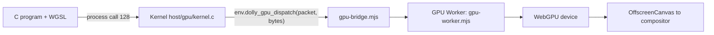

# GPU

`gpu@0` is an experimental extension for bounded WebGPU command packets. Programs
keep their single `dolly_process_0.call` import; operation 128 selects the GPU
extension, so the base process ABI and its digest are unchanged and older
kernels return `ENOSYS`. It is a small C client, not `webgpu.h`, OpenGL or Vulkan.

- Contract and packet layouts: [`host/gpu/dolly-gpu-0.wat`](../host/gpu/dolly-gpu-0.wat); C
  and JavaScript constants are generated from it. Client: [`host/gpu/gpu.h`](../host/gpu/gpu.h),
  [`host/gpu/client.c`](../host/gpu/client.c), in the seed as `libdolly-gpu.a`, which `cc` links
  by default.
- The kernel ([`host/gpu/kernel.c`](../host/gpu/kernel.c)) ties each scope to a process
  and revokes it on exit, abort or forced termination.
- The provider copies each packet before acknowledging it and validates structure
  before executing; WebGPU validates WGSL and pipelines. Accepted batches are not
  transactions: never replay one after an error.
- Quotas: 8 scopes with one pending request each, 1 MiB packets of at most 1,024
  records (clients check `CAPABILITIES` before exceeding 256), 128 KiB shaders,
  4,096 objects per scope, 1 GiB per buffer, 4 GiB of buffers and textures in
  total, 16 bindings. Released handles are invalid at once; their allocation
  stays charged until the GPU finishes.
- `CAPABILITIES` returns a fixed 128-byte record of feature bits and
  device-clamped limits: frame capture (16), BGRA surfaces (32), textured
  rendering (64), large batches (128), BC textures (256), f16 vertices (512).
- Normal frames go to the compositor without readback. Explicit readback returns
  at most 64 KiB per call; `CAPTURE_FRAME` copies the caller's own surface
  rectangle into its buffer.
- No packet names a URL, DOM node, host pointer or native process. Shader time and
  driver memory are not bounded; device loss depends on the browser. A failed
  GPU Worker wakes pending calls with `EIO`.
