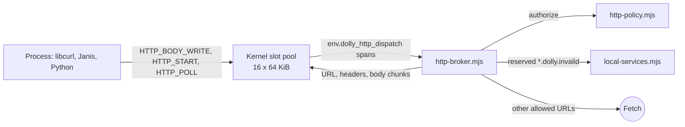

# HTTP

`env.dolly_http_dispatch` is Dolly's only agent-selected network edge. Programs
never import Fetch, sockets, DNS or TLS; libcurl, Git, Python and Janis all sit
above one kernel slot pool and one browser broker whose policy the embedding
sets. Authority is summarized in the [browser boundary](browser-boundary.md).



## Transport

- Contract: [`dolly-http-0.wat`](../abi/dolly-http-0.wat); kernel side in
  [`dolly.c`](../src/dolly.c); browser side in
  [`host/http.mjs`](../src/host/http.mjs) and [`http-broker.mjs`](../src/http-broker.mjs).
- The import passes span descriptors only. The broker checks them against fixed
  caps before copying: method 32 B, URL 8 KiB, headers 64 KiB, body 8 MiB.
  Metadata is literal UTF-8 without NUL.
- URLs must be absolute `http:` or `https:`; nothing resolves against the page.
- A private host acknowledgement admits one request at a time; transfers then run
  concurrently in 16 fixed slots. A handle encodes slot and generation, so stale
  handles never touch a successor. `EBUSY` means the slot is occupied.
- Terminal errors are target errnos: `EACCES` policy, `EDQUOT` quota, `E2BIG`
  size, `ETIMEDOUT` deadline (which includes guest backpressure), `ECANCELED`,
  `EIO` transport. Errors never echo URLs, headers or credentials, and cannot
  distinguish CORS, DNS, TLS or redirect failures.
- Process exit, signal termination and forced termination cancel only that
  process's requests.
- Processes stage request bodies in the kernel with `HTTP_BODY_WRITE` packets of
  at most 1 MiB before `HTTP_START`.

## Policy

Without a policy object (the public demo) the broker permits any HTTP(S) URL,
the app's own origin included, keeps caller credential headers, follows redirects
on request, and applies a 10-minute deadline, no request quota and no response
cap. **This does not prevent exfiltration.** Restricted embeddings set a policy
before `browser.mjs` loads; the broker consumes and deletes the global:

```js
globalThis.DOLLY_HTTP_POLICY = {
  maxRequests: 64,                       // default 256
  rules: [{
    origin: "https://openrouter.ai",     // exact origin
    path: "/api/v1/chat/completions",    // or pathPrefix, matched by whole segments
    methods: ["POST"],                   // default GET and HEAD
    credentialHeaders: ["authorization"],
    maxRequestBytes: 2 * 1024 * 1024,
    maxResponseBytes: 16 * 1024 * 1024,
    timeoutMilliseconds: 120_000,
  }],
};
```

- Credential headers not listed for the matched rule are removed. The broker
  never stores, injects or rewrites credentials; they are ordinary sandbox state.
- Explicit rules and bootstrap sources reject redirects: Fetch hides intermediate
  destinations. `DOLLY_HTTP_FOLLOW_REDIRECTS` works only under the default policy.
- Bootstrap sources (recipes and `SOURCE HOST` files) are exact credential-free
  GETs with pinned byte bounds; under an explicit policy each gets 4 requests.
- Fetch always uses `credentials: "omit"` and no referrer. The broker drops
  browser-owned headers such as `User-Agent` and `Accept-Encoding`, which also
  avoids engine-specific CORS preflights.

## CORS

Dolly cannot turn CORS off; `no-cors` gives unreadable responses. Prefer
endpoints that send CORS headers. Otherwise run a reviewed same-origin relay with
an exact upstream allowlist and limits; it is one more allowed destination and
widens authority accordingly. Never send credentials through a public CORS proxy.

## In-Wasm clients

- C: [`http.h`](../include/dolly/http.h) provides `dolly_http_start`, `_poll`,
  `_cancel` and the synchronous `dolly_http_perform`.
- libcurl: official curl 8.21 headers over
  [`libcurl-fetch.c`](../src/libcurl-fetch.c), linked with `-lcurl`. It covers
  easy and multi handles, header lists, common methods, read/write/header/debug
  callbacks, `HTTPAUTH` basic and info queries. `USERAGENT` and
  `ACCEPT_ENCODING` are accepted request metadata, not authority over those
  browser-owned headers. Fetch owns TLS, DNS, pooling, compression and redirects,
  so options such as proxies, cookies, certificates, disabling TLS verification
  and transfer timeouts return `CURLE_NOT_BUILT_IN`; unknown options return
  `CURLE_UNKNOWN_OPTION`. A relative URL fails with `CURLE_URL_MALFORMAT` and a
  disallowed redirect with `CURLE_COULDNT_CONNECT`.
- Git: upstream `git` and `git-remote-http(s)` link that libcurl
  ([`git.dm`](../modules/git.dm)): clone, fetch and push over HTTP. Clean/smudge
  filters are not ported.
- Janis `fetch()` polls slots cooperatively so timers and promises keep running.
