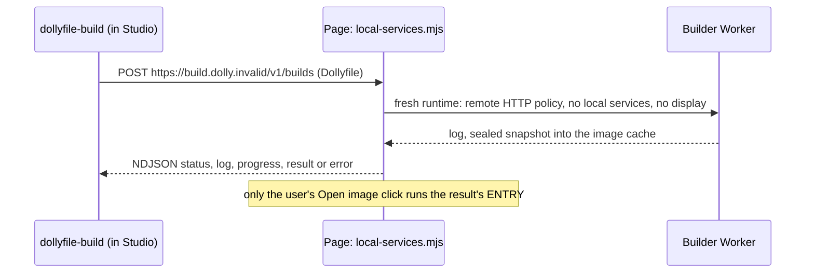

# Studio builds

An image whose recipe declares `REQUIRES HOST build@0` (only Dollyfile Studio)
can ask the page to build a Dollyfile in a separate, disposable Wasm userspace.
Page-initiated rebuilds never need `build@0`.



## Protocol

- `POST https://build.dolly.invalid/v1/builds` with a literal UTF-8 Dollyfile
  body of at most 128 KiB. No query, credentials, headers, redirects or other
  methods; the request goes through the ordinary [HTTP broker](http.md) and never
  reaches Fetch.
- The page admits it only when `build@0` is enabled and the image's ENTRY has
  started; otherwise it fails with `EACCES`. One build runs per page; `409` means
  busy, `400` an invalid recipe.
- The `application/x-ndjson` response carries one JSON object per line:

  ```text
  {"type":"status","text":"Building example in a separate sandbox…"}
  {"type":"log","text":"compiler output\n"}
  {"type":"progress","state":"building"}
  {"type":"result","image":"example","sha256":"…"}
  ```

  Success is a final `result` followed by the end of the stream; a terminal
  `{"type":"error","message":"…"}` or a stream without `result` is failure.
- Limits: 8 MiB of response, which also bounds output a caller never reads, and
  45 minutes. The progress event every 10 s keeps quiet builds observable without
  extending that deadline. Closing the page, cancelling the request, Ctrl+C or
  **Cancel** stops the build. Missing dependencies build first.

## Results

- The result is bound to the runtime, recipe, input digests and snapshot hash in
  the browser image cache (32 images, 8 GiB, least recently saved evicted).
  Keep the recipe: eviction means rebuilding.
- **Open image** launches `/custom/run/` in a new tab. It checks the cached
  bytes and inherits the parent's HTTP policy, intersected with its own: the
  smaller limits apply and request counters start fresh
  ([policy rules](browser-boundary.md#host-modules)). The URL alone is not a
  portable image link.
- Studio's own files, credentials and session stay separate from the build.

Code: [`host/build/build.mjs`](../host/build/build.mjs),
[`host/http/local-services.mjs`](../host/http/local-services.mjs),
[`host/build/service.mjs`](../host/build/service.mjs),
[`image-builder.mjs`](../src/image-builder.mjs); the recipe executor is
[`dollyfile.c`](../src/dollyfile.c).
