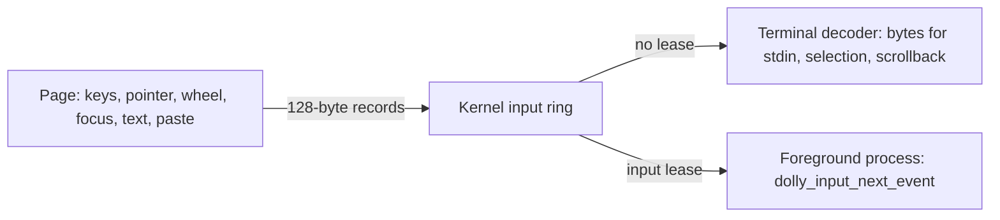

# Input

Keys, the pointer, the wheel, window focus, IME text and paste reach Wasm as
bounded records in one ring ([`host/input/dolly-input-0.wat`](../host/input/dolly-input-0.wat),
[`input.h`](../host/input/input.h), [`input.mjs`](../host/input/input.mjs)).
The page copies ordinary DOM event data; what a record means is decided in
Wasm. An image gets records only if it declares `REQUIRES HOST input@0`.

## Who reads the ring

- Without a lease the terminal does. Keys, text and paste go through the
  decoder that the display library registered
  ([display](display.md#terminal)) and become the bytes the foreground program
  reads from its terminal. Pointer and scroll records are the terminal's own:
  selection and scrollback, handled ahead of unread keys on the display's tick.
- `dolly_input_acquire` gives the foreground process or a descendant the
  lease, one at a time. It then reads every record with
  `dolly_input_next_event`, and the terminal reads none. The page sends it
  every button, pointer presence and a paste as text records.
- Release, exit or forced termination ends the lease; records the program had
  not read are dropped. So are the unread keys of a foreground program that
  ends without a lease, while the terminal keeps its pointer and scroll
  records.
- The display and input leases are independent
  ([graphics processes](display.md#graphics-processes)).
- Pointer lock: `dolly_input_set_pointer_relative` asks for relative motion.
  The page captures the pointer only on a user's press on the canvas while the
  lessee asks, and ends the capture on Escape, release or exit.

## The ring

- The ring in Wasm memory is the only queue of input; the page holds no
  record back. Pointer motion is a sample: relative deltas add up and the
  newest position wins. It is sent once per animation frame while half the ring
  is free, so it never takes a key's slot and a program that does not read
  delays it without losing it.
- Any other record needs a free slot. One that finds none is lost: the page
  counts it in `data-input-dropped` on `<html>`, says so in its status line
  and writes one `DROPPED` record into the slot it keeps for that, where the
  first lost record would have been. A program that reads it lets go of the
  keys and buttons it holds: a release may be among the lost.
- The page notifies the Worker of each record a reader waits on (all under a
  lease; keys, text, paste and focus for the terminal), so the reader resumes
  then, not at the next 16 ms tick.

## Images without one of the two

- `display@0` without `input@0`: the terminal shows output and reads no key,
  and a program that links the input client is refused before it runs.
- `input@0` without `display@0`: a program that takes the lease reads keys,
  text, focus and paste. There is no canvas, so no pointer records, and no
  decoder, so a terminal read returns nothing and unread records stay queued.
