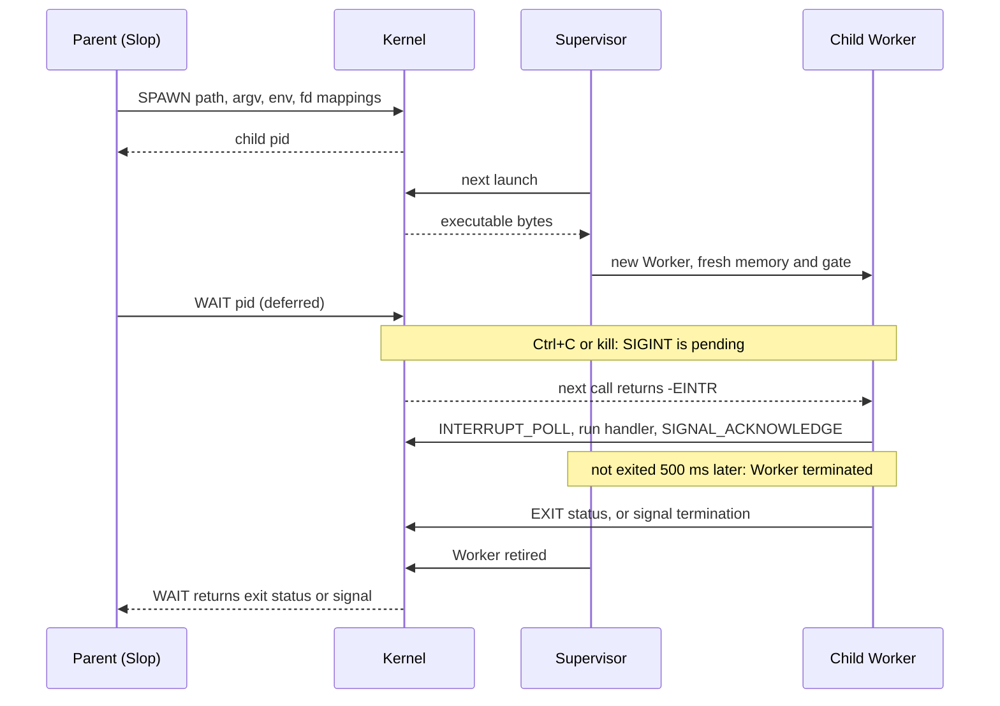

# Process model

Every ordinary command runs in a fresh private wasm64 memory and Worker. The
kernel ([`process-kernel.c`](../src/process-kernel.c)) owns files, open-file
descriptions, pipes, process records, signals and the terminal; processes
inherit handles and values, never another address space. The call path is in
[architecture](architecture.md#system-calls); packet layouts are in
[`process.h`](../include/dolly/process.h) and each [host module](../host/README.md)'s header.

## Executables

- Import one private shared memory64 and one function,
  `dolly_process_0.call`; export `_start`; carry `dolly.process` stamps
  ([`dolly-process-0.wat`](../abi/dolly-process-0.wat)) and a `dolly.host`
  record with the ABI digest of each host module they link
  ([`dolly-host-0.wat`](../abi/dolly-host-0.wat)). Memory is at most 8 GiB.
- A start section may initialize memory/TLS but must not call the kernel.
- Found through `PATH`; `#!` lines name an absolute in-Wasm interpreter, nested at most 4 deep.
- `readlink("/proc/self/exe")` returns the loaded image's canonical path; there is
  no general `/proc`.
- The compiler is itself a private process behind `cc`, `c++`, `ld` and `ar`
  ([`compiler.cpp`](../src/compiler.cpp)). It defaults to `-O2` with `-std=c17`
  or `-std=c++23` and follows Clang's suffix rules; objects are always position
  independent, `-m64` is the only target, `-lc -lm -ldl -lrt -lpthread -lutil`
  add nothing, and `-Wl,--no-undefined` is accepted because the exact typed
  import validation after linking is its target equivalent.
- The supervisor caches compiled modules by SHA-256 (64 entries, 256 MiB), never
  instances; at most 32 processes exist at once and further spawns fail `EAGAIN`.
- An unexpected Worker failure exits the process with status 126 and a one-line
  diagnostic; it does not affect unrelated processes. `cc`, `c++`, `ld` and `ar`
  retry that status up to twice
  ([`runtime-adapter.c`](../src/process/runtime-adapter.c)), so long
  source builds survive a transient browser Worker allocation failure without
  hiding deterministic source errors.

## Descriptors and files

- 256 descriptors per process. Descriptor flags are per handle; offsets and status
  flags belong to the shared open description. `FD_CLOEXEC` works everywhere.
- Pipes hold 64 KiB. Empty reads and full writes return `EAGAIN` when
  nonblocking; closing all writers gives EOF; writing with no reader returns
  `EPIPE` without raising `SIGPIPE`.
- Opening `/dev/stdin`, `/dev/stdout` or `/dev/stderr` duplicates the caller's
  descriptor 0, 1 or 2.
- `poll` covers files, pipes and the terminal; signals wake it with `EINTR`.
- Terminal reads return raw input bytes. `ICANON`/`ECHO` round-trip through termios
  without a line discipline; `OPOST`/`ONLCR` map LF to CRLF on output. While
  `ISIG` is set (the default), Ctrl+C sends SIGINT to the foreground; a program
  that clears it (raw mode) reads Ctrl+C as the byte 0x03.
- There is one user and no permission bits: `chmod`, `chown` and `access` only
  check that the file exists, and nothing changes a file's mode
  ([why](architecture.md#decisions)).
- The cwd is an open directory handle: it follows renames, `getcwd` fails with
  `ENOENT` after unlink, `fchdir` works.
- `mmap` makes private copies; `MAP_SHARED` writes back on `msync` and whole
  `munmap` ([`mmap.c`](../src/process/mmap.c)). Mappings are not coherent with
  other writers, do not extend the file past EOF, and cannot trap there: Wasm
  cannot protect or revoke part of linear memory.
- Advisory locks (`F_GETLK`, `F_SETLK`, `F_SETLKW`) return `ENOTSUP`.

## Spawn and wait

- Spawn inherits no descriptors, the standard streams, or all non-CLOEXEC
  descriptors, then applies explicit parent-to-child mappings, all read from the
  parent at once. A spawn may set the child's cwd.
- `posix_spawn` inherits all non-CLOEXEC descriptors and replays `adddup2`
  actions in order as mappings ([`runtime-adapter.c`](../src/process/runtime-adapter.c)).
  A child starts with default dispositions and an empty signal mask; other file
  actions, a session, process group or scheduler, and a non-empty mask return
  `ENOTSUP`. There is no `fork`, `exec` or `posix_spawnp`.
- `waitpid` accepts a child PID, `-1` or `0`. Wait records distinguish signal
  termination from exit: `exit(130)` is not SIGINT.
- Timed spawns carry an absolute monotonic deadline at most one day away; the
  supervisor ends the child with status 124 even inside a pure CPU loop.
- `SPAWN_FOREGROUND` and `SPAWN_INTERACTIVE` are explicit roles. Ctrl+C with
  `ISIG` set sends SIGINT to the foreground tree; like a job-control shell, an
  interactive owner with running children is spared. Slop clears `ISIG` while
  it reads a line, so Ctrl+C at its prompt is input. Image scripts
  use `/bin/foreground`; the browser knows no command names. Only the
  foreground tree can pass the role on; retirement returns it to the nearest
  foreground ancestor.
- Retirement drops the Worker, memory and gate before the child is waitable.
  Parent exit retires descendants first. Worker termination has no completion
  event, so a large interactive process gets 500 ms of reclamation before its
  exit is acknowledged, sparing the recovery shell. Nothing guarantees against
  browser memory pressure; this is one reason Slop is
  [serial](architecture.md#decisions) and parallel builds need a modest `-jN`.

## Signals

- Supported: `SIGHUP`, `SIGINT`, `SIGQUIT`, `SIGABRT`, `SIGKILL`, `SIGPIPE`,
  `SIGALRM`, `SIGTERM`, `SIGCHLD`, `SIGWINCH`; others are rejected.
- Handlers run in Wasm at syscall boundaries ([`signal.c`](../src/process/signal.c))
  with masks, `SA_RESTART`, `SA_RESETHAND`, `SA_NODEFER` and `SA_SIGINFO`.
  Alternate stacks, `sigwait`, asynchronous preemption and `SA_NOCLDWAIT` are
  unsupported.
- A process that does not finish a delivered signal within 500 ms is terminated;
  a second Ctrl+C within one second terminates at once. The filesystem and the
  shell survive; kernel or supervisor failure is outside this guarantee.
- Normal exit runs `atexit` handlers; default signal termination and forced
  termination do not, so named temporary files may remain.
- Delivered handlers interrupt sleep and `poll`; `SA_RESTART` restarts read,
  write and wait. Ignored or blocked signals do not shorten sleeps.
- Because handlers run only when a syscall starts, `pselect` is the race-free
  way to wait for a descriptor or a blocked signal: a pending signal its mask
  unblocks interrupts it before the wait. `select` is unsupported.
- `SIGCHLD` is queued once a child is waitable. `SIGWINCH` follows terminal
  resizes and never forces termination.
- `alarm`, `setitimer` and `getitimer` support only `ITIMER_REAL` (others fail
  with `EINVAL`); the supervisor raises due timers on its 16 ms tick. A
  default-action SIGALRM is delivered like `kill`, ending even a CPU loop. libc
  tells the kernel while SIGALRM is handled or ignored; it then only becomes
  pending and never forces termination.
- Clock reads use the Worker's clock aligned to the kernel's origin, but enter the
  kernel at least once per millisecond so signals arrive in clock-only loops.

## Threads, DSOs and FFI

- `threads@0` ([`host/threads/dolly-threads-0.wat`](../host/threads/dolly-threads-0.wat),
  [`host/threads/threads.mjs`](../host/threads/threads.mjs)): statically linked `-pthread`
  programs, one Worker per thread sharing the process memory, at most 16 per
  process and 64 in total. No DSOs, FFI, cancellation or directed signals.
- Process-local DSOs share their owner's memory, table and allocator. The loader
  checks exact import types before instantiation
  ([`dolly-process-dso-0.wat`](../abi/dolly-process-dso-0.wat)); missing
  infrastructure returns `ENOSYS`.
- FFI calls and closures stay in the process Worker; libffi supports CPython
  `_ctypes`.

## Unsupported

`fork`, `exec` replacement, job control and process groups, raw sockets, and
changing user or group identity fail explicitly.
