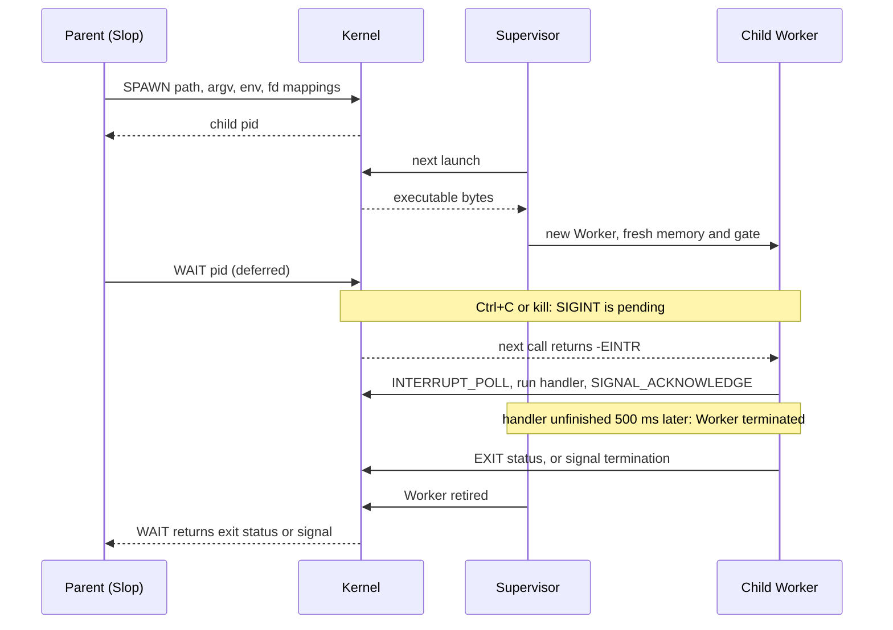

# Process model

Every ordinary command runs in a fresh private wasm64 memory and Worker. The
kernel ([`process-kernel.c`](../src/process-kernel.c)) owns files, open-file
descriptions, pipes, process records, signals and the terminal; processes
inherit handles and values, never another address space. The call path is in
[architecture](architecture.md#system-calls); packet layouts are in
[`process.h`](../include/dolly/process.h) and each [host module](../host/README.md)'s header.

## Executables

- Import one private shared memory64 and one function,
  `dolly_process_0.call`; export `_start`; carry `dolly.process` stamps
  ([`dolly-process-0.wat`](../abi/dolly-process-0.wat)) and a `dolly.host`
  record with the ABI digest of each host module they link
  ([`dolly-host-0.wat`](../abi/dolly-host-0.wat)). Memory is at most 8 GiB.
- A start section may initialize memory/TLS but must not call the kernel.
- Found through `PATH`; `#!` lines name an absolute in-Wasm interpreter, nested at most 4 deep.
- `readlink("/proc/self/exe")` returns the loaded image's canonical path; there is
  no general `/proc`.
- The target's identity: a program sees `__dolly__`, `__unix__` and
  `__wasm64__`, and no macro of Emscripten, Linux or WASI; `cc -dumpmachine`
  prints `wasm64-unknown-dolly` and `uname` `Dolly wasm64`. The libc is a
  bootstrap whose headers test `__dolly__`; LLVM and Zig still generate
  code under its Emscripten name, which no program can test.
- The compiler is itself a private process behind `cc`, `c++`, `ld` and `ar`
  ([`compiler.cpp`](../src/compiler.cpp)). It defaults to Clang's `-std=gnu17` and
  `-std=gnu++17` but to `-O2`, and follows Clang's suffix rules; objects are always position
  independent, `-m64` is the only target, `-lc -lm -ldl -lrt -lpthread -lutil`
  add nothing, and `-Wl,--no-undefined`, `--allow-shlib-undefined` and
  `--as-needed` are accepted and ignored: Dolly links no ELF shared libraries,
  and the exact typed import validation after linking decides.
- The supervisor caches compiled modules by SHA-256 (64 entries, 256 MiB), never
  instances; at most 32 processes exist at once and further spawns fail `EAGAIN`.
- A refusal is reported to the program that asked, not to the person at the
  page. An executable the loader refuses (a wrong stamp or import, a host module
  the image does not declare or whose layout differs, a thread client without
  `dolly_thread_start` or with `dso@0`) and a Worker that fails while running exit with status
  126 after one line on the process's own descriptor 2 that names the cause
  ([`process-supervisor.mjs`](../src/process-supervisor.mjs)); unrelated
  processes are unaffected. `cc` refuses to link a thread client without
  `-pthread`, so what it links the loader runs.
- A malformed call returns an errno and the process keeps running: `EFAULT` for
  a packet outside its memory, `E2BIG` over 1 MiB, `ENOSYS` for an unknown
  operation, `EINVAL` for a wrong layout
  ([`process-worker.mjs`](../src/process-worker.mjs)). FFI packets (`dso@0`) carry
  pointers of the process itself; a wild one is `EFAULT` too, while a trap in
  the function an FFI call reaches ends the process like any other trap.
- Wasm calls nest on a browser stack that a page cannot size; a program that
  exhausts it fails with 126 like any other trap. The Worker enters the
  process through `WebAssembly.promising` where that stack is measured half
  again as deep: Chrome 151, about 950 KB instead of a Worker's 500 KB, and
  not Firefox 155 ([browser stack](browser-stack.md)).
  `RLIMIT_STACK` describes only the stack inside the process's memory.
- `cc`, `c++`, `ld` and `ar` retry status 126 up to twice
  ([`runtime-adapter.c`](../src/process/runtime-adapter.c)), so long
  source builds survive a transient browser Worker allocation failure without
  hiding deterministic source errors.

## Descriptors and files

- 256 descriptors per process. Descriptor flags are per handle; offsets and status
  flags belong to the shared open description. `FD_CLOEXEC` works everywhere.
  `getrlimit` reports the fixed limits (`RLIMIT_NOFILE` 256, `RLIMIT_NPROC` 32,
  `RLIMIT_AS` 8 GiB, `RLIMIT_STACK` 8 MiB); `sysconf(_SC_OPEN_MAX)` is still
  libc's constant 1024.
- Pipes hold 64 KiB. Empty reads and full writes return `EAGAIN` when
  nonblocking; closing all writers gives EOF, also to a reader that was
  waiting. Writing with no reader, or waiting to write when the last reader
  closes, returns `EPIPE`, and libc raises `SIGPIPE` in the writer before
  `write` returns ([`libc-adapter.c`](../src/process/libc-adapter.c)): the
  process ends with that signal unless it ignores, handles or blocks it. A
  process's descriptors close when it exits, before it is waitable.
- Opening `/dev/stdin`, `/dev/stdout` or `/dev/stderr` duplicates the caller's
  descriptor 0, 1 or 2.
- `/dev/tty` opens the terminal for reading and writing. There are no sessions,
  so it is every process's controlling terminal.
- `poll` covers files, pipes and the terminal; signals wake it with `EINTR`.
- Terminal reads return raw input bytes. `ICANON`/`ECHO` round-trip through termios
  without a line discipline; `OPOST`/`ONLCR` map LF to CRLF on output. While
  `ISIG` is set (the default), Ctrl+C sends SIGINT to the foreground; a program
  that clears it (raw mode) reads Ctrl+C as the byte 0x03. termios reports no
  input mapping, flow control or other signal keys, and `VMIN` 1, `VTIME` 0;
  `tcsetattr` rejects anything else with `EINVAL`. `TCSAFLUSH` and `tcflush`
  discard unread input; break and flow control fail with `ENOTSUP`.
- There is one user and no permission bits: `chmod`, `chown` and `access` only
  check that the file exists, and nothing changes a file's mode
  ([why](architecture.md#decisions)).
- `statvfs` reports kernel memory: its maximum as capacity, unallocated memory
  as free, and no inode limit (zero files).
- The cwd is an open directory handle: it follows renames, `getcwd` fails with
  `ENOENT` after unlink, `fchdir` works.
- `mmap` makes private copies; `MAP_SHARED` writes back on `msync` and whole
  `munmap` ([`mmap.c`](../src/process/mmap.c)). Mappings are not coherent with
  other writers, do not extend the file past EOF, and cannot trap there: Wasm
  cannot protect or revoke part of linear memory.
- Advisory locks live in one kernel table of 1024 for all processes; a request
  that needs one more fails with `ENOLCK`. `flock` locks the whole file for an
  open file description: descriptors made by `dup` or inherited by a spawned
  child share the lock, and it goes with the last of them. Converting gives
  the held lock up first, as on Linux, so a refused `LOCK_NB` conversion leaves
  none. `fcntl` `F_SETLK`, `F_SETLKW` and `F_GETLK` (and `lockf`) lock byte
  ranges for the process, splitting and merging what it holds; as POSIX says,
  closing **any** descriptor of a file drops all the process's locks on that
  file. Not the descriptors libc keeps for itself, for a shared mapping or
  inside `truncate`: those are marked `DOLLY_PROCESS_FD_KEEP_LOCKS`. The two
  kinds do not see each other, and neither stops `read` or `write`. A waiting request is parked like a pipe read: a release wakes it at
  once and a signal interrupts it. Waiters are not ordered and deadlocks are
  not detected (no `EDEADLK`). Exit, a kill and a failed Worker release every
  lock of the process. `F_OFD_*` is `EINVAL`; a pipe cannot be locked
  (`ENOTSUP`).

## Spawn and wait

- Spawn inherits no descriptors, the standard streams, or all non-CLOEXEC
  descriptors, then applies explicit parent-to-child mappings, all read from the
  parent at once. A spawn may set the child's cwd.
- `posix_spawn` inherits all non-CLOEXEC descriptors and replays `adddup2`
  actions in order as mappings ([`runtime-adapter.c`](../src/process/runtime-adapter.c)).
  A child starts with default dispositions and an empty signal mask; other file
  actions, a session, process group or scheduler, and a non-empty mask return
  `ENOTSUP`. There is no `fork` or `exec`.
- `waitpid` accepts a child PID, `-1` or `0`. Wait records distinguish signal
  termination from exit: `exit(130)` is not SIGINT.
- Timed spawns carry an absolute monotonic deadline at most one day away; the
  supervisor ends the child with status 124 even inside a pure CPU loop.
- `SPAWN_FOREGROUND` and `SPAWN_INTERACTIVE` are explicit roles. Ctrl+C with
  `ISIG` set sends SIGINT to the foreground tree; like a job-control shell, an
  interactive owner with running children is spared. Slop clears `ISIG` while
  it reads a line, so Ctrl+C at its prompt is input. Image scripts
  use `/bin/foreground`; the browser knows no command names. Only the
  foreground tree can pass the role on; retirement returns it to the nearest
  foreground ancestor.
- Retirement drops the Worker, memory and gate before the child is waitable.
  Parent exit retires descendants first. Worker termination has no completion
  event, so a large interactive process gets 500 ms of reclamation before its
  exit is acknowledged, sparing the recovery shell. Nothing guarantees against
  browser memory pressure; this is one reason Slop itself is
  [serial](architecture.md#decisions) and parallel builds need a modest `-jN`.

## Signals

- Supported: `SIGHUP`, `SIGINT`, `SIGQUIT`, `SIGABRT`, `SIGKILL`, `SIGPIPE`,
  `SIGALRM`, `SIGTERM`, `SIGCHLD`, `SIGWINCH`; others are rejected.
- Handlers run in Wasm at syscall boundaries ([`signal.c`](../src/process/signal.c))
  with masks, `SA_RESTART`, `SA_RESETHAND`, `SA_NODEFER` and `SA_SIGINFO`.
  Alternate stacks, `sigwait`, asynchronous preemption and `SA_NOCLDWAIT` are
  unsupported.
- A process that does not finish a delivered signal within 500 ms is terminated.
  The filesystem and the shell survive; kernel or supervisor failure is outside
  this guarantee. Until a handler is finished the kernel delivers the process
  no other signal.
- A handler is finished when it returns, and when it leaves by `longjmp`,
  `_longjmp` or `siglongjmp`, as a pager or a shell leaves a blocked read.
  `sigsetjmp(env, 1)` saves the signal mask and `siglongjmp` restores it,
  delivering what that unblocks before it jumps; after `sigsetjmp(env, 0)`
  and after `setjmp` the jump leaves the handler's mask, as on Linux, and the
  program unblocks its signal itself. libc sees the jump because `<setjmp.h>`
  declares these as its own functions: a program that declares `longjmp`
  itself is not seen leaving, and its handler stays unfinished. A jump made
  and caught inside a handler counts as leaving it.
- Exit reclaims the subtree, so an exiting parent first leaves a signalled child
  running until it exits, at most 500 ms after its signal. An event loop whose
  handler only notes Ctrl+C (libuv's self-pipe, a flag) still shuts down when
  the same Ctrl+C ends its parent by default, as under `timeout`; a child that
  keeps running ends with the parent.
- Normal exit runs `atexit` handlers; default signal termination and forced
  termination do not, so named temporary files may remain.
- Delivered handlers interrupt sleep, `poll` and `pause`; `SA_RESTART` restarts
  read, write and wait. Ignored or blocked signals do not shorten sleeps.
- Because handlers run only when a syscall starts, `pselect` is the race-free
  way to wait for a descriptor or a blocked signal: a pending signal its mask
  unblocks interrupts it before the wait. `select` is unsupported.
- `SIGCHLD` is queued once a child is waitable. `SIGWINCH` follows terminal
  resizes and never forces termination.
- `alarm`, `setitimer` and `getitimer` support only `ITIMER_REAL` (others fail
  with `EINVAL`); the supervisor raises due timers on its 16 ms tick. A
  default-action SIGALRM is delivered like `kill`, ending even a CPU loop. libc
  tells the kernel while SIGALRM is handled or ignored; it then only becomes
  pending and never forces termination.
- Clock reads use the Worker's clock aligned to the kernel's origin, but enter the
  kernel at least once per millisecond so signals arrive in clock-only loops.
- CPU time is not accounted: `clock()` and `CLOCK_PROCESS_CPUTIME_ID` report the
  monotonic time since the process started, an upper bound that is exact while
  it computes without blocking ([`libc-adapter.c`](../src/process/libc-adapter.c)).

## Threads, DSOs and FFI

- `threads@0` ([`host/threads/dolly-threads-0.wat`](../host/threads/dolly-threads-0.wat),
  [`host/threads/threads.mjs`](../host/threads/threads.mjs)): statically linked `-pthread`
  programs, one Worker per thread sharing the process memory, at most 16 per
  process and 64 in total; `sysconf` reports 4 processors. Handlers run on the
  main thread, also while it waits in `pthread_join`. No DSOs, FFI,
  cancellation or directed signals.
- `dso@0` ([`host/dso/dolly-dso-0.wat`](../host/dso/dolly-dso-0.wat),
  [`host/dso/process.mjs`](../host/dso/process.mjs)): process-local DSOs and
  FFI, served in the Worker of an executable that records the module
  ([host modules](../host/README.md#modules-served-in-the-process-worker)).
  - `cc -rdynamic` builds a host: it exports the program's symbols and links
    the loader behind `dlopen`. A DSO (`cc -shared`) shares its owner's
    memory, table and allocator; the loader checks exact import types before
    instantiation.
  - FFI calls and closures (`dolly_ffi_*`, `<dolly/dso.h>`) stay in the process
    Worker; libffi supports CPython `_ctypes`.
  - Without the record a program loads nothing: `dlopen` returns `NULL` with
    `ENOSYS` and a `dlerror()` naming `-rdynamic` and `dso@0`, and the raw
    operations are unknown ones. With it, the image must declare
    `REQUIRES HOST dso@0` or the program is refused before it starts.

## Unsupported

`fork`, `exec` replacement, job control and process groups, raw sockets, and
changing user or group identity fail explicitly.
