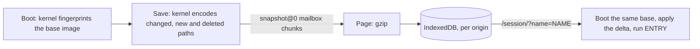

# Sessions and file transfer

A session is a named, browser-local save of filesystem changes against the exact
image the tab booted. It does not save processes. `upload` and `download` move
single files between the user's computer and WasmFS, one user action at a time.

## Save and load

- **Save** or `Ctrl+Shift+S` stores a checkpoint named with 1–64 of
  `A-Z a-z 0-9 . _ -` (not `.` or `..`). `/sessions/` lists saves with Export,
  Import, Delete and Recover files; `/session/?name=NAME` loads one.
- A save holds files, directories, symlinks and deletions, including credentials,
  Pi conversations (`~/.pi/agent/sessions`) and packages installed with `amy`
  ([Dollyfile](dollyfile.md#packages-and-amy)). It does not hold processes,
  descriptors, scrollback, environment, cwd, hard links, timestamps or modes;
  `/etc/dolly/environment` is a file, loaded after the replay, so installed
  variables apply when the session loads.
- `/run`, `/dev` and `/seed` are excluded ([`session-records.h`](../src/session-records.h));
  the uncompressed delta is at most 512 MiB, and exceeding it fails the save
  visibly. A failed save leaves the previous record intact.
- Hashing, encoding and restoring stay in Wasm: sessions add no Wasm import or
  path-level browser filesystem API. The kernel serves a save even while the
  foreground program sleeps or waits for input. IndexedDB stores the encoded
  delta as a Blob, avoiding large serialization copies.
- Loading needs the same runtime build and image identity. Otherwise **Recover
  files** boots `system` and copies changed regular files from `/workspace` and
  `/home` into `/workspace/recovered-NAME`
  ([`session-recover.c`](../src/commands/session-recover.c)). System changes,
  deletions and symlinks are skipped; saved startup files and credentials stay
  in that folder for inspection without becoming live config. Recovery refuses
  an existing destination and leaves the save unchanged.
- On a rebuild route, the first save checks that the rebuilt base is
  byte-identical to the prebuilt image.
- Custom-image saves record the Dollyfile, image digest and HTTP restrictions;
  the image itself must still be in this browser's image cache, so importing the
  file into another browser does not install the image. Restoring intersects
  the saved restrictions with the current policy; a save cannot widen it.
- Saves stay in this browser profile and origin; they are never uploaded,
  synced or shared by the session URL. Exports are unencrypted
  `.dolly-session` files, checksummed but not authenticated; imports never
  overwrite an existing name.

Code: kernel [`host/snapshot/kernel.c`](../host/snapshot/kernel.c); page
[`host/snapshot/transport.mjs`](../host/snapshot/transport.mjs),
[`session-store.mjs`](../src/session-store.mjs),
[`session-file.mjs`](../src/session-file.mjs), list page
[`sessions.mjs`](../src/sessions.mjs).

## Upload and download

- `upload DESTINATION` opens the browser's file picker. The chosen file's bytes
  (at most 1 GiB) stream in 1 MiB chunks to a new path while the dialog shows
  progress; Cancel or Ctrl+C leaves nothing behind. Existing files are never
  overwritten and no host name or path enters Wasm
  ([`host/upload/kernel.c`](../host/upload/kernel.c), [`Dollyfile-system-tools`](../Dollyfile-system-tools)).
- `download FILE` streams one regular file of at most 1 GiB in 1 MiB chunks into
  a browser Blob; Ctrl+C discards it. The page then shows **Save NAME (SIZE)**
  and **Dismiss**; nothing reaches the download manager until the user clicks
  Save. At most four offers wait; more fail with `EBUSY`
  ([`host/download/download.mjs`](../host/download/download.mjs), [`Dollyfile-system-tools`](../Dollyfile-system-tools)).
- Neither is a network path, but uploaded bytes are ordinary sandbox data that
  allowed HTTP can send elsewhere.
