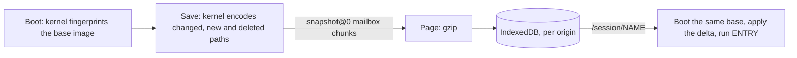

# Sessions and file transfer

A session is a named, browser-local save of filesystem changes against the exact
image the tab booted. It does not save processes. `upload` and `download` move
single files between the user's computer and WasmFS, one user action at a time.

## Save and load

- **Save** or `Ctrl+Shift+S` stores a checkpoint named with 1–64 of
  `A-Z a-z 0-9 . _ -` (not `.`, `..` or `index.html`). `/session/` lists saves
  with Export, Import, Delete and Recover files; `/session/NAME` loads one.
- A save holds files, directories, symlinks and deletions, including credentials
  and Pi conversations (`~/.pi/agent/sessions`). It does not hold processes,
  descriptors, scrollback, environment, cwd, hard links, timestamps or modes.
- `/run`, `/dev` and `/seed` are excluded ([`session-records.h`](../src/session-records.h));
  the uncompressed delta is at most 512 MiB.
- Loading needs the same runtime build and image identity. Otherwise **Recover
  files** boots `system` and copies changed regular files from `/workspace` and
  `/home` into `/workspace/recovered-NAME`
  ([`session-recover.c`](../src/commands/session-recover.c)).
- On a rebuild route, the first save checks that the rebuilt base is
  byte-identical to the prebuilt image.
- Custom-image saves record the Dollyfile, image digest and HTTP restrictions;
  the image itself must still be in this browser's image cache. Restoring
  intersects the saved restrictions with the current policy.
- Saves stay in this browser profile and origin. Exports are unencrypted
  `.dolly-session` files, checksummed but not authenticated; imports never
  overwrite an existing name.

Code: kernel [`session-snapshot.c`](../src/session-snapshot.c); page
[`session-transport.mjs`](../src/session-transport.mjs),
[`session-store.mjs`](../src/session-store.mjs),
[`session-file.mjs`](../src/session-file.mjs), list page
[`sessions.mjs`](../src/sessions.mjs).

## Upload and download

- `upload DESTINATION` opens the browser's file picker. The chosen file's bytes
  (at most 64 MiB) land at a new path; existing files are never overwritten and
  no host name or path enters Wasm ([`upload.c`](../src/upload.c),
  [`upload.dm`](../modules/upload.dm)).
- `download FILE` copies one regular file of at most 64 MiB. The page shows
  **Save NAME (SIZE)** and **Dismiss**; nothing reaches the download manager until
  the user clicks Save. At most four offers wait; more fail with `EBUSY`
  ([`download.mjs`](../src/host/download.mjs), [`download.dm`](../modules/download.dm)).
- Neither is a network path, but uploaded bytes are ordinary sandbox data that
  allowed HTTP can send elsewhere.
