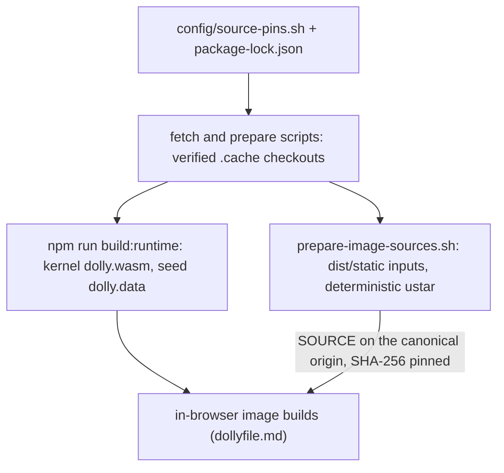

# Sources and bootstrap

Outside the browser, an external toolchain builds only the kernel and the
compiler seed. Every ordinary program is then compiled inside Dolly from pinned
source during an image build. This page lists the bootstrap exceptions, how inputs
are pinned, and what the core ports support.

## Bootstrap exceptions

| Component | Built outside Dolly | Result |
| --- | --- | --- |
| Emscripten 6.0.8 | Digest-pinned container links the kernel, process sysroot, gate and seed ([`CMakeLists.txt`](../toolchain/CMakeLists.txt), [`build.sh`](../scripts/build.sh)) | Kernel plus process libc with its compiler-rt builtins, which the first link needs; the seed holds headers and the Dollyfile engine source, which [`bootstrap.c`](../src/process/bootstrap.c) compiles before the first recipe |
| LLVM/Clang/LLD 24 | Wasm64 libraries linked into one stamped compiler executable ([`build-toolchain.sh`](../scripts/build-toolchain.sh)) | `cc`, `c++`, `ld`, `ar` spawn it as a private process |

libc++, libc++abi and libunwind are not among them: [`Dollyfile-system-build`](../Dollyfile-system-build)
compiles Emscripten's pinned copy with the flags of Emscripten's own build,
before the first C++ program. The container's build of them remains inside the
seed compiler and names what an `-rdynamic` host exports
([`prepare-process-sysroot.sh`](../scripts/prepare-process-sysroot.sh)).

The libc's and libc++'s headers, and libc++'s sources, are staged with their
`__EMSCRIPTEN__` tests renamed to `__dolly__`, and LLVM generates code under the
libc's triple, `wasm64-unknown-emscripten`; a program sees neither name
([process model](process-model.md#executables)).

Demo exceptions (the Rust compiler seed) are recorded in their demo READMEs.
The `llvm` demo (`demos/llvm/README.md`) builds the compiler of the second row
again inside Dolly and gets the seed compiler's output bytes from it; the
host-built seed is still what every image starts from. The `sysroot` demo
(`demos/sysroot/README.md`) does the same for the first row's process libc and
for Dolly's own parts of the sysroot, to equal code and data; their four
assembly sources go through file-scope asm, since `cc` has no assembler.
Every externally built program (compiler, Rust seed)
validates against `dolly-process-0` exactly and ships without an Emscripten
JavaScript loader. Host preparation may
configure and patch pinned trees deterministically and reviewably, but must not
compile the programs an image claims to build.

## Pins and identity

- Upstream versions, URLs and archive digests live in
  [`source-pins.sh`](../config/source-pins.sh) and the npm lockfile. Dollyfiles
  pin the exact served bytes, since preparation can change bytes without changing
  upstream.
- [`prepare-image-sources.sh`](../scripts/prepare-image-sources.sh) stages the
  selected catalog's inputs (each demo adds a `prepare-sources.sh` hook);
  [`generate-routes.mjs`](../scripts/generate-routes.mjs) checks every
  canonical `SOURCE` row against its bytes. Only those rows and module texts are
  trusted build inputs; adding one means referencing it from a recipe.
- [`build-source-tar.mjs`](../scripts/build-source-tar.mjs) writes deterministic
  ustar archives (regular files only, fixed metadata, no host paths). The in-Dolly
  `/bin/tar` ([`Dollyfile-system-build`](../Dollyfile-system-build)) extracts only regular files and
  directories inside WasmFS.
- [`write-build-id.mjs`](../scripts/write-build-id.mjs) derives two identities.
  The image build ID covers the seed, its loader and the process, `dso@0`,
  kernel-plugin and snapshot contracts; images and caches use it, so kernel-only
  changes reuse images. The runtime build ID adds the kernel bytes; sessions
  require it.
- Preparation writes to unique staging paths and publishes completed,
  verified results atomically.

## Core ports

| Family | Support | Limits |
| --- | --- | --- |
| Slop, sbase, Dolly commands | Shell scripts and POSIX file/text tools ([Slop](slop.md)) | Not Bash; POSIX flags, not GNU |
| C/C++ | Clang/LLD, archives, libc++, process-local DSOs with `dso@0`, `-pthread` with `threads@0` | No native target, `fork` or `exec` |
| Make, Ninja | GNU Make 4.4.1 and Samurai 1.3 | Ninja runs one job |
| Git, curl | Local Git 2.55 and HTTP clone/fetch/push over Fetch-backed libcurl ([HTTP](http.md)) | CORS applies; no sockets; clean/smudge filters unported |
| Awk, zlib, gzip | One True Awk (Bison output prepared outside), zlib 1.3.2, Dolly `gzip` | |
| Zig, Ghostty | Zig 0.16 built from source by `cc`; source-built terminal ([display](display.md#zig-and-the-ghostty-build)) | Builder images only; Zig emits only C |

Everything above Dolly's core (Python, JavaScript and Pi, Neovim, Rust, games) is
a demo under `demos/`, listed in `demos/README.md`.

## Reproducibility

`npm run image -- system-build --reproducible` compares two cold browser builds and
a cached build. With the pinned toolchain and browser, compiler scratch files are
named by their output path and LLD section merging is fixed, so the snapshots
match. Cross-browser bit reproducibility is not claimed; every input byte is
still pinned and verified.
