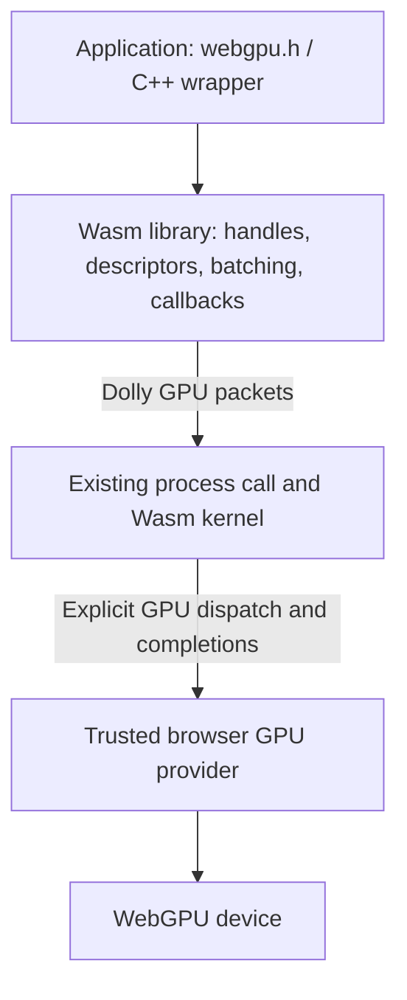

# Proposed Dolly GPU ABI

**Design draft, not an implemented or frozen contract.** The recommendation is WebGPU semantics and the existing `webgpu.h` C API, carried over a small Dolly-specific binary protocol. Applications use a normal userspace library. The process and browser boundaries expose typed, bounded messages. Shader compilation and actual GPU objects belong to the browser provider.

## The 64 MiB limit

The current ceiling is a policy choice, not a WebAssembly, GPU, or streaming requirement. The HTTP default comes from the initial browser userspace policy. It caps the cumulative response body; a finite per-rule override is already supported. There is no measured justification in the inspected code for choosing exactly 64 MiB.[^1]

Uploads have a separate limit of the same size, enforced in both the browser transport and the kernel consumer. The HTTP and upload transports already move data through 64 KiB chunks with backpressure. Lifting a total-transfer ceiling does not require an equally large browser staging buffer.[^2]

The recommended change is to remove the fixed total-response/file-size ceiling from ordinary use, while retaining optional finite limits imposed by an embedding. A restricted session must continue to inherit and enforce those limits. An explicit absence of a byte quota should be represented deliberately in policy; the current configuration validator does not accept `Infinity` as a finite limit.

Keep chunk limits, bounded outstanding transfers, checked counters, cancellation and failure handling. Uploads should still publish through a temporary Wasm file and clean up on failure. Revise the existing transfer deadline policy for large downloads separately: the current default HTTP deadline is 120 seconds. No special model download service is necessary merely to bypass the 64 MiB number.

The remaining memory requirement is real: a model saved into Dolly's in-memory filesystem occupies memory even when delivery is streamed. Removing a per-file ceiling does not make storage infinite. Conversely, retaining that ceiling is not a session memory quota, because many smaller downloads can consume the same memory.

| Limit | Meaning | Recommended treatment |
| --- | --- | --- |
| 64 MiB HTTP response / uploaded file | Total bytes for one transfer | Remove as an unconditional default; retain optional embedding policy |
| 64 KiB HTTP/upload chunk | Size of one exchange with the consumer | Keep bounded streaming |
| 1 MiB process packet | Size of one cross-memory request/response | Keep initially; large objects use several packets |
| GPU buffer and binding limits | What a negotiated GPU device can represent | Query and enforce; these cannot be removed by Dolly |
| Wasm/GPU memory capacity | Available application storage | Handle allocation failures and account for actual requested allocations |

## API versus ABI

The application API should be the existing C WebGPU interface, `webgpu.h`. It describes buffers, textures, shader modules, pipelines, bind groups, command encoders, render/compute passes and asynchronous operations. It is maintained for native and Wasm implementations. Pin a compatible revision and, where needed, the C++ wrapper used by llama.cpp.[^3]

The ABI is the exact representation crossing Dolly's boundary: function types, integer widths, layouts, commands, errors, resource lifetimes and completion rules. An application-facing C descriptor can contain pointers, callbacks, `size_t`, extension chains and compiler padding. Those representations should remain inside its private Wasm process. The C library flattens supported descriptors into versioned records and retains callback pointers locally.

For example, a game calls `wgpuDeviceCreateBuffer`. A local C object remembers its size, usage and protocol object ID. The library emits a buffer-creation record. The host decodes that record and invokes the browser's `device.createBuffer`. There is no need for a Wasm import for every C function, nor for the browser to understand a C++ class layout.

Deferring transport must preserve C API argument lifetimes. If an operation permits the caller to reuse its source bytes after returning, the library must already have copied those bytes into its own bounded batch storage. Queuing a pointer to a temporary descriptor or upload array until a later submit is incorrect.

Use WebGPU's resource and execution model rather than a new rendering framework. WGSL is the initial shader input. The browser compiles it for its GPU backend. C/C++ remains CPU code compiled to Dolly wasm64. Native CUDA, Vulkan and platform window handles are outside this interface.

## Two boundaries



The ordinary process keeps the existing callable import:

```wat
(import "dolly_process_0" "call"
  (func (param i32 i64 i64 i64 i64) (result i64)))
;; operation, request_address, request_size,
;; response_address, response_capacity -> response_bytes or -errno
```

Add one process operation, provisionally named `DOLLY_PROCESS_GPU`. Its packet contains the GPU protocol version and suboperation. This avoids continually expanding `process.h` for every GPU command. Actual pointers occur only in the outer call's checked request/response spans; embedded records use offsets and IDs.

The kernel needs a distinct outer browser capability. A candidate admission signature is:

```wat
(import "env" "dolly_gpu_dispatch"
  (func (param i64 i64) (result i32)))
;; kernel request address, request bytes -> admission status
```

The accompanying contract must describe completion-mailbox exports, layout and publication rules. This two-argument signature is a proposed shape, not a complete mailbox specification. The provider receives the shared kernel memory during trusted setup; the packet cannot supply a different browser memory object.

Dispatch returns only after the provider has copied or rejected the bounded request. A private host acknowledgement limits pending admission messages, following Dolly's HTTP pattern. Returning from dispatch does not wait for shaders to compile or the GPU to finish. Subsequent completion records enter a bounded Wasm mailbox and wake deferred process calls.

`WAIT` can be implemented by the kernel consuming those completions; it need not issue a browser operation that blocks a browser thread. The process worker sleeps while the GPU provider progresses independently. No kernel lock should remain held across a GPU wait.[^4]

The browser provider must enforce limits from its own private state. Guest-written counters and claimed PIDs cannot authorize additional host objects or submissions. The allowed actions are GPU resource creation, execution, readback and presentation to the embedding's designated surface. Network requests remain on the existing HTTP edge.

## Initial operation families

| Operation | Meaning |
| --- | --- |
| `OPEN` | Establish a scope; negotiate version, features, limits and optional presentation access; return a capability descriptor |
| `BATCH` | Copy and admit a bounded sequence of typed GPU records |
| `WAIT` | Poll or wait for specified futures/events, with a timeout; return bounded records |
| `READ` | Copy part of a ready mapped/readback range into the caller's response |
| `CLOSE` | Revoke a scope, discard unsubmitted work and retire its resources |

An initial low-level `OPEN` may defer the calling process until adapter/device creation settles. The C library must separately implement the public API's callback delivery rules. A later asynchronous-open extension is possible if actual application behavior requires it; neither form permits blocking the UI or the GPU provider itself.

The word `BATCH` describes transport, not a GPU submission. A batch may define resources, encode commands, or submit previously encoded command buffers. Only an explicit queue-submit record submits GPU work. A queue-fence record requests notification when preceding work has completed.

The initial command vocabulary should cover the shared requirements of a game and ggml:

| Family | Representative records |
| --- | --- |
| Resources | Create buffer, texture, view, sampler, bind-group layout and bind group; release objects |
| Programs | Create WGSL module, pipeline layout, compute/render pipeline; report compilation/validation errors |
| Transfer | Write buffer/texture, copy buffer/texture, map buffer, write mapped bytes, unmap |
| Encoding | Create encoder, begin/end render or compute pass, bind pipeline/resources, draw indexed/non-indexed, dispatch workgroups, finish encoder |
| Execution | Submit command buffers; request queue-completion future |
| Presentation | Acquire/configure the allowed surface, acquire current texture, present, release |
| Sharing | Explicitly export/import a texture reference between scopes on the same device |

This is still a substantive interface. Five entry operations do not make the command vocabulary trivial. Exact descriptor variants should be chosen from the exercised WebGPU subset; unsupported formats, extension chains and native-only features must fail explicitly.

## Candidate packet representation

The following layouts make the proposal concrete without allocating final opcode numbers. All fields are little-endian, records align to eight bytes, and reserved fields are zero. The packet's length must match the checked outer request span.

| Common header offset | Field | Type |
| --- | --- | --- |
| 0 | GPU protocol version | `u32` |
| 4 | Operation | `u32` |
| 8 | Scope handle; zero for opening | `u64` |
| 16 | Request sequence | `u64` |
| 24 | Body byte count | `u32` |
| 28 | Reserved | `u32` |

A batch body starts with a `u32` record count and `u32` reserved field. Each record starts with `u32 opcode` and `u32 byte_count`, where the count includes the record header. Parsing must end exactly at the packet boundary. Unknown commands or enum values are rejected before interpretation, not treated as arbitrary method calls.

A buffer-creation record could be exactly 32 bytes:

| Record offset | Field | Type |
| --- | --- | --- |
| 0 | `CREATE_BUFFER` | `u32` opcode |
| 4 | Record byte count = 32 | `u32` |
| 8 | New object ID | `u64` |
| 16 | Requested buffer size | `u64` |
| 24 | Defined buffer usage bits | `u32` |
| 28 | Reserved | `u32` |

A write record can use the same 32-byte fixed prefix: opcode, record length, buffer ID, 64-bit buffer offset, 32-bit data offset and 32-bit data length, followed by inline data and alignment padding. The data offset is relative to that record's beginning. GPU alignment requirements still apply.

Thus creating a 512 MiB buffer needs a small descriptor. Filling it takes several bounded writes, provided the negotiated device permits that buffer and its bindings. The size of an object is independent of the size of an individual packet.

Decode records explicitly; do not cast arbitrary bytes to native C structs or JavaScript objects. Copy descriptors before validation to avoid guest mutation between checking and use. Check size arithmetic before addition/multiplication, nested arrays, alignment and device limits. Keep IDs as opaque 64-bit values; convert lengths to host numbers only after range checks.

## Handles, batching and ordering

The browser issues a nonzero scope handle bound to the current device generation. Within it, the client can allocate monotonically increasing, never-reused object IDs. This lets C resource creation return a local proxy immediately and allows several creations to travel in one packet. The provider independently verifies new IDs, resource kinds and allocation limits; choosing an ID does not grant an allocation.

Resource identity is the pair `(scope, object ID)`, not a pointer. Live objects occupy a private provider table; a high-water mark prevents ID reuse without keeping tombstones forever. Closing a scope or losing the device invalidates the whole namespace. C reference counting is local; final release emits a protocol operation, with provider storage retained as long as submitted work actually needs it.

One physical device per session makes game-to-viewer texture sharing possible. Logical device scopes must obey their negotiated feature/limit view; a later scope cannot add features to an already-created physical device. Incompatible requests fail or require an explicit session-device restart. One client's logical device destruction must not destroy another client's physical device.

Command encoders and finished command buffers may span several transport packets. Their retained object count and encoded command bytes must be bounded independently of packet size. Otherwise a guest can defeat the packet limit by growing one never-finished encoder indefinitely. This avoids incorrectly assuming every large render pass can be split without changing its semantics.

Operations preserve submission order within a scope. Across scopes, the provider chooses admission order on the shared device; explicit completion establishes dependencies when sharing. Initial scheduling can remain serial with a shallow queue.

Reject structurally malformed packets before executing them. GPU validation or allocation may still fail later. Do not promise transaction rollback for a batch: earlier resource creations or writes can have occurred. Track and clean up those resources, associate errors with request/record IDs, and never automatically replay an accepted batch after a timeout or interruption.

## Completion and mapping

Three events must remain distinct:

1. **Admission:** the provider owns an immutable copy and the source packet can be reused.
2. **Operation completion:** a requested asynchronous result, such as pipeline creation or mapping, is ready or failed.
3. **Queue completion:** previously submitted GPU work has finished.

Completion records need the scope, request/future ID, event kind, structured status and bounded payload length. Validation diagnostics can additionally identify a command record and contain bounded UTF-8 text. An accepted call's future must eventually report success, failure or scope/device loss while the browser continues executing. A stopped browser cannot promise progress.

`WAIT` with timeout zero polls. A finite timeout suspends only the requesting process; interruption returns the appropriate target error without resubmitting or undoing GPU work. The library tracks completed futures and dispatches callbacks inside Wasm when `wgpuInstanceWaitAny` or `wgpuInstanceProcessEvents` permits. Callback function pointers and userdata never cross into JavaScript. Advertise only the callback and threading behavior actually implemented.[^5]

Host queue credits must depend on real retained resources and settled operations, not on forged guest mailbox flags. Failure to consume results creates backpressure. Closing or interrupting a client must not release credits prematurely while browser/GPU work remains alive.

Mapping is an explicit transfer boundary. For reading: GPU work completes, the browser maps an eligible buffer, `READ` copies bounded ranges into Wasm, and the C library returns a pointer to its Wasm staging allocation. That pointer is not a GPU address. For mapped writes, copy changed Wasm bytes into the host's mapped range before unmapping. Do not implement this by calling queue-write on a buffer that is still mapped. GPU usage and mapping-state validation still apply.[^6]

Keep weights, textures and intermediate compute data on the GPU between operations. Normal rendering needs no readback. Agents request a capture, whose pixels become an ordinary Wasm file. Presentation uses only the fixed Dolly surface and existing display ownership; a C surface adapter must not accept X11 handles or CSS canvas selectors as browser authority.

## Example compute flow

An application-facing WebGPU program creates an input/storage buffer and a readback buffer, writes inputs, creates a WGSL pipeline, encodes a compute pass and a copy, submits, then maps the readback buffer. A Dolly client can express that approximately as:

```text
OPEN -> scope, features, limits
BATCH:
  CREATE_BUFFER input
  CREATE_BUFFER readback
  CREATE_SHADER wgsl_bytes
  CREATE_COMPUTE_PIPELINE pipeline
  WRITE_BUFFER input, bytes
  ...create bindings...
  CREATE_ENCODER encoder
  BEGIN_COMPUTE_PASS encoder, pass
  SET_PIPELINE pass, pipeline
  SET_BIND_GROUP pass, bindings
  DISPATCH pass, x, y, z
  END_PASS pass
  COPY_BUFFER encoder, input, readback
  FINISH_ENCODER encoder, commands
  QUEUE_SUBMIT commands
  MAP_READ readback, future
WAIT future -> mapped or error
READ readback, offset, length -> bytes in Wasm
BATCH: UNMAP readback
```

This illustrates protocol operations and ordering; it omits full descriptors and error handling and is not a claim of implemented C API support. Pipeline creation can require an additional asynchronous completion before dependent encoding. A rendering flow replaces the compute pass with a render pass and present; the same buffers, shaders, handles and completion machinery remain useful.

## Canonical definition and compatibility

Put the typed outer imports/exports, protocol version and exact layout definitions in `abi/dolly-gpu-0.wat`, compiled to its canonical Wasm contract. Define offsets and numeric constants in inspectable WAT declarations and derive matching C/JavaScript constants where useful. WAT function types alone do not describe packet contents or prove safe handling; the command layouts, semantic rules and actual decoder are also part of the contract. JSON may be generated but must not become a competing ABI source.

Keep the base process operation and outer GPU signature stable after the first migration. Do not hash the entire evolving upstream `webgpu.h`, library implementation or shader collection into the ordinary process ABI. The first GPU process operation changes today's `process.h` digest; that compatibility migration remains necessary.[^7]

Freeze the version-0 wire meanings once both graphics and compute prototypes exercise them. Optional additions need explicit capability negotiation and never reinterpret an old opcode or field. A breaking change requires a new protocol version, either supported alongside the old version deliberately or rejected before submission. Unsupported capability and unavailable GPU must remain distinguishable from malformed requests.

The full version-0 specification still needs an exact completion-mailbox state machine, all selected command layouts/enums, WebGPU error-scope mapping, resource state transitions, surface acquisition rules and the chosen callback profile. Those should be settled with a minimal game/render test and actual ggml operations before declaring the ABI stable. This document supplies a concrete architecture and representative layouts, not a false claim that those details have already been implemented.

## Sources

[^1]: Dolly baseline `1a57397`, [`src/http-policy.mjs`](../../src/http-policy.mjs), defaults at line 39 and rule normalization/authorization; [`src/http-broker.mjs`](../../src/http-broker.mjs), cumulative response check at line 240. The default originates in `aa0e63c0`, “Build the browser-native Dolly agent userspace.”
[^2]: Dolly, [`src/upload-transport.mjs`](../../src/upload-transport.mjs), [`src/upload.c`](../../src/upload.c), [`abi/dolly-upload-0.wat`](../../abi/dolly-upload-0.wat), and [`include/dolly/http.h`](../../include/dolly/http.h). Independent upload checks, streaming chunks, temporary-file publication and cancellation.
[^3]: WebGPU Native contributors, [`webgpu.h` project](https://github.com/webgpu-native/webgpu-headers) and [header reference](https://webgpu-native.github.io/webgpu-headers/webgpu_8h_source.html), accessed 14 September 2026. Application API and pointer-bearing C descriptors. Actual implementation should pin the headers compatible with its upstream consumers.
[^4]: Dolly, [`abi/dolly-process-0.wat`](../../abi/dolly-process-0.wat), [`src/process-worker.mjs`](../../src/process-worker.mjs), [`src/process-supervisor.mjs`](../../src/process-supervisor.mjs), and [`abi/dolly-http-0.wat`](../../abi/dolly-http-0.wat). Current machine interface, deferred calls and the existing bounded-admission pattern.
[^5]: WebGPU Native contributors, [Asynchronous Operations](https://webgpu-native.github.io/webgpu-headers/Asynchronous-Operations.html), accessed 14 September 2026. Futures, waits, callback modes and callback reentrancy requirements.
[^6]: MDN Web Docs, [`GPUBuffer.mapAsync`](https://developer.mozilla.org/en-US/docs/Web/API/GPUBuffer/mapAsync), and GPU for the Web Community Group, [WebGPU explainer](https://gpuweb.github.io/gpuweb/explainer/), accessed 14 September 2026. Mapping and Wasm memory separation; see also the [recorded local probe](evidence.json).
[^7]: Dolly, [`scripts/dolly-abi.mjs`](../../scripts/dolly-abi.mjs) and [`abi/README.md`](../../abi/README.md). Contract binding and current process-layout identity.
