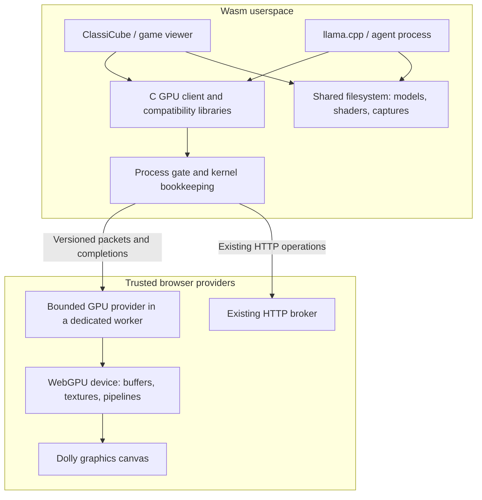
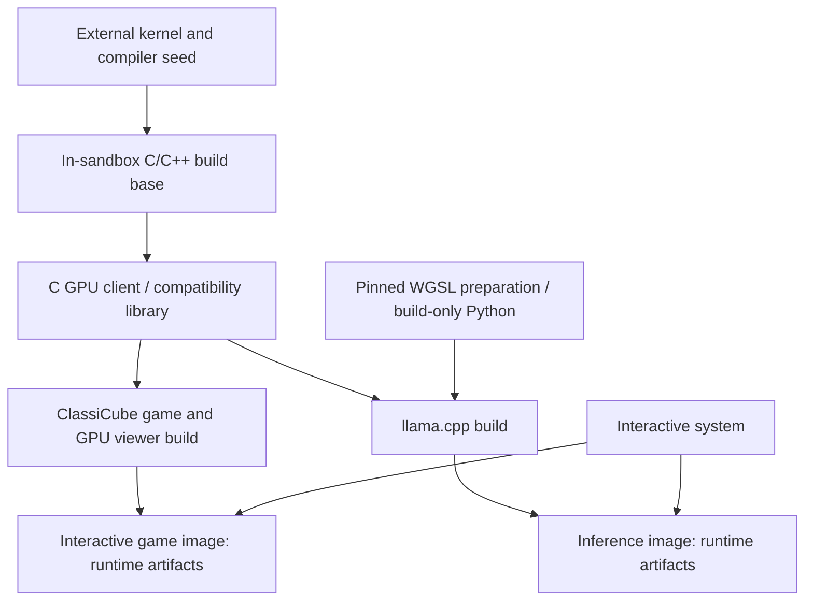

# GPU access in Dolly

**Recommendation:** add a bounded WebGPU device interface below userspace libraries, supporting both graphics and compute. Keep game logic, inference, model files, and resource bookkeeping in Wasm. Let a small browser provider own actual GPU objects, validate requests, enforce allocation and submission limits, and present to Dolly's canvas. Build a C client above this interface, then adapt ClassiCube and the existing llama.cpp WebGPU backend.

This requires an explicit architectural change: GPU buffers and textures contain mutable state outside Wasm linear memory. They must be documented as ephemeral device allocations, accessible through revocable handles. Filesystem contents, process state, and ordinary CPU memory remain in Wasm. The GPU provider must not acquire network, filesystem, or general JavaScript execution capabilities on behalf of programs.

Browser-level feasibility is demonstrated, including shared memory64 uploads, compute readback, and worker-side rendering submission. A Dolly GPU interface, an accelerated game, and sandbox-owned LLM inference are **not implemented or benchmarked**. The implementation recommendation is stronger than a speculative API sketch, but performance and port completeness still require end-to-end proofs.

## Existing architecture

The source baseline is Dolly commit `1a57397` on `codex/core-iteration-20260913`. Evidence was collected on 14 September 2026. Production source was not changed for this investigation.

| Area | Current behavior | Consequence |
| --- | --- | --- |
| Process interface | Private shared memory64 plus one typed `dolly_process_0.call` import; packets limited to 1 MiB | GPU access can use the existing process gate, with new versioned operations |
| Display | Complete RGBA frames, foreground PID/generation lease, browser 2D canvas | Presentation exists; GPU drawing and resource management do not |
| ClassiCube | `CC_GFX_BACKEND_SOFTGPU`; custom platform/window/input integration | Accelerating presentation alone leaves software 3D rasterization intact |
| Raylib/Bhop | Raylib 6.0 memory platform, software OpenGL renderer | A GPU backend or graphics compatibility layer is required |
| Agent spectator | Separate viewer reads each game's `view.rgba` file | GPU rendering must extend to the viewer to avoid continuous readback |
| Local LLM | Browser-owned WebLLM worker behind a reserved HTTP service | Local inference exists, but ordinary Dolly programs cannot use a GPU |

These are separate problems. The current display interface supplies pixels; a GPU interface supplies resources and commands. The current local-model service supplies inference; a GPU interface lets a sandbox program implement inference itself.[^1][^2][^3]

The existing WebLLM integration should remain available during development. Its model loading is restricted to a pinned asset graph; prompts do not select arbitrary model URLs. Its weights are cached outside the Dolly filesystem as an explicit host service. A generic GPU device should not inherit that service's model downloads or make those caches appear to be ordinary Wasm files.[^3]

## Feasibility and browser coverage

Isolated probes ran in secure, cross-origin-isolated localhost pages with fresh browser profiles. Both the main thread and a dedicated worker were tested. The compute probe uploaded `[1, 2, 3, 4]` from an actual shared `WebAssembly.Memory` with 64-bit addressing, ran a WGSL compute shader, and read back `[3, 5, 7, 9]`. A separate Wasm module verified the imported memory64 configuration. An OffscreenCanvas WebGPU render pass also completed.

| Browser on this Linux machine | Ordinary configuration | Explicit test configuration | Result |
| --- | --- | --- | --- |
| Chrome 151.0.7922.71 | `navigator.gpu` present, but no adapter in headless or X11 tests | Fresh X11 process with WebGPU/Vulkan opt-in flags | Compute, memory64 and offscreen render submission passed; AMD RDNA2, non-fallback adapter |
| Firefox 155.0.1, installed system browser | `navigator.gpu` absent in fresh headless profile | Disposable profile with `dom.webgpu.enabled=true` | Same probes passed; non-fallback adapter, identifying fields redacted |

Both successful configurations exposed `shader-f16`. Chrome exposed `subgroups`; Firefox did not. Adapter limits differed: advertised maximum buffer sizes were approximately 4 GiB and 2 GiB respectively. Those are adapter ceilings, **not allocations tested**, available VRAM, or limits automatically granted to a device. The probes requested a device with default limits. Render completion was checked; visible canvas integration, clear-color pixel accuracy, and sustained rendering were not measured.[^4]

This establishes that wasm64 is not inherently incompatible with browser GPU work. It does not establish that a normal visit in every Linux browser can obtain a GPU. Chrome's official Linux rollout initially covered selected Intel hardware and later expanded to supported NVIDIA systems under Wayland. Firefox's Linux release-enablement issue remains open. Shipping behavior must be based on successful adapter/device creation and required features, with a useful unavailable state.[^5][^6]

Chrome and Firefox should be the initial verification targets. Safari 26 is listed as supporting WebGPU, but was not tested here; it should remain a portability target rather than a claimed supported implementation. Browser support tables also describe platform restrictions, not a guarantee for every driver.[^7]

The host has an RTX 5070, but NVIDIA verification was blocked by a driver/library mismatch: the loaded module reported `580.173.02`, while NVML reported `580.178`. This investigation did not change drivers or existing browser profiles. The successful Chrome result used AMD hardware; Firefox did not disclose enough information to identify its adapter.[^4]

## Interface choice

| Approach | Fit | Recommendation |
| --- | --- | --- |
| Expand the host WebLLM service | Useful inference quickly, but no general GPU access or sandbox-owned engine | Retain as an existing option |
| Link stock Emscripten graphics/WebGPU glue | Assumes browser adapters and runtime glue outside Dolly's current process contract | Use as reference, not as a drop-in target |
| Bounded WebGPU protocol with userspace C compatibility | Supports rendering and compute through one explicit browser capability | Preferred direction |
| Full OpenGL/Vulkan/CUDA environment | Large surface; native driver interfaces are not browser capabilities | Exclude from the first implementation |
| Adopt WASI WebGPU directly | Useful prior art, but a different component/interface environment; presentation is separate | Compare semantics without replacing Dolly's ABI |

WebGPU supplies the resource, shader, command, and synchronization model needed by both workloads. WGSL is the portable shader input. CUDA binaries and native Vulkan or Metal programs do not become browser programs through this interface.[^8][^9]

A dedicated WebGL2 adapter deserves consideration for games: it exposes an OpenGL ES rendering model and has broader browser availability. It could preserve more existing graphics code. However, it would not implement llama.cpp's WebGPU backend, and maintaining both providers would add two resource and lifecycle paths. Start with one WebGPU provider; revisit WebGL2 if measured game-port cost or required browser coverage justifies it.[^25]

Stock Emdawnwebgpu is relevant but not the implementation to link blindly. Its package includes JavaScript integration and Emscripten assumptions. Its core C API is described as stable without guarantees; Dawn extensions and the C++ wrapper remain unstable. Pin the headers and wrapper used by a Dolly compatibility library, and implement the required behavior over Dolly's own interface.[^10]

A `/dev/gpu` device is a possible naming choice, but it does not remove the protocol work. Dolly currently lacks a general descriptor/ioctl forwarding path for this purpose. Explicit process operations are a closer fit to existing HTTP and display handling. Avoid adding a generic device framework merely to make the interface resemble Linux.

## Proposed boundary and ownership

Start with one actual GPUDevice per Dolly session, owned by a dedicated trusted worker. Give programs scoped resource tables over that device. This permits a game and its spectator to use the same texture without transferring GPU objects between browser workers or copying pixels through the filesystem. These scopes support lifecycle and accounting; processes inside a compromised Dolly instance are not separate host-security boundaries.

Device creation must enable the supported, policy-approved feature set needed by both rendering and inference. A later client cannot add features to an existing physical device. Logical C API device requests should validate against that negotiated set and fail explicitly when incompatible; closing a logical device should release its scope rather than destroy another program's device. Exclude experimental browser features unless a concrete requirement earns a contract extension.

The kernel should retain ordinary ownership and process bookkeeping in Wasm. The browser must separately retain authoritative allocation counts, in-flight request limits, and resource generations in private host state. A compromised kernel can lie about its PID, counters, packet lengths, or free slots. Such claims must not increase browser authority or bypass session-wide limits.

The first protocol needs a small set of operation families:

| Family | Required behavior |
| --- | --- |
| Open/query | Negotiate protocol version, supported features, limits, and optional surface access |
| Resource operations | Create/release buffers, textures, samplers, shader modules and pipelines; bounded uploads |
| Submit | Encode resource bindings, render/compute passes, copies and presentation as batches |
| Completion | Query or wait for sequence completion; report validation, allocation, cancellation and device-loss errors |
| Readback | Copy a requested range or captured image into bounded Wasm response chunks |
| Close | Revoke a scope and reclaim its resources when outstanding work permits |

This is a proposed scope, not a frozen ABI. The minimum graphics and compute prototypes should determine the exact records before version 0 is finalized. A small number of entry points can still conceal an enormous command vocabulary; keep that vocabulary limited to demonstrated game and inference requirements.

Records should use fixed-width little-endian fields, explicit lengths and offsets, request sequence numbers, typed resource IDs, and a device generation. Embedded fields must never be native pointers, JavaScript property names, URLs, DOM selectors, or executable JavaScript. Buffer offsets can be 64-bit on the wire, but must be checked against negotiated limits and safe host-number conversion. Wasm64 pointers do not imply unrestricted GPU address sizes.

Copy command descriptors into bounded host-owned storage before interpreting them. Guest memory can change concurrently. Validate counts, offsets, alignment, handle types, and total sizes against that immutable copy; browser WebGPU validation then checks the GPU-specific semantics. Upload bytes must have defined snapshot/lifetime behavior as well. Start with explicit chunked copying rather than an additional shared command-ring protocol.

The outer browser ABI should gain one explicitly typed GPU dispatch edge, with completions through a bounded mailbox, following the existing asynchronous broker pattern. The exact signature belongs in canonical WAT/Wasm. The process API can retain its two-import shape while adding GPU operations behind `dolly_process_0.call`. The browser allowlist and `docs/browser-boundary.md` must describe the new authority and its actual provider, not merely the client library.[^1][^11]

The GPU edge may compile supplied WGSL and allocate GPU resources. It must not fetch shader includes or models, open files on the host, evaluate JavaScript, open a window, or choose a DOM element. Model and asset retrieval continues through `env.dolly_http_dispatch`. Fullscreen, clipboard and pointer lock remain controlled by the existing browser interaction rules.

## Synchronization, failure and memory

Dolly already runs an ordinary command in a worker that can sleep in `Atomics.wait` while the supervisor services a deferred process call. A GPU provider in another worker can complete an asynchronous request and wake that command. This is a plausible basis for synchronous C waits without making JSPI or Asyncify a platform requirement. The kernel gate must be released while waiting, and cancellation must complete outstanding waits.[^1]

A C WebGPU compatibility layer must implement future/callback semantics deliberately. Dispatch callbacks inside the requesting Wasm process when it pumps or waits for completion; never ask the browser to call arbitrary guest function pointers. Adapter requests, pipeline creation, buffer mapping and queue completion all need this treatment. Merely stubbing callbacks as successful would produce difficult hangs and invalid buffers.

GPU memory is separate from Wasm memory. `mapAsync` makes a GPU buffer range accessible through a browser ArrayBuffer; it does not map that buffer into a Wasm address range. The probe observed distinct buffers. A C `GetMappedRange` implementation therefore needs Wasm staging storage and explicit copies or uploads on unmap. Readback has asynchronous completion and alignment restrictions, and a mapped buffer cannot simultaneously be used for GPU commands.[^12]

Do not base the portable implementation on experimental synchronous mapping. Chrome documents worker-side `mapSync` behind an experimental feature switch; the ordinary asynchronous completion path is needed across browsers.[^13]

Keep frequently used data resident on the device: game meshes and textures, model weights, the KV cache and intermediate tensors. Avoid reading activations back between layers, uploading identical resources every frame, or waiting for the whole queue after each dispatch. Read back logits or other required outputs, and explicitly requested game captures.

Session saves should preserve ordinary files and configuration, never live GPU handles. Reopening a session recreates the device, pipelines and uploads. Device loss invalidates all handles from the previous generation. An ordinary process exit releases its scope; failure of the shared device affects all GPU clients in that session. Restore the software display/terminal path and report the cause when the browser itself remains alive.[^14]

Host limits should cover total requested allocation bytes, object counts, shader source size, concurrent compilation, outstanding submissions and unread results. Exact physical VRAM use is not exposed as a reliable browser accounting number. Queue credits must remain occupied until work actually settles; cancelling repeatedly must not create an unbounded queue of abandoned operations.

These bounds cannot guarantee a hard millisecond budget for arbitrary shaders or immediate interruption of work already submitted to the GPU. Terminating a worker is not proof that an in-flight GPU kernel has stopped. Browser/driver recovery remains the final fault boundary. Promise responsive cancellation of further work and bounded retained host state, then measure recovery behavior rather than claiming hard GPU preemption.

## Performance implications

The present software display path already copies pixel data between private process memory and kernel memory, and the browser makes another copy before `putImageData`. A present request uses bounded chunks. The display mailbox supports RGBA8 frames up to 4096 × 2304.[^2]

The following figures are calculated pixel payloads for **one copy** at 60 frames per second, not measured memory bandwidth or frame rates:

| Resolution | Bytes per second, decimal |
| --- | ---: |
| 640 × 480 | 73.7 MB/s |
| 960 × 540 | 124.4 MB/s |
| 1920 × 1080 | 497.7 MB/s |
| 3840 × 2160 | 1,990.7 MB/s |

GPU presentation should remove full-frame CPU copying from ordinary rendering. That only helps a game substantially if its rendering work also moves to the GPU. Uploading a software-rendered frame to a WebGPU texture changes presentation cost, not its rasterizer or simulation cost.

A separate microbenchmark compiled a small C program inside Dolly and measured the current `DOLLY_PROCESS_INFO` round trip. After one warm-up, five samples of 1,024 calls produced median costs of **9.697 µs in Chrome** and **9.902 µs in Playwright Firefox**. These measure the existing minimal process gate, not the proposed GPU provider. A thousand individual boundary calls could already consume roughly 10 ms on this setup before any GPU encoding or execution.[^4]

Consequently, the C library should accumulate commands locally and submit batches per render pass/frame or inference graph segment. Buffer and pipeline objects should persist across submissions. Large uploads can use bounded chunks, but normal per-draw state changes must not each become a separate worker round trip. Optimize transport further only after a real frame and graph demonstrate a bottleneck.

GPU limits must be negotiated explicitly. Portable default limits include a 256 MiB buffer limit and 128 MiB storage-binding limit; adapters may offer higher values, but a device must request what it needs. Tensor allocation and splitting must respect both total buffer size and binding size. A large addressable Wasm heap does not remove these constraints.[^15]

Rendering and inference will compete for the same hardware. Submit inference in bounded graph/prefill segments so the provider can interleave frames between segments. Begin with simple serial admission and a shallow queue. A sophisticated scheduler is premature, and cannot provide hard priority guarantees for commands already running. The existing WebLLM worker owns a separate device, so the new provider cannot fully schedule or account for its GPU usage; coexistence needs its own measurements.

## Game integration

**ClassiCube is the best first real rendering target.** Dolly already has a source-built port with working world, input and lifecycle behavior. Upstream separates its graphics operations into interchangeable backends. Its GL2 implementation shows a bounded collection of vertex formats, textured drawing, depth, blending and fog behavior that can guide a WebGPU implementation.[^16]

Add a graphics backend against the Dolly C GPU library while preserving the current input and platform integration. Prefer this small adapter over importing a general OpenGL translation layer first. Keep the software backend available when device creation fails; select from actual runtime capabilities rather than requiring a GPU to boot.

The spectator requires explicit work. Current ClassiCube agent mode runs game processes separately and publishes `view.rgba`; the shared viewer uses a software SDL renderer and streaming texture. A GPU-only game port followed by this path would read the rendered image back to the CPU and upload it again every displayed frame.[^17]

Instead, render each watched game to an offscreen GPU texture. Publish a scoped texture handle and frame sequence through ordinary Wasm IPC; let the viewer compose that texture with its UI using the same device. Define explicit sharing/release behavior so stale handles cannot outlive a game, session, or device generation. The handle is an ephemeral reference, not a persistent file format or a browser object exposed to Wasm.

Agent screenshots should remain ordinary image files in the shared filesystem. On capture, optionally downsample on the GPU, copy into a small bounded staging pool, then return pixels for in-sandbox encoding. Associate the result with a completed frame sequence. Continuous recording may still need readback, but it should use an explicit resolution and cadence instead of accidentally imposing full-resolution readback on every displayed frame.

Presentation also needs a browser change: the existing canvas has a 2D context, and that same canvas cannot simply switch to a WebGPU context. A dedicated graphics canvas layer is a straightforward option, with the software/terminal canvas retained for recovery. Transfer only the designated graphics surface to the GPU worker. Preserve input focus, overlay typing, pointer-lock gestures and F11 behavior; do not recreate UI controls around every backend transition.[^18]

**Raylib/Bhop is a later port.** Dolly's current raylib build selects a software OpenGL implementation and copies its framebuffer at `EndDrawing`. Replacing that final copy is insufficient. Evaluate an upstream-compatible GPU backend or a narrowly scoped userspace graphics adapter once ClassiCube proves the device and surface contracts. Sokol can be evaluated as a userspace rendering library, but its API should not become Dolly's canonical machine interface.[^19]

**RTS Arena needs workload-specific measurement.** GPU blitting may reduce display overhead, but does not speed a CPU simulation or software drawing that remains unchanged. GPU inference for agents can still be valuable independently of the game's rendering path.

## Sandbox-owned inference

Use llama.cpp's existing WebGPU backend as the first compute compatibility target. At upstream revision `ad6c66839af3c5646fba8c6c2e2087a1e4e38948`, it uses the WebGPU C++ wrapper, batches compute work, and handles adapter/device selection, resource binding, queue submission and asynchronous completion. It **requires `shader-f16`**; subgroups are optional. Thus the existing WebLLM FP32 fallback does not establish compatibility for this backend.[^20]

The required compatibility subset includes buffers and mapping, shader modules, compute pipelines, bind groups, command encoding/copies, queue writes/submission/completion, adapter features/limits, and futures/waits. Profiling adds queries. Implement the exercised subset correctly, returning explicit unsupported errors elsewhere, rather than promising complete Dawn compatibility in the first release.[^20]

Its current build selects Emdawnwebgpu plus JSPI/Asyncify under Emscripten, or native Dawn otherwise. It requires C++20 and uses a Python shader-embedding step. Dolly needs target/build integration that links its C compatibility library instead. Keep the shader sources and compute implementation upstream; record any unavoidable source changes as small target patches. Building native Dawn, Vulkan drivers, or a new Rust compiler inside Dolly is not required for this approach.[^21]

Start with one CPU thread and disable OpenMP/native CPU backends. The current ggml thread pool only creates secondary workers starting at index one, but it still initializes synchronization primitives. This makes a single-thread configuration a candidate, not proof that the unmodified program will link or run on Dolly. Audit the resulting imports and exercise CPU fallback operations; do not silently pretend unsupported threading succeeded.[^22]

A second blocker is model ingestion. The ordinary HTTP policy and file upload path each have a 64 MiB default response/file bound. A typical useful GGUF exceeds that. Both paths already stream, so the recommended policy is to lift the fixed default ceiling while preserving optional embedding-imposed quotas, bounded chunks, backpressure and cancellation. A model-specific service is unnecessary merely to bypass this number. Large-transfer deadlines and memory capacity still need attention. The [ABI follow-up](ABI.md) explains this distinction; GPU access itself must not acquire URL-fetching authority.[^11]

Memory is another independent constraint. Dolly's `mmap` implementation allocates private process storage and reads file contents into it. With model files already resident in the kernel filesystem, mapping a whole GGUF can add another large CPU copy. Evaluate llama.cpp's non-mmap loading path and bounded staging; measure whether it actually reduces the peak.[^23]

Count filesystem weights, process-side tensors/staging, GPU weights, KV cache, activations and game textures together. Current WebLLM download sizes are approximately 0.42, 1.06 and 2.37 GB for its three model sizes; those are neither GGUF sizes nor complete GPU memory requirements. Model architecture, quantization and context length determine the viable configuration.[^3]

First validate supported tensor operations against CPU results, then run a small compatible GGUF through actual prefill and decoding. Only then choose a useful agent model and test tool use. An inference benchmark is not proof of coding-agent reliability. Record model revision, quantization, context, prompt length and sampling settings with results.

Run inference as an ordinary long-lived Dolly process, communicating through existing pipes/files and normal process lifecycle. A Pi integration can use a process adapter without inventing native localhost sockets or an agent-specific host API. Retain the browser WebLLM service as a separate option until replacing it is justified by compatibility, memory and performance measurements.

## Bootstrapping and iteration cost

Adding process operations changes the current ABI identity: the build embeds the SHA-256 of `include/dolly/process.h` into the process contract. Keeping the same import signature does **not** preserve compatibility. Adding the outer GPU import also changes the browser contract. Plan one explicit seed/runtime/image compatibility migration after the minimum rendering and compute requirements are understood.[^24]

Put the evolving GPU packet vocabulary behind its own versioned contract and keep its canonical machine description in WAT/Wasm. Separate that from upstream `webgpu.h` versions, C++ wrapper changes, shaders, model formats and graphics libraries. The latter should not require process-header edits or another global rebuild.

The proposed build dependency shape is:

The interactive system should not inherit compiler and shader-generation dependencies just because an application uses a GPU. Build the C client and programs inside suitable builder images and copy runtime outputs into their leaf images. Keep model weights outside default images. If shader embedding temporarily uses external source preparation, declare it as a bootstrap exception; prefer the existing in-sandbox Python build tooling when practical.

Once the ABI is stable, browser-provider edits should require browser asset rebuilding only. Client-library changes should rebuild its consumers, and WGSL or game changes should rebuild the relevant producer/leaf image. Do not put full image reconstruction or model downloads in routine source checks. The default system must continue to boot when no GPU exists.

The expected code changes are concentrated rather than spread across every language runtime:

| Component | Expected change |
| --- | --- |
| `abi/dolly-browser-0.wat`, process contract and headers | Declare the new capability and bind versioned packet layouts |
| `src/dolly.c`, process dispatch/supervisor | Resource ownership, deferred waits, completion and exit cleanup |
| New GPU browser provider/worker | WebGPU object table, bounded validation, admission and device-loss handling |
| New C GPU library and pinned WebGPU compatibility layer | Packet encoding, local batching, staging and C callback/future behavior |
| `src/browser.mjs` | Graphics surface integration and software recovery |
| `src/classicube/`, `src/game-agent/viewer.cpp` | Graphics backend, shared textures and explicit captures |
| New inference build recipe and target configuration | Source-build llama.cpp against Dolly and copy runtime artifacts into its image |
| `docs/browser-boundary.md`, `docs/sources.md`, relevant contracts | Record actual authority and bootstrap changes when implemented |

## Implementation sequence and acceptance

| Stage | Concrete result | Evidence required before moving on |
| --- | --- | --- |
| 1. Minimal device | C program compiled inside Dolly creates buffers, dispatches compute, reads a result, draws a triangle | Real Chrome/Firefox execution; clean no-adapter failure; process exit leaves shell usable; all access crosses declared imports |
| 2. Contract and lifecycle | Batched transport, generations, bounded host admission, asynchronous waits, surface ownership | Malformed requests rejected; bounded queues under cancellation; device loss and stale handles recover; measured round trips and upload/readback costs |
| 3. ClassiCube | GPU renderer plus GPU spectator and on-demand screenshots | Same world/input behavior; meaningful visual comparison; frame-time improvement at fixed resolution and scene; captures reach ordinary files |
| 4. llama.cpp | Upstream compute backend through the compatibility client, then a small useful GGUF | Tensor correctness, actual prompt/generation, feature negotiation, model-loading peak memory, cancellation and CPU fallback checks |
| 5. Combined workload | Agent inference while watching/controlling a game | Frame latency and generation throughput measured together; background/resume and resource-pressure recovery |
| 6. Additional games | Raylib or another rendering backend where justified | Measured benefit large enough to justify adapter maintenance |

Stages 1 and 2 should include both a minimal graphics path and a representative ggml compute path before freezing the ABI. Otherwise the first complete game port may force a second foundational migration when inference exposes missing mapping or synchronization requirements.

Validation should follow behavior rather than implementation spelling. A small browser suite can cover packet rejection, allocation limits, actual computation and pixels, scope cleanup and denied unrelated host access. Run hardware-dependent game/model tests as focused integration checks; keep ordinary no-GPU development fast.

Useful measurements are median and tail frame time, CPU time encoding commands, boundary calls per frame/token, transferred bytes, readback latency, time to first token, prefill throughput, decoding tokens per second, and known allocation peaks. Record browser build, driver, adapter, required features, model configuration and test flags. Compare cold loading and warm execution separately.

Test process interruption during an outstanding map/wait, viewer or game exit, deliberately destroyed devices, failed shader compilation, exhausted allocation budgets, and session restoration. Exercise real tab hiding/resume and browser suspension where available. GPU completion must not depend on `requestAnimationFrame`; browsers can pause background work, so backgrounding must not be mistaken for a successful exit or produce an unbounded retry queue.

The largest unresolved risks are C WebGPU compatibility completeness, memory use during model loading, and rendering/inference contention. Browser capability and shared memory64 interoperation have concrete positive evidence. No game FPS, LLM tokens/second, maximum model size, or unconditional Linux availability can yet be claimed.

## Sources

Numbered notes distinguish repository evidence, measured results, and upstream references. Upstream behavior was checked against the revisions or access date below; implementation proposals are analytical recommendations.

[^1]: Dolly, [`abi/dolly-process-0.wat`](../../abi/dolly-process-0.wat), [`include/dolly/process.h`](../../include/dolly/process.h), [`src/process-worker.mjs`](../../src/process-worker.mjs), and [`src/process-supervisor.mjs`](../../src/process-supervisor.mjs), source baseline `1a57397`. Process imports, packet limit and deferred call mechanism.
[^2]: Dolly, [`docs/display.md`](../../docs/display.md), [`src/browser.mjs`](../../src/browser.mjs), [`src/process/runtime-adapter.c`](../../src/process/runtime-adapter.c), [`src/sdl2/SDL_dollyvideo.c`](../../src/sdl2/SDL_dollyvideo.c), [`src/classicube/config.h`](../../src/classicube/config.h), [`src/gamedev.mk`](../../src/gamedev.mk), and [`src/gamedev/dolly-raylib.c`](../../src/gamedev/dolly-raylib.c), baseline `1a57397`. Display and current software rendering paths.
[^3]: Dolly, [`docs/browser-local-models.md`](../../docs/browser-local-models.md), [`src/webgpu-worker.mjs`](../../src/webgpu-worker.mjs), [`src/local-model-service.mjs`](../../src/local-model-service.mjs), and [`config/webgpu-assets.json`](../../config/webgpu-assets.json), baseline `1a57397`. WebLLM 0.2.84 integration, model formats, limits and storage ownership.
[^4]: Dolly GPU investigation, [`evidence.json`](evidence.json), 14 September 2026. Browser configurations, raw capability results and five-sample process round-trip measurements. GPU probe: real shared memory64, four-element compute and OffscreenCanvas clear submission; not an end-to-end Dolly GPU benchmark. Scratch probe sources are in `build/gpu-investigation/` in the investigation worktree and are not distribution tests.
[^5]: Google Chrome Developers, [“What's New in WebGPU (Chrome 144)”](https://developer.chrome.com/blog/new-in-webgpu-144), January 2026, and [“What's New in WebGPU (Chrome 147–148)”](https://developer.chrome.com/blog/new-in-webgpu-147-148), 22 April 2026. Linux hardware/display-stack rollout.
[^6]: Mozilla, [Bug 2006676: enable WebGPU on Linux](https://bugzilla.mozilla.org/show_bug.cgi?id=2006676), status checked 14 September 2026. Linux release support remains pending.
[^7]: MDN contributors, [`GPU` browser compatibility data](https://raw.githubusercontent.com/mdn/browser-compat-data/main/api/GPU.json), accessed 14 September 2026. Firefox platform restrictions and Safari 26 support; newer Chrome Linux release announcements take precedence over older table notes.
[^8]: MDN Web Docs, [WebGPU API](https://developer.mozilla.org/en-US/docs/Web/API/WebGPU_API), accessed 14 September 2026. Rendering, compute and browser API scope.
[^9]: W3C GPU for the Web Community Group, [WebGPU Shading Language](https://gpuweb.github.io/gpuweb/wgsl/), and WebAssembly Community Group, [WASI WebGPU proposal](https://github.com/WebAssembly/wasi-webgpu), accessed 14 September 2026. WGSL and the distinction between device and surface interfaces.
[^10]: Google Dawn, [Emdawnwebgpu package README](https://github.com/google/dawn/blob/396fe14739bfa02f91e1eaafe43c1db359f7a3d1/src/emdawnwebgpu/pkg/README.md), revision `396fe14739bfa02f91e1eaafe43c1db359f7a3d1`, 13 September 2026. Package integration and API stability statements.
[^11]: Dolly, [`abi/dolly-browser-0.wat`](../../abi/dolly-browser-0.wat), [`docs/browser-boundary.md`](../../docs/browser-boundary.md), [`src/http-policy.mjs`](../../src/http-policy.mjs), and [`src/upload-transport.mjs`](../../src/upload-transport.mjs), baseline `1a57397`. Outer imports, browser authority, network/upload bounds and bootstrap download exception.
[^12]: MDN Web Docs, [`GPUBuffer.mapAsync`](https://developer.mozilla.org/en-US/docs/Web/API/GPUBuffer/mapAsync), updated 21 May 2026, and GPU for the Web Community Group, [WebGPU explainer](https://gpuweb.github.io/gpuweb/explainer/), accessed 14 September 2026. Mapping, buffer ownership and Wasm interoperation. Future interoperation proposals are not treated as shipping APIs.
[^13]: Google Chrome Developers, [“What's New in WebGPU (Chrome 145)”](https://developer.chrome.com/blog/new-in-webgpu-145), accessed 14 September 2026. Experimental synchronous mapping in workers.
[^14]: MDN Web Docs, [`GPUDevice.lost`](https://developer.mozilla.org/en-US/docs/Web/API/GPUDevice/lost), accessed 14 September 2026. Device-loss notification and resource recreation.
[^15]: MDN Web Docs, [`GPUSupportedLimits`](https://developer.mozilla.org/en-US/docs/Web/API/GPUSupportedLimits), updated 18 May 2026. Default limits, adapter limits and required-limit negotiation.
[^16]: ClassiCube contributors, [`Graphics.h`](https://github.com/ClassiCube/ClassiCube/blob/6d0fb4d6279a32b9fb1c0bab5da63d28f32292c8/src/Graphics.h) and [`Graphics_GL2.c`](https://github.com/ClassiCube/ClassiCube/blob/6d0fb4d6279a32b9fb1c0bab5da63d28f32292c8/src/Graphics_GL2.c), revision `6d0fb4d6279a32b9fb1c0bab5da63d28f32292c8`, 12 September 2026. Backend analysis uses this upstream revision; Dolly's existing source pin is the older `df93681952f8bb2cb0e7943f708db30cb92a34fa`.
[^17]: Dolly, [`src/classicube/agent/world.mjs`](../../src/classicube/agent/world.mjs), [`src/classicube/window.c`](../../src/classicube/window.c), [`src/classicube/input.c`](../../src/classicube/input.c), and [`src/game-agent/viewer.cpp`](../../src/game-agent/viewer.cpp), baseline `1a57397`. Independent game/viewer processes, framebuffer files and screenshot flow.
[^18]: MDN Web Docs, [`HTMLCanvasElement.getContext`](https://developer.mozilla.org/en-US/docs/Web/API/HTMLCanvasElement/getContext), accessed 14 September 2026. Context-mode exclusivity; worker rendering support is additionally demonstrated in local evidence.
[^19]: Dolly, [`config/source-pins.sh`](../../config/source-pins.sh), raylib revision `dbc56a87da87d973a9c5baa4e7438a9d20121d28`; Andre Weissflog and contributors, [`sokol_gfx.h`](https://github.com/floooh/sokol/blob/c0db757ea10cbe40aa8398aa378b2b5aae0278b2/sokol_gfx.h), revision `c0db757ea10cbe40aa8398aa378b2b5aae0278b2`, 13 September 2026. Optional userspace graphics abstraction, not a proposed Dolly ABI.
[^20]: ggml-org, [`ggml-webgpu.cpp`](https://github.com/ggml-org/llama.cpp/blob/ad6c66839af3c5646fba8c6c2e2087a1e4e38948/ggml/src/ggml-webgpu/ggml-webgpu.cpp), revision `ad6c66839af3c5646fba8c6c2e2087a1e4e38948`, 13 September 2026. Required f16, optional subgroups, API use and asynchronous completion.
[^21]: ggml-org, [WebGPU `CMakeLists.txt`](https://github.com/ggml-org/llama.cpp/blob/ad6c66839af3c5646fba8c6c2e2087a1e4e38948/ggml/src/ggml-webgpu/CMakeLists.txt), same revision. C++20, Emdawnwebgpu/JSPI/Asyncify, native Dawn branch and Python shader embedding.
[^22]: ggml-org, [`ggml-cpu.c`](https://github.com/ggml-org/llama.cpp/blob/ad6c66839af3c5646fba8c6c2e2087a1e4e38948/ggml/src/ggml-cpu/ggml-cpu.c), same revision. Thread-pool creation and synchronization requirements.
[^23]: Dolly, [`src/process/mmap.c`](../../src/process/mmap.c), baseline `1a57397`. File-backed mappings copy into allocated process memory.
[^24]: Dolly, [`scripts/dolly-abi.mjs`](../../scripts/dolly-abi.mjs) and [`abi/dolly-process-0.wat`](../../abi/dolly-process-0.wat), baseline `1a57397`. Process layout digest and executable ABI identity.
[^25]: MDN Web Docs, [`WebGL2RenderingContext`](https://developer.mozilla.org/en-US/docs/Web/API/WebGL2RenderingContext), accessed 14 September 2026. OpenGL ES 3.0 rendering model and broad browser availability.
